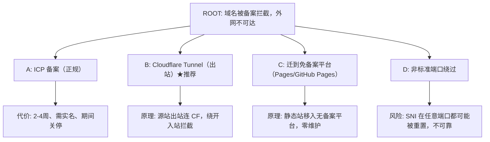

# ICP 备案拦截网站恢复（Cloudflare Tunnel）

## 概述（What）

诊断并恢复一个"无法访问 / 无法登录"的网站。本 skill 沉淀了一次真实的运维排障：阿里云源站 + Cloudflare 代理，因域名**未完成 ICP 备案**，阿里云在公网 80/443 拦截该域名（HTTP 403 / HTTPS 525），Cloudflare 回源失败导致整站不可达。最终通过 **Cloudflare Tunnel 出站隧道**绕过拦截，恢复访问。

**输出**：根因结论（含证据链）+ 方案决策 + 验收证据。

## 何时使用（When to Use）

- 网站"无法登录 / 无法访问 / 打不开"，尤其用户用词是"登录"但站点可能是静态站
- Cloudflare 返回 **525**（SSL handshake failed）或 **403**
- 响应头出现 **`Server: Beaver`** 或页面标题 **"Non-compliance ICP Filing"**（跳转 `aliyun.com/beian/beian-block`）
- **中国云（阿里云/腾讯云）源站 + Cloudflare**，域名未备案
- 特征性现象：**本地/服务器本机能访问，外网不能**；**无 Host/SNI 能通，带 Host/SNI 被拦**

## 核心原则

1. **分层定位**：按 DNS → CDN → 源站 三层逐层排除，不跨层猜测。
2. **假设驱动**：每个分支 = 可证伪假设（"出现 X 即宣告不成立"），结论只取 supported / refuted / undetermined。
3. **区分语义**：先澄清"无法登录"是**账号认证失败**还是**整站不可访问**（静态站无登录功能，通常是后者）。
4. **证据权威**：人类裁定 > 意图图谱/验收语义 > 实现架构契约 > 代码现实行为 > 互联网来源。
5. **不直接改生产**：诊断用临时、可逆的改动；改动前记录原始状态。

## 流程（Procedure）

### 阶段 1 — 问题定义（SMART）
- 明确目标状态：公网 HTTPS 返回 **200** 且页面正常渲染。
- 澄清"登录"语义；确认站点类型（静态/动态、有无登录功能）。

### 阶段 2 — 分层诊断（DNS → CDN → 源站）
1. **DNS**：确认域名解析到 CDN（Cloudflare IP）还是直连源站。
2. **CDN 层**：经域名访问 HTTP/HTTPS，记录状态码（525 = 回源 TLS 失败；403 = 被拦）。
3. **源站 TCP**：`Test-NetConnection <源站IP> -Port 80/443`。
4. **源站直连（绕过 CDN）**：`curl` 到源站 IP 并带 `Host` 头；TLS 握手分"带 SNI / 不带 SNI"两组测试。
5. **服务器本机对照**：SSH 进源站，在 localhost 上重复上述测试。
   完整命令见 [diagnosis-commands.md](./references/diagnosis-commands.md)。

### 阶段 3 — 识别 ICP 拦截特征
出现以下**组合**即可判定阿里云 ICP 备案拦截（与 nginx/证书/代码无关）：
- 外网 `:80` + `Host=域名` → **403**，`Server: Beaver`，正文 **"Non-compliance ICP Filing"**
- 外网 `:443`（及任意端口）+ `SNI=域名` → **TLS 连接被重置**（Cloudflare 表现为 525）
- **无** Host/SNI → 放行到源站 200
- 服务器本机（localhost / 自身公网 IP）**全部正常**（不经过阿里云边缘拦截）
- nginx 日志出现 `bad key share` / `bad extension`（被拦截/扫描流量的 ClientHello 异常）

> 反例确认：nginx `-t` 通过、证书/密钥 modulus 匹配、本机带 SNI 握手成功 —— 排除源站配置问题。

### 阶段 4 — 方案决策（决策树）

- **B（Cloudflare Tunnel）**：最快、免费、保留现有托管 → 本 skill 主路径。
- **A（ICP 备案）**：最正规，但慢、需实名、备案期关停。
- **C（迁移托管）**：一劳永逸，需改 DNS/控制台。
- **D（非标准端口）**：已实测**无效**（带该域名 SNI 的 TLS 在 8443 等端口同样被重置），不推荐。

### 阶段 5 — 执行 Cloudflare Tunnel 恢复
1. 验证/获取 Cloudflare API token 权限（**账号级**，`cfat_` 格式走 `/accounts/{id}/tokens/verify`，不走 `/user/tokens/verify`）。
2. 获取 account id、zone id。
3. 创建命名隧道 + 配置 ingress（域名 → `http://localhost:80`）。
4. 源站安装 `cloudflared`（国内 GitHub 限速 → **aria2 多线程**）。
5. 写入凭据 + config + systemd 服务，启动并确认 `Registered tunnel connection`。
6. DNS：CNAME `域名 → <tunnel-id>.cfargotunnel.com`（**Proxied**）。
   逐步命令见 [cloudflare-tunnel-setup.md](./references/cloudflare-tunnel-setup.md)。

### 阶段 6 — 验收
对照下方验收标准逐项验证，并截图/日志留证。

## 验收标准（验收方视角：控制点 + 观测点）

| # | 控制点 | 观测点（预期业务结果） |
|---|---|---|
| T1 | 浏览器访问 `https://<域名>/` | 返回 200，页面正常渲染（标题/导航/内容/页脚） |
| T2 | 公网任意网络发起 HTTPS | 返回 200，无 525/403/证书错误 |
| T3 | 连续多次访问 | 稳定 200，无间歇性失败 |
| T4 | 静态资源（CSS/JS/图片） | 均返回 200 |

## 经验教训（Lessons）

- 阿里云源站 + Cloudflare 回源：**回源这一跳仍经过阿里云备案拦截**，"用 CDN 绕备案"的设想**不成立**。
- 唯一可靠绕过 = **隧道出站**（不暴露域名到公网入站 80/443）或 **迁出国内托管**。
- 国内直连 GitHub 大文件被限速（~15-30KB/s）→ **aria2 `-x 8 -s 8`** 多连接可叠加提速（实测 127KB/s）。
- 静态站点"无法登录"通常 = **整站不可访问**，先测可访问性再找登录。
- Cloudflare `cfat_` token 是账号级格式，用 `/accounts/{id}/tokens/verify` 验证；R2 页面创建的 token 通常**缺 Zone DNS 权限**，DNS 变更需控制台操作或另给 DNS token。

## 参考资料

- [诊断命令集](./references/diagnosis-commands.md) — DNS/CDN/源站/TLS/SNI 全套诊断命令
- [Cloudflare Tunnel 部署](./references/cloudflare-tunnel-setup.md) — 隧道创建、cloudflared 部署、DNS、验收
