# SystemArchitecture Diff PlantUML

- Source: `design/KG/SystemArchitecture.json`
- Generated: `2026-07-13T05:16:22.841Z`
- Color: added=pink, affected=blue, context=light yellow.
- Tree direction: root dependency -> depended-on elements; `G传递` means the child contributes granularity to its parent.

```plantuml
@startuml
title SystemArchitecture 当前 Git Diff 变化树

top to bottom direction
hide stereotype
skinparam shadowing false
skinparam linetype ortho
skinparam defaultTextAlignment center
skinparam wrapWidth 120
skinparam ArrowFontSize 10
skinparam nodesep 25
skinparam ranksep 55

skinparam rectangle {
  RoundCorner 12
  BackgroundColor<<added>> #F8BBD0
  BorderColor<<added>> #AD1457
  BackgroundColor<<affected>> #BBDEFB
  BorderColor<<affected>> #1565C0
  BackgroundColor<<context>> #FFF9C4
  BorderColor<<context>> #F9A825
}

legend right
  |= 颜色 |= 含义 |
  | <back:#F8BBD0>新增</back> | Git diff 新增元素/关系 |
  | <back:#BBDEFB>影响</back> | Git diff 修改既有元素/关系 |
  | <back:#FFF9C4>上下文</back> | 被变更关系引用的上下文元素 |
  | 估算 | 总计 1.5G |
endlegend



@enduml
```

