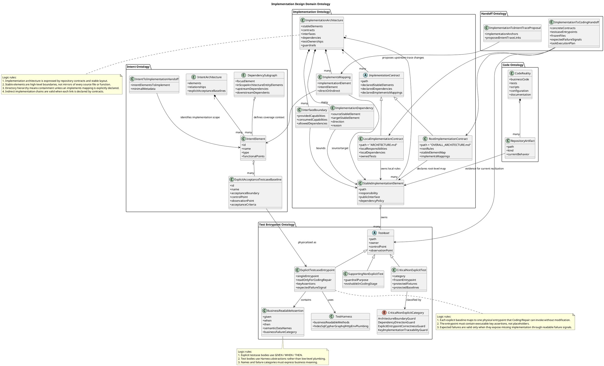
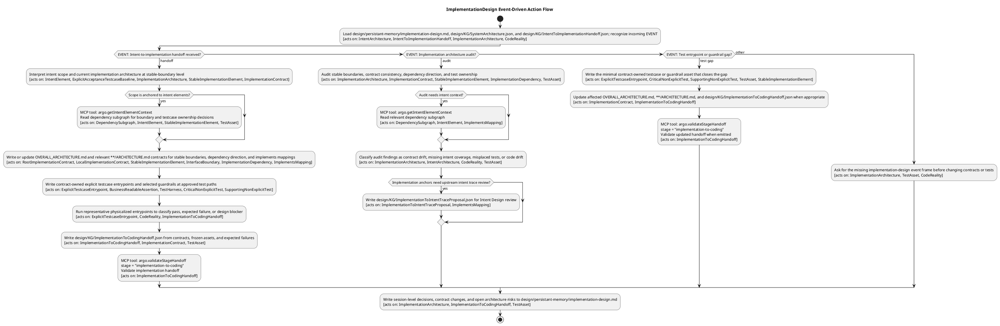

### Current Stage

Implementation Design

## Cognitive Part: PlantUML Class Diagram

```plantuml
@startuml ImplementationDesign_Cognition
skinparam classAttributeIconSize 0
title Implementation Design Domain Ontology

package "Intent Ontology" {
  class IntentArchitecture {
    +elements
    +relationships
    +explicitAcceptanceBaselines
  }

  class IntentElement {
    +id
    +name
    +type
    +functionalPoints
  }

  class ExplicitAcceptanceTestcaseBaseline {
    +id
    +name
    +acceptanceBoundary
    +controlPoint
    +observationPoint
    +acceptanceCriteria
  }

  class IntentToImplementationHandoff {
    +intentElementsToImplement
    +minimalMetadata
  }

  class DependencySubgraph {
    +focusElement
    +inScopeArchitectureEntityElements
    +upstreamDependencies
    +downstreamDependents
  }
}

package "Implementation Ontology" {
  class ImplementationArchitecture {
    +stableElements
    +contracts
    +interfaces
    +dependencies
    +testOwnerships
    +guardrails
  }

  abstract class ImplementationContract {
    +path
    +declaredStableElements
    +declaredDependencies
    +declaredImplementsMappings
  }

  class RootImplementationContract {
    +path = "OVERALL_ARCHITECTURE.md"
    +rootRules
    +stableElementMap
    +implementsMappings
  }

  class LocalImplementationContract {
    +path = "ARCHITECTURE.md"
    +localResponsibilities
    +localDependencies
    +ownedTests
  }

  class StableImplementationElement {
    +path
    +responsibility
    +publicInterface
    +dependencyPolicy
  }

  class InterfaceBoundary {
    +providedCapabilities
    +consumedCapabilities
    +allowedDependencies
  }

  class ImplementationDependency {
    +sourceStableElement
    +targetStableElement
    +direction
    +reason
  }

  class ImplementsMapping {
    +implementationElement
    +intentElement
    +directOrIndirect
  }
}

package "Test Entrypoint Ontology" {
  abstract class TestAsset {
    +path
    +owner
    +controlPoint
    +observationPoint
  }

  class ExplicitTestcaseEntrypoint {
    +singleEntrypoint
    +readOnlyForCodingRepair
    +keyAssertions
    +expectedFailureSignal
  }

  class CriticalNonExplicitTest {
    +category
    +frozenEntrypoint
    +protectedFixtures
    +protectedBaselines
  }

  class SupportingNonExplicitTest {
    +guardrailPurpose
    +evolvableInCodingStage
  }

  class TestHarness {
    +businessReadableMethods
    +hidesSqlCypherGraphqlHttpEnvPlumbing
  }

  class BusinessReadableAssertion {
    +given
    +when
    +then
    +semanticDataNames
    +businessFailureCategory
  }

  enum CriticalNonExplicitCategory {
    ArchitectureBoundaryGuard
    DependencyDirectionGuard
    ExplicitEntrypointCorrectnessGuard
    KeyImplementationTraceabilityGuard
  }
}

package "Code Ontology" {
  class CodeReality {
    +businessCode
    +tests
    +scripts
    +configuration
    +documentation
  }

  class RepositoryArtifact {
    +path
    +kind
    +currentBehavior
  }
}

package "Handoff Ontology" {
  class ImplementationToCodingHandoff {
    +concreteContracts
    +testcaseEntrypoints
    +frozenFiles
    +expectedFailureSignals
    +taskExecutionPlan
  }

  class ImplementationToIntentTraceProposal {
    +implementationAnchors
    +proposedIntentTraceLinks
  }
}

IntentArchitecture "1" *-- "many" IntentElement
IntentElement "1" o-- "many" ExplicitAcceptanceTestcaseBaseline
IntentToImplementationHandoff --> IntentElement : identifies implementation scope
DependencySubgraph "1" o-- "many" IntentElement : defines coverage context

ImplementationArchitecture "1" *-- "many" StableImplementationElement
ImplementationArchitecture "1" *-- "many" ImplementationContract
ImplementationArchitecture "1" *-- "many" InterfaceBoundary
ImplementationArchitecture "1" *-- "many" ImplementationDependency
ImplementationArchitecture "1" *-- "many" ImplementsMapping
ImplementationContract <|-- RootImplementationContract
ImplementationContract <|-- LocalImplementationContract
RootImplementationContract --> StableImplementationElement : declares root-level map
LocalImplementationContract --> StableImplementationElement : owns local rules
InterfaceBoundary --> StableImplementationElement : bounds
ImplementationDependency --> StableImplementationElement : source/target
ImplementsMapping --> StableImplementationElement
ImplementsMapping --> IntentElement

TestAsset <|-- ExplicitTestcaseEntrypoint
TestAsset <|-- CriticalNonExplicitTest
TestAsset <|-- SupportingNonExplicitTest
ExplicitAcceptanceTestcaseBaseline --> ExplicitTestcaseEntrypoint : physicalized as
ExplicitTestcaseEntrypoint --> BusinessReadableAssertion : contains
ExplicitTestcaseEntrypoint --> TestHarness : uses
CriticalNonExplicitTest --> CriticalNonExplicitCategory : classified by
StableImplementationElement "1" o-- "many" TestAsset : owns

CodeReality "1" *-- "many" RepositoryArtifact
RepositoryArtifact --> StableImplementationElement : evidence for current realization
ImplementationToCodingHandoff --> RootImplementationContract
ImplementationToCodingHandoff --> LocalImplementationContract
ImplementationToCodingHandoff --> TestAsset
ImplementationToIntentTraceProposal --> ImplementsMapping : proposes upstream trace changes

note bottom of ImplementationArchitecture
  Logic rules:
  1. Implementation architecture is expressed by repository contracts and stable layout.
  2. Stable elements are high-level boundaries, not mirrors of every source file or function.
  3. Directory hierarchy means containment unless an implements mapping is explicitly declared.
  4. Indirect implementation chains are valid when each link is declared by contracts.
end note

note bottom of ExplicitTestcaseEntrypoint
  Logic rules:
  1. Each explicit baseline maps to one physical entrypoint that Coding/Repair can invoke without modification.
  2. The entrypoint must contain executable key assertions, not placeholders.
  3. Expected failures are valid only when they expose missing implementation through readable failure signals.
end note

note bottom of BusinessReadableAssertion
  Logic rules:
  1. Explicit testcase bodies use GIVEN / WHEN / THEN.
  2. Test bodies use Harness abstractions rather than low-level plumbing.
  3. Names and failure categories must express business meaning.
end note
@enduml
```
## Action Part: PlantUML Activity Diagram

```plantuml
@startuml ImplementationDesign_Action
title ImplementationDesign Event-Driven Action Flow

start
:Load design/persistant-memory/implementation-design.md, design/KG/SystemArchitecture.json, and design/KG/IntentToImplementationHandoff.json; recognize incoming EVENT
[acts on: IntentArchitecture, IntentToImplementationHandoff, ImplementationArchitecture, CodeReality];

if (EVENT: Intent-to-implementation handoff received?) then (handoff)
  :Interpret intent scope and current implementation architecture at stable-boundary level
  [acts on: IntentElement, ExplicitAcceptanceTestcaseBaseline, ImplementationArchitecture, StableImplementationElement, ImplementationContract];
  if (Scope is anchored to intent elements?) then (yes)
    :MCP tool: argo.getIntentElementContext
    Read dependency subgraph for boundary and testcase ownership decisions
    [acts on: DependencySubgraph, IntentElement, StableImplementationElement, TestAsset];
  endif
  :Write or update OVERALL_ARCHITECTURE.md and relevant **/ARCHITECTURE.md contracts for stable boundaries, dependency direction, and implements mappings
  [acts on: RootImplementationContract, LocalImplementationContract, StableImplementationElement, InterfaceBoundary, ImplementationDependency, ImplementsMapping];
  :Write contract-owned explicit testcase entrypoints and selected guardrails at approved test paths
  [acts on: ExplicitTestcaseEntrypoint, BusinessReadableAssertion, TestHarness, CriticalNonExplicitTest, SupportingNonExplicitTest];
  :Run representative physicalized entrypoints to classify pass, expected failure, or design blocker
  [acts on: ExplicitTestcaseEntrypoint, CodeReality, ImplementationToCodingHandoff];
  :Write design/KG/ImplementationToCodingHandoff.json from contracts, frozen assets, and expected failures
  [acts on: ImplementationToCodingHandoff, ImplementationContract, TestAsset];
  :MCP tool: argo.validateStageHandoff
  stage = "implementation-to-coding"
  Validate implementation handoff
  [acts on: ImplementationToCodingHandoff];

elseif (EVENT: Implementation architecture audit?) then (audit)
  :Audit stable boundaries, contract consistency, dependency direction, and test ownership
  [acts on: ImplementationArchitecture, ImplementationContract, StableImplementationElement, ImplementationDependency, TestAsset];
  if (Audit needs intent context?) then (yes)
    :MCP tool: argo.getIntentElementContext
    Read relevant dependency subgraph
    [acts on: DependencySubgraph, IntentElement, ImplementsMapping];
  endif
  :Classify audit findings as contract drift, missing intent coverage, misplaced tests, or code drift
  [acts on: ImplementationArchitecture, IntentArchitecture, CodeReality, TestAsset];
  if (Implementation anchors need upstream intent trace review?) then (yes)
    :Write design/KG/ImplementationToIntentTraceProposal.json for Intent Design review
    [acts on: ImplementationToIntentTraceProposal, ImplementsMapping];
  endif

elseif (EVENT: Test entrypoint or guardrail gap?) then (test gap)
  :Write the minimal contract-owned testcase or guardrail asset that closes the gap
  [acts on: ExplicitTestcaseEntrypoint, CriticalNonExplicitTest, SupportingNonExplicitTest, TestAsset, StableImplementationElement];
  :Update affected OVERALL_ARCHITECTURE.md, **/ARCHITECTURE.md, and design/KG/ImplementationToCodingHandoff.json when appropriate
  [acts on: ImplementationContract, ImplementationToCodingHandoff];
  :MCP tool: argo.validateStageHandoff
  stage = "implementation-to-coding"
  Validate updated handoff when emitted
  [acts on: ImplementationToCodingHandoff];
else (other)
  :Ask for the missing implementation-design event frame before changing contracts or tests
  [acts on: ImplementationArchitecture, TestAsset, CodeReality];
endif

:Write session-level decisions, contract changes, and open architecture risks to design/persistant-memory/implementation-design.md
[acts on: ImplementationArchitecture, ImplementationToCodingHandoff, TestAsset];
stop
@enduml
```