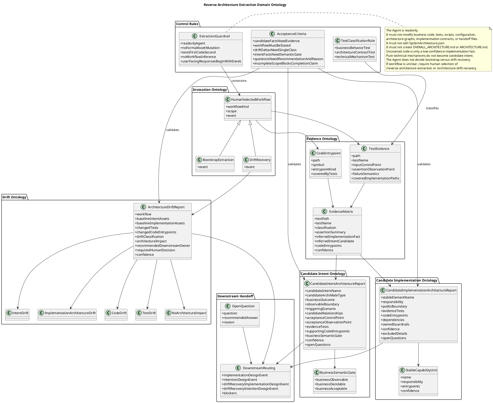
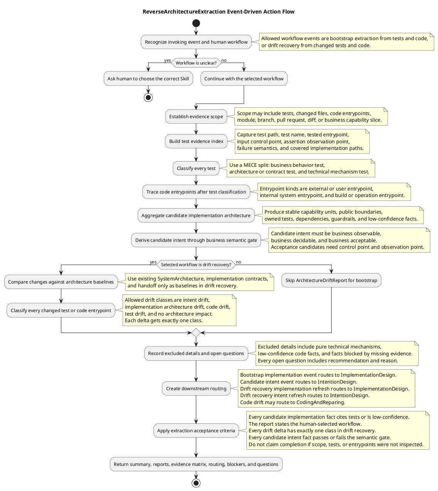

### Current Stage

Reverse Architecture Extraction.

## Domain Ontology

```plantuml
@startuml ReverseArchitectureExtraction_Cognition
skinparam classAttributeIconSize 0
title Reverse Architecture Extraction Domain Ontology

package "Invocation Ontology" {
  class HumanSelectedWorkflow {
    +workflowKind
    +scope
    +event
  }

  class BootstrapExtraction {
    +event
  }

  class DriftRecovery {
    +event
  }
}

package "Evidence Ontology" {
  class TestEvidence {
    +path
    +testName
    +inputControlPoint
    +assertionObservationPoint
    +failureSemantics
    +coveredImplementationPaths
  }

  class CodeEntrypoint {
    +path
    +symbol
    +entrypointKind
    +coveredByTests
  }

  class EvidenceMatrix {
    +testPath
    +testName
    +classification
    +assertionSummary
    +inferredImplementationFact
    +inferredIntentCandidate
    +codeEntrypoints
    +confidence
  }
}

package "Candidate Implementation Ontology" {
  class CandidateImplementationArchitectureReport {
    +stableElementName
    +responsibility
    +publicBoundary
    +evidenceTests
    +codeEntrypoints
    +dependencies
    +ownedGuardrails
    +confidence
    +excludedDetails
    +openQuestions
  }

  class StableCapabilityUnit {
    +name
    +responsibility
    +entrypoints
    +confidence
  }
}

package "Candidate Intent Ontology" {
  class CandidateIntentArchitectureReport {
    +candidateIntentName
    +candidateArchiMateType
    +businessOutcome
    +observableBoundary
    +triggeringScenario
    +candidateRelationships
    +acceptanceControlPoint
    +acceptanceObservationPoint
    +evidenceTests
    +supportingCodeEntrypoints
    +businessSemanticGate
    +confidence
    +openQuestions
  }

  class BusinessSemanticGate {
    +businessObservable
    +businessDecidable
    +businessAcceptable
  }
}

package "Drift Ontology" {
  class ArchitectureDriftReport {
    +workflow
    +baselineIntentAssets
    +baselineImplementationAssets
    +changedTests
    +changedCodeEntrypoints
    +driftClassification
    +architectureImpact
    +recommendedDownstreamOwner
    +requiredHumanDecision
    +confidence
  }

  class IntentDrift
  class ImplementationArchitectureDrift
  class CodeDrift
  class TestDrift
  class NoArchitectureImpact
}

package "Control Rules" {
  class ExtractionGuardrail {
    +readonlyAgent
    +noFormalAssetMutation
    +testsFirstCodeSecond
    +noWorkflowInference
    +userFacingResponsesBeginWithDerek
  }

  class TestClassificationRule {
    +businessBehaviorTest
    +architectureContractTest
    +technicalMechanismTest
  }

  class AcceptanceCriteria {
    +candidateFactsNeedEvidence
    +workflowMustBeStated
    +driftDeltasNeedSingleClass
    +intentFactsNeedSemanticGate
    +questionsNeedRecommendationAndReason
    +incompleteScopeBlocksCompletionClaim
  }
}

package "Downstream Handoff" {
  class OpenQuestion {
    +question
    +recommendedAnswer
    +reason
  }

  class DownstreamRouting {
    +implementationDesignEvent
    +intentionDesignEvent
    +driftRecoveryImplementationDesignEvent
    +driftRecoveryIntentionDesignEvent
    +blockers
  }
}

HumanSelectedWorkflow <|-- BootstrapExtraction
HumanSelectedWorkflow <|-- DriftRecovery
HumanSelectedWorkflow --> TestEvidence
HumanSelectedWorkflow --> CodeEntrypoint
ExtractionGuardrail --> HumanSelectedWorkflow : constrains
TestClassificationRule --> TestEvidence : classifies
TestEvidence --> EvidenceMatrix
CodeEntrypoint --> EvidenceMatrix
EvidenceMatrix --> CandidateImplementationArchitectureReport
EvidenceMatrix --> CandidateIntentArchitectureReport
CandidateImplementationArchitectureReport --> StableCapabilityUnit
CandidateIntentArchitectureReport --> BusinessSemanticGate
DriftRecovery --> ArchitectureDriftReport
ArchitectureDriftReport --> IntentDrift
ArchitectureDriftReport --> ImplementationArchitectureDrift
ArchitectureDriftReport --> CodeDrift
ArchitectureDriftReport --> TestDrift
ArchitectureDriftReport --> NoArchitectureImpact
AcceptanceCriteria --> CandidateImplementationArchitectureReport : validates
AcceptanceCriteria --> CandidateIntentArchitectureReport : validates
AcceptanceCriteria --> ArchitectureDriftReport : validates
CandidateImplementationArchitectureReport --> DownstreamRouting
CandidateIntentArchitectureReport --> DownstreamRouting
ArchitectureDriftReport --> DownstreamRouting
OpenQuestion --> DownstreamRouting

note right of ExtractionGuardrail
The Agent is readonly.
It must not modify business code, tests, scripts, configuration,
architecture graphs, implementation contracts, or handoff files.
It must not edit SystemArchitecture.json.
It must not create OVERALL_ARCHITECTURE.md or ARCHITECTURE.md.
Uncovered code is only a low-confidence implementation fact.
Pure technical mechanisms do not become candidate intent.
The Agent does not decide bootstrap versus drift recovery.
If workflow is unclear, require human selection of
/reverse-architecture-extraction or /architecture-drift-recovery.
end note
@enduml
```

## Behavior

```plantuml
@startuml ReverseArchitectureExtraction_Behavior
title ReverseArchitectureExtraction Event-Driven Action Flow

start
:Recognize invoking event and human workflow;
note right
Allowed workflow events are bootstrap extraction from tests and code,
or drift recovery from changed tests and code.
end note

if (Workflow is unclear?) then (yes)
  :Ask human to choose the correct Skill;
  stop
else (no)
  :Continue with the selected workflow;
endif

:Establish evidence scope;
note right
Scope may include tests, changed files, code entrypoints,
module, branch, pull request, diff, or business capability slice.
end note

:Build test evidence index;
note right
Capture test path, test name, tested entrypoint,
input control point, assertion observation point,
failure semantics, and covered implementation paths.
end note

:Classify every test;
note right
Use a MECE split: business behavior test,
architecture or contract test, and technical mechanism test.
end note

:Trace code entrypoints after test classification;
note right
Entrypoint kinds are external or user entrypoint,
internal system entrypoint, and build or operation entrypoint.
end note

:Aggregate candidate implementation architecture;
note right
Produce stable capability units, public boundaries,
owned tests, dependencies, guardrails, and low-confidence facts.
end note

:Derive candidate intent through business semantic gate;
note right
Candidate intent must be business observable,
business decidable, and business acceptable.
Acceptance candidates need control point and observation point.
end note

if (Selected workflow is drift recovery?) then (yes)
  :Compare changes against architecture baselines;
  note right
Use existing SystemArchitecture, implementation contracts,
and handoff only as baselines in drift recovery.
end note
  :Classify every changed test or code entrypoint;
  note right
Allowed drift classes are intent drift,
implementation architecture drift, code drift,
test drift, and no architecture impact.
Each delta gets exactly one class.
end note
else (no)
  :Skip ArchitectureDriftReport for bootstrap;
endif

:Record excluded details and open questions;
note right
Excluded details include pure technical mechanisms,
low-confidence code facts, and facts blocked by missing evidence.
Every open question includes recommendation and reason.
end note

:Create downstream routing;
note right
Bootstrap implementation event routes to ImplementationDesign.
Candidate intent event routes to IntentionDesign.
Drift recovery implementation refresh routes to ImplementationDesign.
Drift recovery intent refresh routes to IntentionDesign.
Code drift may route to CodingAndReparing.
end note

:Apply extraction acceptance criteria;
note right
Every candidate implementation fact cites tests or is low-confidence.
The report states the human-selected workflow.
Every drift delta has exactly one class in drift recovery.
Every candidate intent fact passes or fails the semantic gate.
Do not claim completion if scope, tests, or entrypoints were not inspected.
end note

:Return summary, reports, evidence matrix, routing, blockers, and questions;
stop
@enduml
```
