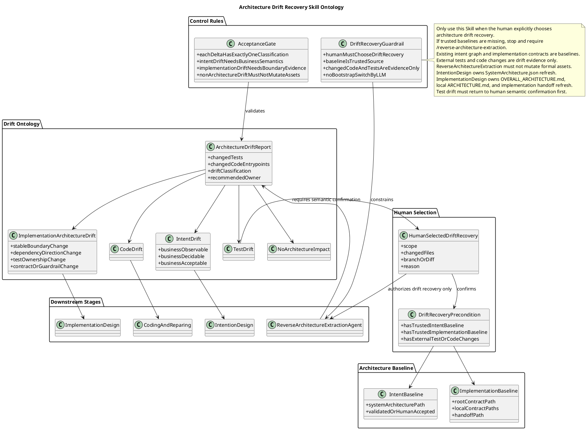
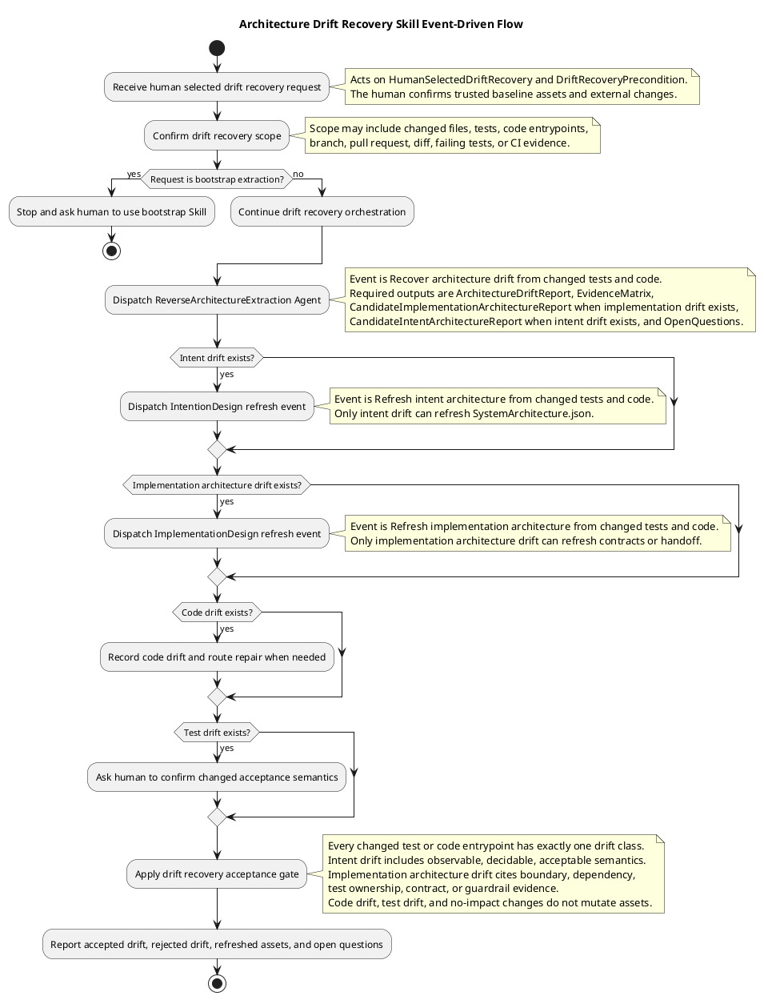

# Architecture Drift Recovery

### Current Stage

Architecture Drift Recovery Skill.

## Domain Ontology

```plantuml
@startuml ArchitectureDriftRecoverySkill_Cognition
skinparam classAttributeIconSize 0
title Architecture Drift Recovery Skill Ontology

package "Human Selection" {
  class HumanSelectedDriftRecovery {
    +scope
    +changedFiles
    +branchOrDiff
    +reason
  }

  class DriftRecoveryPrecondition {
    +hasTrustedIntentBaseline
    +hasTrustedImplementationBaseline
    +hasExternalTestOrCodeChanges
  }
}

package "Architecture Baseline" {
  class IntentBaseline {
    +systemArchitecturePath
    +validatedOrHumanAccepted
  }

  class ImplementationBaseline {
    +rootContractPath
    +localContractPaths
    +handoffPath
  }
}

package "Drift Ontology" {
  class ArchitectureDriftReport {
    +changedTests
    +changedCodeEntrypoints
    +driftClassification
    +recommendedOwner
  }

  class IntentDrift {
    +businessObservable
    +businessDecidable
    +businessAcceptable
  }

  class ImplementationArchitectureDrift {
    +stableBoundaryChange
    +dependencyDirectionChange
    +testOwnershipChange
    +contractOrGuardrailChange
  }

  class CodeDrift
  class TestDrift
  class NoArchitectureImpact
}

package "Control Rules" {
  class DriftRecoveryGuardrail {
    +humanMustChooseDriftRecovery
    +baselineIsTrustedSource
    +changedCodeAndTestsAreEvidenceOnly
    +noBootstrapSwitchByLLM
  }

  class AcceptanceGate {
    +eachDeltaHasExactlyOneClassification
    +intentDriftNeedsBusinessSemantics
    +implementationDriftNeedsBoundaryEvidence
    +nonArchitectureDriftMustNotMutateAssets
  }
}

package "Downstream Stages" {
  class ReverseArchitectureExtractionAgent
  class IntentionDesign
  class ImplementationDesign
  class CodingAndReparing
}

HumanSelectedDriftRecovery --> DriftRecoveryPrecondition : confirms
DriftRecoveryPrecondition --> IntentBaseline
DriftRecoveryPrecondition --> ImplementationBaseline
DriftRecoveryGuardrail --> ReverseArchitectureExtractionAgent : constrains
HumanSelectedDriftRecovery --> ReverseArchitectureExtractionAgent : authorizes drift recovery only
ReverseArchitectureExtractionAgent --> ArchitectureDriftReport
ArchitectureDriftReport --> IntentDrift
ArchitectureDriftReport --> ImplementationArchitectureDrift
ArchitectureDriftReport --> CodeDrift
ArchitectureDriftReport --> TestDrift
ArchitectureDriftReport --> NoArchitectureImpact
AcceptanceGate --> ArchitectureDriftReport : validates
IntentDrift --> IntentionDesign
ImplementationArchitectureDrift --> ImplementationDesign
CodeDrift --> CodingAndReparing
TestDrift --> HumanSelectedDriftRecovery : requires semantic confirmation

note right of DriftRecoveryGuardrail
Only use this Skill when the human explicitly chooses
architecture drift recovery.
If trusted baselines are missing, stop and require
/reverse-architecture-extraction.
Existing intent graph and implementation contracts are baselines.
External tests and code changes are drift evidence only.
ReverseArchitectureExtraction must not mutate formal assets.
IntentionDesign owns SystemArchitecture.json refresh.
ImplementationDesign owns OVERALL_ARCHITECTURE.md,
local ARCHITECTURE.md, and implementation handoff refresh.
Test drift must return to human semantic confirmation first.
end note
@enduml
```

## Behavior

```plantuml
@startuml ArchitectureDriftRecoverySkill_Behavior
title Architecture Drift Recovery Skill Event-Driven Flow

start
:Receive human selected drift recovery request;
note right
Acts on HumanSelectedDriftRecovery and DriftRecoveryPrecondition.
The human confirms trusted baseline assets and external changes.
end note

:Confirm drift recovery scope;
note right
Scope may include changed files, tests, code entrypoints,
branch, pull request, diff, failing tests, or CI evidence.
end note

if (Request is bootstrap extraction?) then (yes)
  :Stop and ask human to use bootstrap Skill;
  stop
else (no)
  :Continue drift recovery orchestration;
endif

:Dispatch ReverseArchitectureExtraction Agent;
note right
Event is Recover architecture drift from changed tests and code.
Required outputs are ArchitectureDriftReport, EvidenceMatrix,
CandidateImplementationArchitectureReport when implementation drift exists,
CandidateIntentArchitectureReport when intent drift exists, and OpenQuestions.
end note

if (Intent drift exists?) then (yes)
  :Dispatch IntentionDesign refresh event;
  note right
Event is Refresh intent architecture from changed tests and code.
Only intent drift can refresh SystemArchitecture.json.
end note
endif

if (Implementation architecture drift exists?) then (yes)
  :Dispatch ImplementationDesign refresh event;
  note right
Event is Refresh implementation architecture from changed tests and code.
Only implementation architecture drift can refresh contracts or handoff.
end note
endif

if (Code drift exists?) then (yes)
  :Record code drift and route repair when needed;
endif

if (Test drift exists?) then (yes)
  :Ask human to confirm changed acceptance semantics;
endif

:Apply drift recovery acceptance gate;
note right
Every changed test or code entrypoint has exactly one drift class.
Intent drift includes observable, decidable, acceptable semantics.
Implementation architecture drift cites boundary, dependency,
test ownership, contract, or guardrail evidence.
Code drift, test drift, and no-impact changes do not mutate assets.
end note

:Report accepted drift, rejected drift, refreshed assets, and open questions;
stop
@enduml
```
