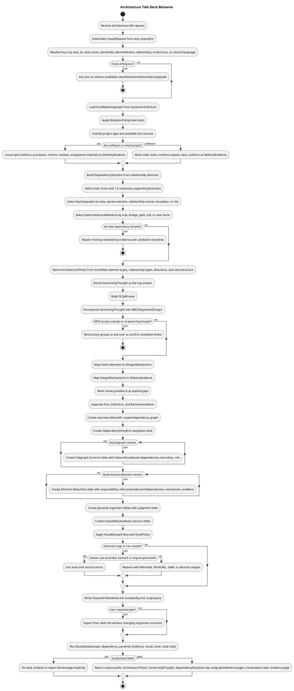

# Architecture Talk Deck

Use when the user wants a PPT, presentation, briefing deck, talk script, or architecture walkthrough from an ArchiMate view, element, subgraph, or project trace.

## Domain Ontology

```plantuml
@startuml ArchitectureTalkDeck_Cognition
skinparam classAttributeIconSize 0
title Architecture Talk Deck Domain Ontology

package "Architecture Scope Ontology" {
  class ScopeRequest {
    +rawArgument
    +focusKind = "view|element|relationship|natural-language|multi-focus"
    +focusIdOrName
    +audience
    +projectType = "software|non-software|mixed|unknown"
  }

  class ArchiMateSubgraph {
    +focus
    +elements
    +relationships
    +views
    +boundaryRule = "inside requested scope unless user asks upstream/downstream"
  }

  abstract class ArchitectureElement {
    +id
    +name
    +type
    +attributes
    +semanticRole
  }

  abstract class ArchitectureRelationship {
    +id
    +type
    +source
    +target
    +directionalSemantics
  }

  class KeySubgraph {
    +includedElements
    +includedRelationships
    +inboundDependencies
    +outboundDependencies
    +riskIfMisunderstood
  }

  class KeyArchitectureElement {
    +elementId
    +role = "hub|bridge|gate|risk|user-focus"
    +responsibility
    +inboundDependencies
    +outboundDependencies
  }
}

package "Argument Ontology" {
  class ArchitectureThesis {
    +claim
    +systemicProblem
    +architectureArrangement
  }

  class GoverningThought {
    +answer
    +designMechanism
    +evidenceGuarantee
  }

  class SCQAFrame {
    +situation
    +complication
    +question
    +answer
  }

  class MECEArgumentGroup {
    +name = "architecture intent|design mechanism|delivery evidence"
    +claim
    +evidencePoints
    +speakerNotes
  }

  class DependencyStoryline {
    +mainChain
    +supportingBranches
    +orderingRationale
  }
}

package "Traceability Ontology" {
  class DesignMechanism {
    +contractOrProcess
    +boundary
    +owner
    +interfaceOrHandoff
  }

  class DeliveryEvidence {
    +artifact
    +observable
    +status = "mapped|gap|unverified"
    +source
  }

  class TraceabilityMatrix {
    +intentElement
    +designMechanism
    +deliveryEvidence
    +status
  }
}

package "Policy Ontology" {
  class ArchitectureFirstPolicy {
    +treatIntentArchitectureAsGenericArchiMate
    +doNotUseArgoStagesAsMainStoryUnlessRequested
    +deriveArchitectureThesisBeforeEvidence
  }

  class PyramidPrinciplePolicy {
    +governingThoughtFirst
    +SCQAOpeningRequired
    +MECEArgumentGroupsRequired
    +judgmentTitlesOnly
  }

  class DependencyExpansionPolicy {
    +overviewFirst
    +storylineFromRelationshipDirection
    +zoomInKeySubgraphs
    +deepDiveKeyElements
    +closeWithEvidenceMatrix
  }

  class ProjectTypePolicy {
    +classifyBeforeEvidenceMapping
    +softwareMayUseCodeAndTests
    +nonSoftwareUsesArtifactsProcessesMetricsReviews
    +neverAssumeCodeExists
  }

  class EvidencePolicy {
    +factsNeedSources
    +missingEvidenceMarkedExplicitly
    +separateFactInferenceRecommendation
    +doNotInvent
  }

  class VisualDesignPolicy {
    +style = "executive architecture briefing"
    +oneConclusionPerSlide
    +maxThreeMainBlocks
    +diagramFirst
    +lowToMediumDensity
  }

  class AssetPolicy {
    +useOwnedUserLicensedOrOriginalAssetsOnly
    +doNotCopyThirdPartyTemplatesOrImages
    +noCompetitorDeckReconstruction
    +ordinaryDeckUsesMermaidPlantUMLTablesShapes
  }

  class MutationPolicy {
    +readOnlyPresentationTask
    +mustNotModifyArchitectureGraph
    +mustNotModifyHandoffsContractsDeliverablesCodeTests
  }
}

package "Deck Ontology" {
  class DeckPlan {
    +sections = "SCQA|dependency expansion|intent|mechanism|evidence|closure"
    +slideCount
    +dependencyExpansionPages
  }

  class Slide {
    +judgmentTitle
    +visualSpec
    +evidenceSource
    +speakerNotes
  }

  class VisualDesignSpec {
    +style = "executive architecture briefing"
    +layout
    +diagramType
    +assetPolicy
  }

  class OutputArtifact {
    +deckMd = "docs/YYYY-MM-DD-[scope]-讲稿/deck.md"
    +traceabilityMd
    +scopeJson
    +optionalPptx
  }

  class QualityGate {
    +scopeResolved
    +dependencyStorylineExists
    +architectureThesisExists
    +governingThoughtExists
    +MECEPass
    +evidenceMappedOrGapMarked
    +visualPolicyPass
    +assetPolicyPass
  }
}

ScopeRequest --> ArchiMateSubgraph : resolves
ArchiMateSubgraph o-- ArchitectureElement
ArchiMateSubgraph o-- ArchitectureRelationship
ArchiMateSubgraph --> KeySubgraph : partitions
ArchiMateSubgraph --> KeyArchitectureElement : selects
ArchitectureRelationship --> DependencyStoryline : orders
DependencyStoryline --> ArchitectureThesis : supports
ArchitectureThesis --> GoverningThought : condenses
GoverningThought --> SCQAFrame : answers
GoverningThought --> MECEArgumentGroup : decomposes
KeySubgraph --> Slide : zoom-in page
KeyArchitectureElement --> Slide : deep-dive page
MECEArgumentGroup --> DeckPlan : structures
DesignMechanism --> TraceabilityMatrix
DeliveryEvidence --> TraceabilityMatrix
TraceabilityMatrix --> Slide : evidence map
ArchitectureFirstPolicy --> ArchitectureThesis : constrains
PyramidPrinciplePolicy --> DeckPlan : constrains
DependencyExpansionPolicy --> DependencyStoryline : constrains
ProjectTypePolicy --> DeliveryEvidence : constrains
EvidencePolicy --> TraceabilityMatrix : constrains
VisualDesignPolicy --> VisualDesignSpec : constrains
AssetPolicy --> VisualDesignSpec : constrains
MutationPolicy --> OutputArtifact : read-only boundary
VisualDesignSpec --> Slide : constrains
DeckPlan --> OutputArtifact : materializes
QualityGate --> OutputArtifact : validates
@enduml
```

## Behavior

