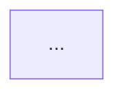

# Slide Template Reference

`deck.md` 使用 Marp 分页符 `---`。每页结构：**结论型标题 → MECE 要点 → 可选图 → 讲者备注**。

所有页标题必须是可被证明的判断句，不使用空泛主题标题。示例：

- 好：`该子图用分阶段契约降低 AI Coding 交付偏航`
- 避免：`架构背景`
- 好：`实现契约把意图验收边界落到可执行测试入口`
- 避免：`材料展示` / `代码展示`

## 视觉风格

默认采用 `executive architecture briefing` 风格：接近顶级咨询/产品战略/投资路演材料的清晰度，但不复制任何公司的模板、品牌色、图标或图片。

### 版式规则

- 每页一个结论，标题必须能独立表达观点。
- 单页最多 3 个主要信息块；超过则拆页。
- 首选图式：金字塔、2x2 矩阵、分层架构图、流程链、泳道、roadmap、evidence map。
- 图片只在能增强论证时使用；优先项目截图、交付物截图、架构图、流程图和原创抽象图。
- 每个外部图片/图标必须有来源或授权说明；没有授权时不要使用。

### 默认视觉 Token

```yaml
style:
  canvas: "16:9, clean white or very light neutral background"
  typography: "large judgment-title, compact body, high contrast"
  palette: "one dark neutral + one primary accent + one warning accent"
  density: "low to medium; avoid dense paragraphs"
  visual_language: "architecture diagrams, structured shapes, minimal icons"
  image_policy: "owned, user-provided, licensed, or original-generated only"
```

## 推荐页序（可按 scope 裁剪）

### 顶层答案

#### 封面
```markdown
---
# [子图名称] — 项目架构讲稿

**范围**：[一句话 scope]
**日期**：YYYY-MM-DD
**视觉风格**：Executive architecture briefing

<!-- notes: 开场 30 秒说明本次分享边界——只讲子图内内容，完整系统见 SystemArchitecture。 -->
---
```

#### SCQA 开场
```markdown
---
## [Answer：一句话中心结论]

[visual: clean SCQA table with one accent color; no decorative image]

| SCQA | 内容 |
| --- | --- |
| Situation | [当前系统/业务/工程背景] |
| Complication | [如果没有该架构安排，会出现的复杂性或风险] |
| Question | [本讲稿要回答的关键架构问题] |
| Answer | [Governing Thought] |

<!-- notes: 先讲 Answer，再用 SCQA 补足上下文；不要先铺长背景。 -->
---
```

#### Architecture Thesis
```markdown
---
## [该子图的架构命题]

[visual: pyramid diagram; top = Architecture Thesis, base = three MECE argument groups]

**Architecture Thesis**  
[一句话说明该 ArchiMate 子图主张什么架构安排，以及它解决什么系统性问题。]

**三层论证**
1. 架构意图：[一句话]
2. 实现机制：[一句话]
3. 落地证据：[一句话]

<!-- notes: 这是全 deck 的金字塔顶点；后续每页都必须支撑这里的 thesis。 -->
---
```

### 第一组：架构意图

#### 依赖展开主线
```markdown
---
## [主依赖链解释了本子图的设计重心]

[visual: dependency storyline; highlight main path, fade supporting branches]


- **主链**：[A --relationship--> B --relationship--> C]
- **支链**：[只列 1–2 条必要支链]
- **讲解顺序**：[为什么按这个方向展开]

<!-- notes: 本页是后续 zoom-in 的导航页；不要展开所有细节，只建立听众地图。 -->
---
```

#### 关键子图 Zoom-In
```markdown
---
## [关键子图 X 承接上游意图并约束下游机制]

[visual: zoomed subgraph with incoming edges on left and outgoing edges on right]


- **子图边界**：[included elements / relationships]
- **入边**：[谁依赖或约束本子图]
- **出边**：[本子图影响什么设计机制或落地证据]
- **风险**：[该局部若失效会造成什么影响]

<!-- notes: 每个关键子图可复制本页单独起页；不要把多个关键子图压在一页。 -->
---
```

#### 关键架构元素 Deep-Dive
```markdown
---
## [关键元素 Y 是该依赖链的控制点]

[visual: element card in center; inbound dependencies left, outbound dependencies right, evidence below]

| 维度 | 内容 |
| --- | --- |
| 元素 | `[id] [name] ([type])` |
| 职责 | [该元素在架构中的单一职责] |
| 入向依赖 | [source --relationship--> element] |
| 出向依赖 | [element --relationship--> target] |
| 设计机制 | [contract / process / ownership / interface] |
| 落地证据 | [artifact / metric / test / review] |

<!-- notes: 对 hub、bridge、gate、风险高或用户点名元素单独起页。 -->
---
```

#### 为什么该架构安排成立
```markdown
---
## [该子图回应了一个明确的架构问题]

[visual: before/after contrast or problem-solution bridge]

- **业务/工程问题**：[来自 Goal / Requirement / 用户 scope]
- **子图解决什么**：[子图内核心 outcome]
- **不在本次范围**：[explicit out-of-scope]

<!-- notes: 用一张口头「Before/After」；无证据则声明 gap。 -->
---
```

#### 意图子图全景
```markdown
---
## [ArchiMate 子图把职责、依赖和约束组织成一个闭环]

[visual: scoped ArchiMate-derived graph; use semantic colors for element groups]



- **焦点元素**：[id name type]
- **关键关系**：[type source → target × 2–3]
- **架构含义**：[从关系方向推导出的 inference]

<!-- notes:  walk 图顺时针；强调 ArchiMate 关系语义，不要念 JSON。 -->
---
```

#### 原则与约束
```markdown
---
## [原则与约束限定了可接受的设计空间]

[visual: constraint cards or 2-column rule/impact table]

| 类型 | 名称 | 对本子图的约束 |
| --- | --- | --- |
| Principle | ... | ... |
| Constraint | ... | ... |

<!-- notes: 每条原则对应一个「设计时不能做什么」的例子。 -->
---
```

#### 验收边界
```markdown
---
## [验收边界让架构意图变成可观察承诺]

[visual: acceptance boundary map; intent elements on left, observable evidence on right]

| 测试/控制点 | 覆盖的 intent 元素 | 验收标准摘要 |
| --- | --- | --- |
| ... | ... | ... |

<!-- notes: 强调 Argo 在意图阶段就定义 acceptance，不是编码后才补测。 -->
---
```

### 第二组：设计机制

#### 意图 → 实现映射
```markdown
---
## [设计机制承接了子图中的职责边界]

[visual: traceability bridge from intent elements to design mechanisms]

| Intent 元素 | 设计机制 / 契约 | 职责摘要 |
| --- | --- | --- |
| ... | ARCHITECTURE.md / 流程 / 组织 / 交付计划 | ... |

<!-- notes: 这是第二幕桥梁页，听众靠这张表切换心智模型。 -->
---
```

#### 模块与依赖
```markdown
---
## [模块、流程或组织依赖保持了 ArchiMate 关系中的方向性]

[visual: layered architecture / swimlane / process handoff diagram]


- **稳定边界**：[stable elements / process boundaries / ownership boundaries in scope]
- **允许依赖**：[dependency rules / process handoff / interface rules excerpt]
- **禁止依赖**：[if any]

<!-- notes: 只画 scope 内模块；引用 OVERALL_ARCHITECTURE 原句。 -->
---
```

#### 测试与入口
```markdown
---
## [验收入口把设计机制固定为可检查承诺]

[visual: gate checklist or evidence funnel]

| 架构元素 | Contract / 机制 | Acceptance entry / guardrail |
| --- | --- | --- |
| ... | ... | ... |

<!-- notes: 说明 handoff 如何把验收边界物理化为测试、交付物检查、运营指标或评审关口。 -->
---
```

#### 关键设计决策
```markdown
---
## [关键设计决策来自架构约束，而不是实现偏好]

[visual: decision matrix; rows = decisions, columns = evidence/trade-off/risk]

1. **[决策]** — 原因：[evidence]；取舍：[trade-off]
2. ...

<!-- notes: 每决策准备一句「如果当时选另一条路会怎样」。 -->
---
```

### 第三组：落地证据

#### 交付物地图
```markdown
---
## [落地证据证明项目执行遵守了架构契约]

[visual: evidence map; software projects may show file/test map, non-software projects show artifact/process/metric map]

| Intent | Design mechanism | Evidence path / artifact | Key observable |
| --- | --- | --- | --- |
| ... | ... | ... | ... |

<!-- notes: 软件项目可填代码路径和符号；非软件项目填交付物、流程记录、运营数据、评审记录或验收材料。 -->
---
```

#### 核心流程 Walkthrough
```markdown
---
## [核心流程展示了架构命题如何在执行路径中成立]

[visual: happy-path chain with 4-6 steps; use numbered nodes]

1. **触发**：[entrypoint / milestone / workflow trigger]
2. **主路径**：[artifact/process/role/code path → next step]
3. **可观测结果**：[test / metric / review / artifact]

<!-- notes: 像 walkthrough 一样讲一条 happy path；软件项目可讲调用链，非软件项目讲流程链或交付链。 -->
---
```

#### 验证状态
```markdown
---
## [验证结果说明哪些架构承诺已经闭环]

[visual: status board; mapped / gap / unverified]

- **架构测试**：[passed / 未运行 / 未找到]
- **相关验收项**：[testcase / review gate / acceptance criteria + 结果摘要]
- **已知 GAP**：[未覆盖项]

<!-- notes: 诚实说明未测项；不要夸大 coverage。 -->
---
```

### 收尾

```markdown
---
## [剩余风险集中在未闭合追溯和未验证路径]

[visual: risk heatmap or gap matrix]

- **风险**：[architecture / design mechanism / delivery evidence]
- **未闭合追溯**：[from traceability.md gaps]
- **建议下一步**：[audit / 补 handoff / 扩 scope]

<!-- notes: 留 3 分钟 Q&A；准备两个深度问题的证据出处。 -->
---
```

## traceability.md 模板

```markdown
# 追溯矩阵 — [子图短名]

## Scope
- Focus: ...
- Elements: ...
- Views: ...

## Matrix

| # | Intent element | Design mechanism | Delivery evidence | Status |
| --- | --- | --- | --- | --- |
| 1 | ... | ... | ... | mapped / gap |

## Gaps
- ...

## Sources
- design/KG/SystemArchitecture.json (elements: ...)
- OVERALL_ARCHITECTURE.md
- ...
```

## scope.json 模板

```json
{
  "focus": { "type": "view|element", "id": "", "name": "" },
  "elementIds": [],
  "relationshipIds": [],
  "viewIds": [],
  "generatedAt": "YYYY-MM-DD"
}
```
