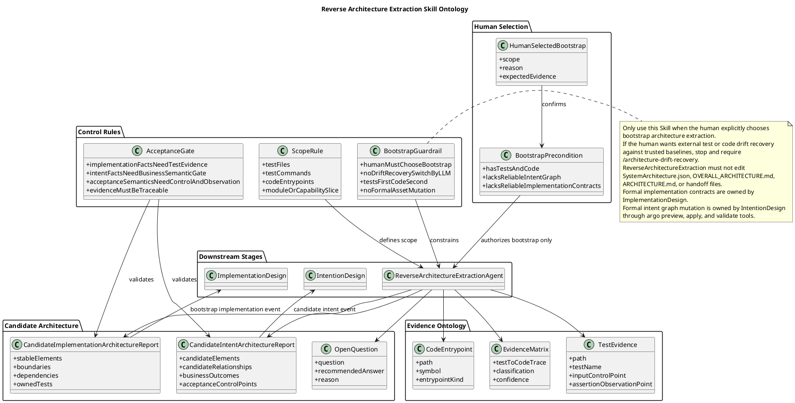
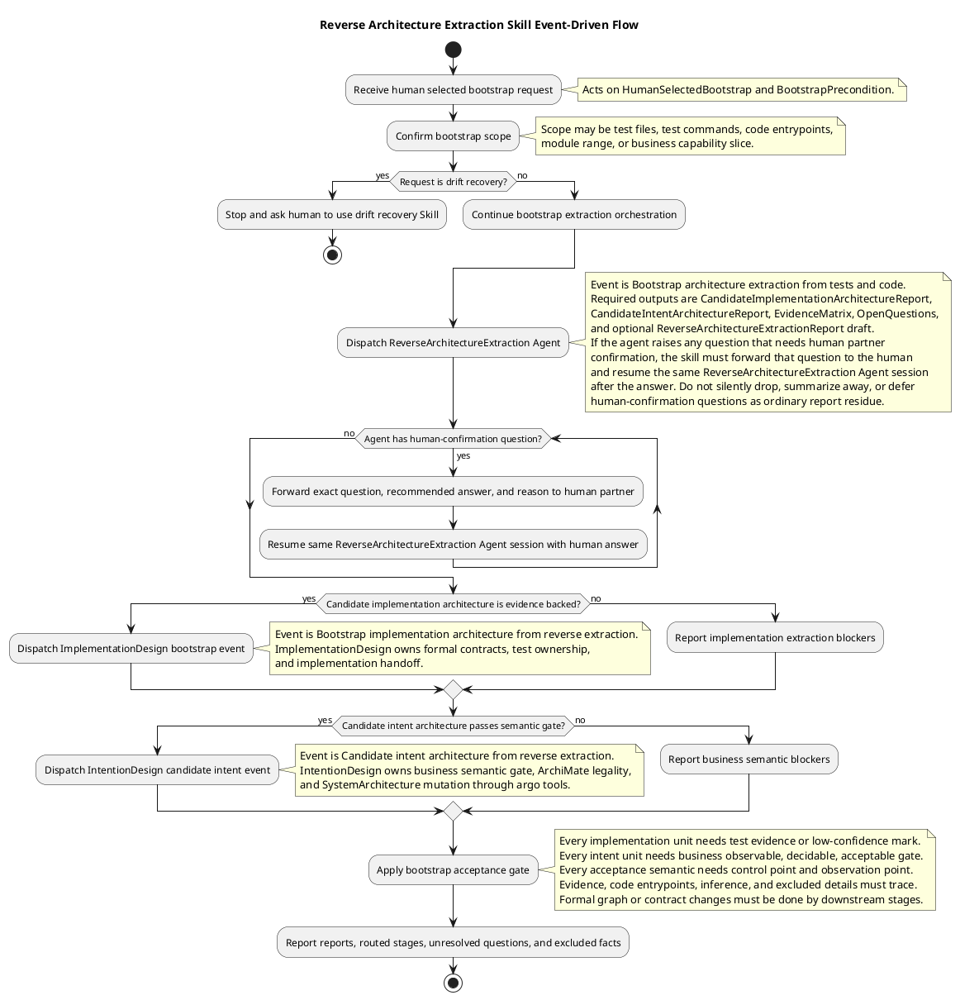

# Reverse Architecture Extraction

### Current Stage

Bootstrap Architecture Extraction Skill.

## Domain Ontology

```plantuml
@startuml ReverseArchitectureExtractionSkill_Cognition
skinparam classAttributeIconSize 0
title Reverse Architecture Extraction Skill Ontology

package "Human Selection" {
  class HumanSelectedBootstrap {
    +scope
    +reason
    +expectedEvidence
  }

  class BootstrapPrecondition {
    +hasTestsAndCode
    +lacksReliableIntentGraph
    +lacksReliableImplementationContracts
  }
}

package "Evidence Ontology" {
  class TestEvidence {
    +path
    +testName
    +inputControlPoint
    +assertionObservationPoint
  }

  class CodeEntrypoint {
    +path
    +symbol
    +entrypointKind
  }

  class EvidenceMatrix {
    +testToCodeTrace
    +classification
    +confidence
  }
}

package "Candidate Architecture" {
  class CandidateImplementationArchitectureReport {
    +stableElements
    +boundaries
    +dependencies
    +ownedTests
  }

  class CandidateIntentArchitectureReport {
    +candidateElements
    +candidateRelationships
    +businessOutcomes
    +acceptanceControlPoints
  }

  class OpenQuestion {
    +question
    +recommendedAnswer
    +reason
  }
}

package "Control Rules" {
  class ScopeRule {
    +testFiles
    +testCommands
    +codeEntrypoints
    +moduleOrCapabilitySlice
  }

  class BootstrapGuardrail {
    +humanMustChooseBootstrap
    +noDriftRecoverySwitchByLLM
    +testsFirstCodeSecond
    +noFormalAssetMutation
  }

  class AcceptanceGate {
    +implementationFactsNeedTestEvidence
    +intentFactsNeedBusinessSemanticGate
    +acceptanceSemanticsNeedControlAndObservation
    +evidenceMustBeTraceable
  }
}

package "Downstream Stages" {
  class ReverseArchitectureExtractionAgent
  class ImplementationDesign
  class IntentionDesign
}

HumanSelectedBootstrap --> BootstrapPrecondition : confirms
BootstrapPrecondition --> ReverseArchitectureExtractionAgent : authorizes bootstrap only
ScopeRule --> ReverseArchitectureExtractionAgent : defines scope
BootstrapGuardrail --> ReverseArchitectureExtractionAgent : constrains
ReverseArchitectureExtractionAgent --> TestEvidence
ReverseArchitectureExtractionAgent --> CodeEntrypoint
ReverseArchitectureExtractionAgent --> EvidenceMatrix
ReverseArchitectureExtractionAgent --> CandidateImplementationArchitectureReport
ReverseArchitectureExtractionAgent --> CandidateIntentArchitectureReport
ReverseArchitectureExtractionAgent --> OpenQuestion
AcceptanceGate --> CandidateImplementationArchitectureReport : validates
AcceptanceGate --> CandidateIntentArchitectureReport : validates
CandidateImplementationArchitectureReport --> ImplementationDesign : bootstrap implementation event
CandidateIntentArchitectureReport --> IntentionDesign : candidate intent event

note right of BootstrapGuardrail
Only use this Skill when the human explicitly chooses
bootstrap architecture extraction.
If the human wants external test or code drift recovery
against trusted baselines, stop and require
/architecture-drift-recovery.
ReverseArchitectureExtraction must not edit
SystemArchitecture.json, OVERALL_ARCHITECTURE.md,
ARCHITECTURE.md, or handoff files.
Formal implementation contracts are owned by
ImplementationDesign.
Formal intent graph mutation is owned by IntentionDesign
through argo preview, apply, and validate tools.
end note
@enduml
```

## Behavior

```plantuml
@startuml ReverseArchitectureExtractionSkill_Behavior
title Reverse Architecture Extraction Skill Event-Driven Flow

start
:Receive human selected bootstrap request;
note right
Acts on HumanSelectedBootstrap and BootstrapPrecondition.
end note

:Confirm bootstrap scope;
note right
Scope may be test files, test commands, code entrypoints,
module range, or business capability slice.
end note

if (Request is drift recovery?) then (yes)
  :Stop and ask human to use drift recovery Skill;
  stop
else (no)
  :Continue bootstrap extraction orchestration;
endif

:Dispatch ReverseArchitectureExtraction Agent;
note right
Event is Bootstrap architecture extraction from tests and code.
Required outputs are CandidateImplementationArchitectureReport,
CandidateIntentArchitectureReport, EvidenceMatrix, OpenQuestions,
and optional ReverseArchitectureExtractionReport draft.
If the agent raises any question that needs human partner
confirmation, the skill must forward that question to the human
and resume the same ReverseArchitectureExtraction Agent session
after the answer. Do not silently drop, summarize away, or defer
human-confirmation questions as ordinary report residue.
end note

while (Agent has human-confirmation question?) is (yes)
  :Forward exact question, recommended answer, and reason to human partner;
  :Resume same ReverseArchitectureExtraction Agent session with human answer;
endwhile (no)

if (Candidate implementation architecture is evidence backed?) then (yes)
  :Dispatch ImplementationDesign bootstrap event;
  note right
Event is Bootstrap implementation architecture from reverse extraction.
ImplementationDesign owns formal contracts, test ownership,
and implementation handoff.
end note
else (no)
  :Report implementation extraction blockers;
endif

if (Candidate intent architecture passes semantic gate?) then (yes)
  :Dispatch IntentionDesign candidate intent event;
  note right
Event is Candidate intent architecture from reverse extraction.
IntentionDesign owns business semantic gate, ArchiMate legality,
and SystemArchitecture mutation through argo tools.
end note
else (no)
  :Report business semantic blockers;
endif

:Apply bootstrap acceptance gate;
note right
Every implementation unit needs test evidence or low-confidence mark.
Every intent unit needs business observable, decidable, acceptable gate.
Every acceptance semantic needs control point and observation point.
Evidence, code entrypoints, inference, and excluded details must trace.
Formal graph or contract changes must be done by downstream stages.
end note

:Report reports, routed stages, unresolved questions, and excluded facts;
stop
@enduml
```
