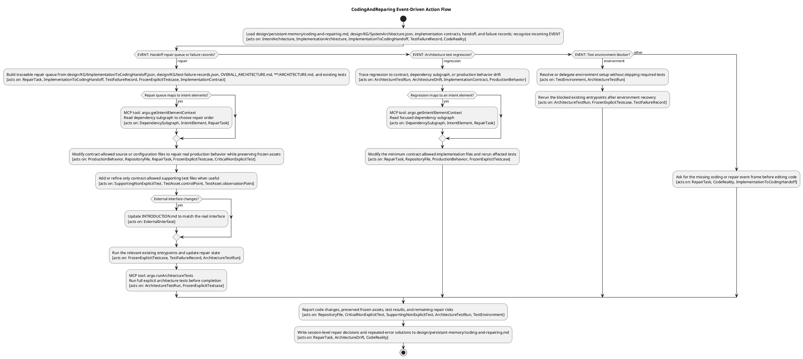

### Current Stage

Coding/Repair

## Cognitive Part: PlantUML Class Diagram

```plantuml
@startuml CodingAndReparing_Cognition
skinparam classAttributeIconSize 0
title Coding/Repair Domain Ontology

package "Intent Ontology" {
  class IntentArchitecture {
    +elements
    +relationships
    +explicitTestcaseBaselines
  }

  class IntentElement {
    +id
    +name
    +type
    +functionalPoints
  }

  class DependencySubgraph {
    +focusElement
    +upstreamDependencies
    +sharedContracts
    +downstreamCapabilities
  }
}

package "Implementation Ontology" {
  class ImplementationArchitecture {
    +contracts
    +stableElements
    +dependencyDirection
    +testOwnership
    +guardrails
  }

  class ImplementationContract {
    +path
    +stableBoundaryRules
    +implementsMappings
    +ownedTestAssets
  }

  class StableImplementationElement {
    +path
    +responsibility
    +publicBoundary
  }

  class ImplementationDependency {
    +source
    +target
    +direction
  }
}

package "Code Ontology" {
  class CodeReality {
    +businessCode
    +tests
    +scripts
    +configuration
    +documentation
  }

  class RepositoryFile {
    +path
    +kind
    +currentBehavior
    +editableInCodingStage
  }

  class ProductionBehavior {
    +input
    +stateTransition
    +output
    +sideEffect
    +errorBehavior
  }

  class ExternalInterface {
    +endpointOrCommand
    +requestContract
    +responseContract
    +documentedInIntroduction
  }
}

package "Repair Ontology" {
  class ImplementationToCodingHandoff {
    +taskExecutionPlan
    +frozenTestAssets
    +expectedFailureSignals
    +concreteContracts
  }

  class TestFailureRecord {
    +testcase
    +acceptanceCriteriaEntrypoint
    +failureSignal
    +failingObservation
  }

  class RepairTask {
    +targetArchitectureEntity
    +targetFailureRecord
    +requiredBehaviorChange
    +traceability
  }

  class ArchitectureDrift {
    +conflictingCodeReality
    +violatedContract
    +repairDirection
  }
}

package "Test Ontology" {
  abstract class TestAsset {
    +path
    +controlPoint
    +observationPoint
    +owner
  }

  class FrozenExplicitTestcase {
    +acceptanceBoundary
    +singleEntrypoint
    +mustNotBeModified
  }

  class CriticalNonExplicitTest {
    +guardrailCategory
    +mustNotBeModified
  }

  class SupportingNonExplicitTest {
    +mayBeAddedOrRefinedWithinContract
    +supportsRepair
  }

  class TestEnvironment {
    +requiredServices
    +requiredFixtures
    +requiredConfiguration
  }

  class ArchitectureTestRun {
    +entrypoints
    +result
    +remainingFailures
  }
}

package "Forbidden Shortcut Ontology" {
  class TestOnlyBusinessCodeShortcut {
    +testStub
    +testBranch
    +testSwitch
    +assertionOnlyReturnField
    +testBackdoor
    +mockOrFixtureFakePass
  }
}

IntentArchitecture "1" *-- "many" IntentElement
DependencySubgraph "1" o-- "many" IntentElement : orders repair by dependencies
ImplementationArchitecture "1" *-- "many" ImplementationContract
ImplementationArchitecture "1" *-- "many" StableImplementationElement
ImplementationArchitecture "1" *-- "many" ImplementationDependency
ImplementationContract --> StableImplementationElement : declares
ImplementationDependency --> StableImplementationElement : source/target
StableImplementationElement --> IntentElement : realizes

CodeReality "1" *-- "many" RepositoryFile
RepositoryFile --> ProductionBehavior : implements
ProductionBehavior --> ExternalInterface : may expose
CodeReality --> ImplementationArchitecture : conforms to or drifts from
ArchitectureDrift --> ImplementationContract : violates
ArchitectureDrift --> RepositoryFile : observed in

ImplementationToCodingHandoff --> RepairTask : defines queue
ImplementationToCodingHandoff --> TestAsset : names frozen or relevant tests
TestFailureRecord --> FrozenExplicitTestcase : records failing acceptance boundary
TestFailureRecord --> RepairTask : creates
RepairTask --> IntentElement : traceable to
RepairTask --> RepositoryFile : modifies allowed files
RepairTask --> ProductionBehavior : repairs real behavior
RepairTask --> ArchitectureDrift : may resolve

TestAsset <|-- FrozenExplicitTestcase
TestAsset <|-- CriticalNonExplicitTest
TestAsset <|-- SupportingNonExplicitTest
ArchitectureTestRun --> FrozenExplicitTestcase : executes
ArchitectureTestRun --> TestEnvironment : requires
SupportingNonExplicitTest --> RepairTask : may verify local repair
TestOnlyBusinessCodeShortcut --> ProductionBehavior : forbidden contamination

note bottom of RepairTask
  Logic rules:
  1. Every repair task must trace to a handoff item, failure record, explicit testcase, or dependency-subgraph entity.
  2. Repairs follow dependency order: upstream dependencies, shared contracts, and prerequisite entrypoints before downstream capabilities.
  3. Repair changes the real production behavior with the minimum code needed.
end note

note bottom of TestAsset
  Logic rules:
  1. Frozen explicit testcases and frozen critical non-explicit tests are read-only in Coding/Repair.
  2. Supporting non-explicit tests may be added or refined only inside contract-allowed locations.
  3. Every test-related design or summary must preserve control point and observation point.
end note

note bottom of TestOnlyBusinessCodeShortcut
  Logic rules:
  Business code must not contain test-only branches, switches, backdoors,
  assertion-only fields, or fake mock/fixture paths to make tests pass.
end note

note bottom of ArchitectureTestRun
  Logic rules:
  1. Existing failing entrypoints are rerun until repaired.
  2. Full explicit architecture tests must pass before completion.
  3. Test environment problems are resolved rather than used to skip tests.
end note
@enduml
```
## Action Part: PlantUML Activity Diagram

```plantuml
@startuml CodingAndReparing_Action
title CodingAndReparing Event-Driven Action Flow

start
:Load design/persistant-memory/coding-and-repairing.md, design/KG/SystemArchitecture.json, implementation contracts, handoff, and failure records; recognize incoming EVENT
[acts on: IntentArchitecture, ImplementationArchitecture, ImplementationToCodingHandoff, TestFailureRecord, CodeReality];

if (EVENT: Handoff repair queue or failure records?) then (repair)
  :Build traceable repair queue from design/KG/ImplementationToCodingHandoff.json, design/KG/test-failure-records.json, OVERALL_ARCHITECTURE.md, **/ARCHITECTURE.md, and existing tests
  [acts on: RepairTask, ImplementationToCodingHandoff, TestFailureRecord, FrozenExplicitTestcase, ImplementationContract];
  if (Repair queue maps to intent elements?) then (yes)
    :MCP tool: argo.getIntentElementContext
    Read dependency subgraph to choose repair order
    [acts on: DependencySubgraph, IntentElement, RepairTask];
  endif
  :Modify contract-allowed source or configuration files to repair real production behavior while preserving frozen assets
  [acts on: ProductionBehavior, RepositoryFile, RepairTask, FrozenExplicitTestcase, CriticalNonExplicitTest];
  :Add or refine only contract-allowed supporting test files when useful
  [acts on: SupportingNonExplicitTest, TestAsset.controlPoint, TestAsset.observationPoint];
  if (External interface changes?) then (yes)
    :Update INTRODUCTION.md to match the real interface
    [acts on: ExternalInterface];
  endif
  :Run the relevant existing entrypoints and update repair state
  [acts on: FrozenExplicitTestcase, TestFailureRecord, ArchitectureTestRun];
  :MCP tool: argo.runArchitectureTests
  Run full explicit architecture tests before completion
  [acts on: ArchitectureTestRun, FrozenExplicitTestcase];

elseif (EVENT: Architecture test regression?) then (regression)
  :Trace regression to contract, dependency subgraph, or production behavior drift
  [acts on: ArchitectureTestRun, ArchitectureDrift, ImplementationContract, ProductionBehavior];
  if (Regression maps to an intent element?) then (yes)
    :MCP tool: argo.getIntentElementContext
    Read focused dependency subgraph
    [acts on: DependencySubgraph, IntentElement, RepairTask];
  endif
  :Modify the minimum contract-allowed implementation files and rerun affected tests
  [acts on: RepairTask, RepositoryFile, ProductionBehavior, FrozenExplicitTestcase];

elseif (EVENT: Test environment blocker?) then (environment)
  :Resolve or delegate environment setup without skipping required tests
  [acts on: TestEnvironment, ArchitectureTestRun];
  :Rerun the blocked existing entrypoints after environment recovery
  [acts on: ArchitectureTestRun, FrozenExplicitTestcase, TestFailureRecord];
else (other)
  :Ask for the missing coding or repair event frame before editing code
  [acts on: RepairTask, CodeReality, ImplementationToCodingHandoff];
endif

:Report code changes, preserved frozen assets, test results, and remaining repair risks
[acts on: RepositoryFile, CriticalNonExplicitTest, SupportingNonExplicitTest, ArchitectureTestRun, TestEnvironment];
:Write session-level repair decisions and repeated-error solutions to design/persistant-memory/coding-and-repairing.md
[acts on: RepairTask, ArchitectureDrift, CodeReality];
stop
@enduml
```