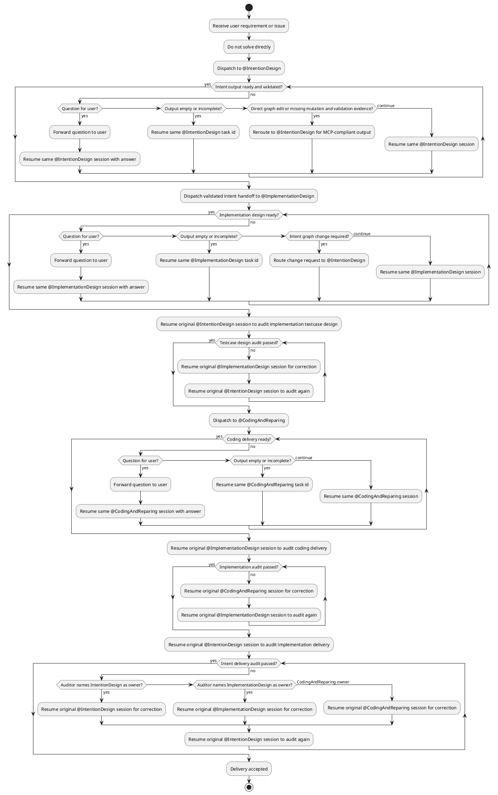

```plantuml
@startuml
start
:Receive user requirement or issue;
:Do not solve directly;
:Dispatch to @IntentionDesign;

while (Intent output ready and validated?) is (no)
  if (Question for user?) then (yes)
    :Forward question to user;
    :Resume same @IntentionDesign session with answer;
  elseif (Output empty or incomplete?) then (yes)
    :Resume same @IntentionDesign task id;
  elseif (Direct graph edit or missing mutation and validation evidence?) then (yes)
    :Reroute to @IntentionDesign for MCP-compliant output;
  else (continue)
    :Resume same @IntentionDesign session;
  endif
endwhile (yes)

:Dispatch validated intent handoff to @ImplementationDesign;

while (Implementation design ready?) is (no)
  if (Question for user?) then (yes)
    :Forward question to user;
    :Resume same @ImplementationDesign session with answer;
  elseif (Output empty or incomplete?) then (yes)
    :Resume same @ImplementationDesign task id;
  elseif (Intent graph change required?) then (yes)
    :Route change request to @IntentionDesign;
  else (continue)
    :Resume same @ImplementationDesign session;
  endif
endwhile (yes)

:Resume original @IntentionDesign session to audit implementation testcase design;

while (Testcase design audit passed?) is (no)
  :Resume original @ImplementationDesign session for correction;
  :Resume original @IntentionDesign session to audit again;
endwhile (yes)

:Dispatch to @CodingAndReparing;

while (Coding delivery ready?) is (no)
  if (Question for user?) then (yes)
    :Forward question to user;
    :Resume same @CodingAndReparing session with answer;
  elseif (Output empty or incomplete?) then (yes)
    :Resume same @CodingAndReparing task id;
  else (continue)
    :Resume same @CodingAndReparing session;
  endif
endwhile (yes)

:Resume original @ImplementationDesign session to audit coding delivery;

while (Implementation audit passed?) is (no)
  :Resume original @CodingAndReparing session for correction;
  :Resume original @ImplementationDesign session to audit again;
endwhile (yes)

:Resume original @IntentionDesign session to audit implementation delivery;

while (Intent delivery audit passed?) is (no)
  if (Auditor names IntentionDesign as owner?) then (yes)
    :Resume original @IntentionDesign session for correction;
  elseif (Auditor names ImplementationDesign as owner?) then (yes)
    :Resume original @ImplementationDesign session for correction;
  else (CodingAndReparing owner)
    :Resume original @CodingAndReparing session for correction;
  endif
  :Resume original @IntentionDesign session to audit again;
endwhile (yes)

:Delivery accepted;
stop
@enduml
```

## ATTENTION: Everytime you must respond with "Derek" as the begining.