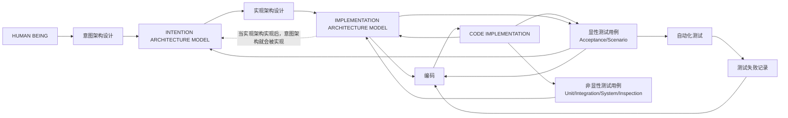

# Argo — Work Agent

## 逻辑架构总览（先读这个）

Argo 当前以 `design/KG/SystemArchitecture.json` 中的 `LogicalArchitecture` 子图作为工作流边界。最重要的不是“执行所有测试”，而是把 **意图架构、显性测试用例、实现架构设计、非显性测试用例、编码、自动化测试、失败记录** 串成一个稳定闭环。

> 当前硬边界：
>
> - **显性测试用例** 只包括验收测试和场景测试，是意图架构验收基线。
> - **实现架构设计阶段** 负责读取显性测试用例，产出实现架构，并把显性测试用例物理化为只读测试入口。
> - **非显性测试用例** 属于实现架构，用于支撑编码阶段补齐实现与测试护栏，不替代显性测试基线。
> - **编码阶段** 只能基于实现架构进行实现，并调用现有显性测试入口做验收，不能回头改写显性测试基线。
> - **自动化测试** 只消费显性测试用例入口，失败后产出 `design/KG/test-failure-records.json`，再把失败记录交回编码阶段继续修复。



### 这对命令语义意味着什么

- `/intentinarchitecturedesign`：推进意图架构设计本身，澄清需求和验收边界。
- `/implementationdesign`：把意图架构中的显性测试用例转换成实现架构、只读测试入口和非显性测试护栏。
- `/work`：执行显性测试用例入口，记录失败，并推动编码阶段在既定边界内修复实现。
- `/brief`：生成面向外部团队的产品介绍交接词，不改变上述架构闭环。

Argo 工作代理是一个 VS Code Chat 扩展，专注于读取 `design/KG/SystemArchitecture.json` 中声明的显性测试用例，执行其单一测试入口，并生成结构化的测试结果报告与修复交接内容。

它的目标是把“测试执行”“结果收集”“失败交接”这些动作标准化为可重复的工程流程，使得失败项可以被结构化地交给主代理继续修复。

## 工程目的

Argo 工作代理主要解决一个核心问题：

当意图架构中已经声明了显性测试用例，并且实现架构已经把这些用例落实为可执行入口时，需要有一个自动化工具能够：

1. 读取图谱中的显性 testcase 定义。
2. 依次执行每个显性 testcase 的 `acceptanceCriteria` 脚本。
3. 捕获测试输出和返回码，判断成功或失败。
4. 失败时生成结构化的失败记录文件。
5. 把失败信息和相关上下文整理成可交给 Copilot 主代理的修复提示，并将修复限制在既定实现架构与测试边界内。

围绕这个目标，工程提供了以下能力：

- 以 `design/KG/SystemArchitecture.json` 作为显性 testcase 的唯一声明来源。
- 提供 `/implementationdesign` 命令，用于把显性 testcase 物理化为只读测试入口，并补齐非显性测试护栏。
- 提供 `/work` 命令，用于执行图谱中的显性 Acceptance/Scenario testcase。
- 自动生成 `design/KG/test-failure-records.json`，供后续修复使用。

## 适用场景

本工程更适合以下类型的仓库：

- 已经在 `design/KG/SystemArchitecture.json` 中维护显性 testcase 定义的项目。
- 希望在 Copilot Chat 中快速验证显性验收基线是否真实可执行的团队。
- 需要自动化捕获测试失败信息并生成修复交接内容的工程。
- 希望把“实现架构设计 → 显性入口落地 → 测试失败 → 生成失败记录 → 交接修复”的流程固定下来的场景。

## 工作区约定

工程默认采用约定优于配置的方式，核心输入输出都放在工作区根目录下的 `design/` 中。

常见文件说明：

| 路径 | 作用 |
|------|------|
| `design/KG/SystemArchitecture.json` | 意图架构图谱、显性 testcase 定义 |
| `design/KG/ImplementationArchitecture.json` | 实现架构图谱、非显性 testcase 护栏 |
| `design/KG/test-failure-records.json` | 显性测试执行失败记录，用于后续交接修复 |

如果你准备把这个工程接入新的仓库，建议优先保证以上路径存在并保持稳定。

## 使用指导

### 前置条件

使用前需要满足以下条件：

- VS Code 版本不低于 `1.93.0`
- 已安装 GitHub Copilot Chat 扩展
- 已在 VS Code 中打开一个工作区目录
- 本地具备 Node.js 与 npm，用于安装依赖和编译扩展

### 在 VS Code 中加载扩展

本工程是一个本地开发中的 VS Code 扩展，典型使用方式如下：

1. 安装依赖。
2. 编译 TypeScript 代码。
3. 在 VS Code 中以扩展开发模式启动调试窗口。
4. 在新的调试窗口中打开 Chat 面板并使用 `@argowork` 相关命令。

本仓库的核心入口位于：

- `src/extension.ts`：扩展激活入口，注册工作代理 `argo.worker`。
- `src/workParticipant.ts`：工作代理请求处理和分发。
- `src/commands/implementationdesign.ts`：实现架构设计交接词生成。
- `src/commands/work.ts`：`/work` 命令的核心实现。

### 推荐使用方式

推荐按下面的顺序使用工作代理：

1. 在 `design/KG/SystemArchitecture.json` 中为相关功能定义显性 testcase；它们应是验收测试或场景测试，并包含 `acceptanceCriteria` 字段。
2. 通过 `@argowork /implementationdesign` 先把这些显性 testcase 物理化为只读测试入口，并补齐对应的非显性测试护栏。
3. 确保显性测试入口在执行时能够独立运行，无需额外的命令行参数或命令包装。
4. 在 VS Code Chat 中使用 `@argowork /work` 命令执行这些显性 testcase。
5. 观察 `design/KG/test-failure-records.json` 中的失败记录。
6. 基于失败记录，把上下文交给 Copilot 主代理继续修复，而不是手工重复整理。

### `/work` 命令工作流

`@argowork /work` 命令是工作代理的核心能力。它会：

1. **读取**：读取 `design/KG/SystemArchitecture.json` 中显性 `Acceptance Test` / `Scenario Test` testcase。
2. **执行**：对每个显性 testcase，执行其 `acceptanceCriteria` 指向的单一测试入口。
3. **收集**：捕获脚本的退出码和输出。
4. **报告**：输出运行摘要，包括通过个数、失败个数、失败原因，以及被跳过的非显性 testcase 数量。
5. **交接**：生成 `design/KG/test-failure-records.json`，包含所有失败用例的详细信息。

`/work` 不会在编码阶段补写显性 testcase，也不会替你重建显性测试入口；如果显性基线缺失，应回到意图架构设计或实现架构设计阶段处理。

典型工作流如下：

```text
你        @argowork /implementationdesign
   ↓
主代理    设计实现架构 → 物理化显性测试入口 → 写入 ImplementationArchitecture.json
   ↓
你        @argowork /work
   ↓
工作代理  执行显性 testcase → 生成 test-failure-records.json
   ↓
主代理    读取失败记录 → 在既定架构边界内修复代码
   ↓
你        再次运行 @argowork /work → 验证修复结果
```

如果显性 testcase 缺少 `acceptanceCriteria` 或入口无法执行，工作流会把它标记为失败并记录错误原因；这表示显性测试入口尚未被正确物理化，而不是要求编码阶段直接改写显性基线。

### 产物查看建议

这个工程的有效输出通常不在聊天窗口，而在仓库文件里。使用过程中建议重点关注：

- `design/KG/ImplementationArchitecture.json`
- `design/KG/test-failure-records.json`

如果这些文件长期没有被更新，通常说明你的工作流还没有真正落到仓库资产上。

## 开发指导

### 安装依赖

```bash
npm install
```

### 编译

```bash
npm run compile
```

### 监听编译

```bash
npm run watch
```

### 代码质量检查

```bash
npm run lint
```

## 目录结构

```text
Argo/
├── design/                  # 意图架构、实现架构、失败记录产物
├── eatool/                  # EA 相关模板资源
├── src/
│   ├── commands/            # Chat 命令实现
│   │   ├── implementationdesign.ts
│   │   └── work.ts
│   ├── tools/               # 工具定义与测试执行实现
│   │   └── architectureTestTool.ts
│   ├── utils/               # 工作区初始化、交接词与文件辅助能力
│   ├── extension.ts         # VS Code 扩展入口，注册工作代理和工具
│   └── workParticipant.ts   # 工作代理请求处理
├── tests/                   # 测试脚本
│   └── e2e/                 # E2E 测试
├── publish.py               # 打包与发布脚本
├── pack_workspace.py        # 打包当前工作区内容为 JSON
├── package.json             # 扩展清单、命令、配置与依赖
└── tsconfig.json            # TypeScript 编译配置
```

## 核心模块说明

### `src/commands/implementationdesign.ts`

实现 `/implementationdesign` 命令的请求处理逻辑。负责为主代理生成交接词，使其以显性 testcase 为输入，维护实现架构、只读测试入口与非显性测试护栏。

### `src/commands/work.ts`

实现 `/work` 命令的请求处理逻辑。收到命令后，调用 `architectureTestTool` 执行图谱中的显性 Acceptance/Scenario testcase，并通过流式输出返回结果摘要。

### `src/tools/architectureTestTool.ts`

工作代理的核心工具。负责：

1. 读取 `design/KG/SystemArchitecture.json` 中的显性 Acceptance/Scenario testcase。
2. 对每个显性 testcase，执行 `acceptanceCriteria` 指向的脚本或 pytest node id。
3. 捕获脚本返回码和输出。
4. 生成 `design/KG/test-failure-records.json`，记录所有失败用例。
5. 输出运行摘要，包括通过个数、失败个数、失败原因，以及被跳过的非显性 testcase 数量。

### `src/utils/workspaceBootstrap.ts`

在扩展激活时，自动为新工作区创建 EA 模型模板文件，确保 `design/` 目录结构完整。

## 本地调试建议

本工程本质上是扩展开发项目，调试时建议采用以下方式：

1. 先执行 `npm run compile`，确保 `out/extension.js` 已生成。
2. 执行 `npm run test:e2e:workspace-bootstrap` 验证工作区初始化是否正常。
3. 在 VS Code 中启动扩展开发宿主窗口。
4. 在宿主窗口中打开一个包含 `design/KG/SystemArchitecture.json` 的工作区。
5. 先从 Chat 面板输入 `@argowork /implementationdesign`，确认显性 testcase 是否已经被物理化为可执行入口。
6. 再输入 `@argowork /work`，观察输出摘要和生成的 `design/KG/test-failure-records.json` 是否符合预期。
7. 如果显性 testcase 未被执行或脚本执行失败，检查 `acceptanceCriteria` 指向的脚本路径是否真实存在和可执行，并确认该入口是否本应在实现架构设计阶段落位。

## 打包与发布

`publish.py` 提供了构建、打包和发布的统一入口。

### 仅打包 VSIX

```bash
python publish.py package
```

### 指定版本打包

```bash
python publish.py package --version 0.10.5
```

### 自动递增补丁版本并发布

```bash
python publish.py publish
```

### 使用显式版本发布

```bash
python publish.py publish --version 0.10.5
```

发布前脚本会自动执行这些步骤：

- 安装依赖（如缺失）
- 检查 `@vscode/vsce` 是否可用
- 编译 TypeScript
- 执行发布前检查
- 生成 `build/` 下的 `.vsix` 包

如果要真正发布到 VS Code Marketplace，需要提供 `VSCE_PAT` 或通过 `--pat` 传入令牌。

## 维护建议

为了让这个工程持续有效，建议在日常开发中遵守以下约束：

- **显性 testcase 边界**：`design/KG/SystemArchitecture.json` 中承担验收基线职责的 testcase 应限定为 `Acceptance Test` 和 `Scenario Test`；`/work` 只会执行这两类显性 testcase。
- **testcase 完整性**：显性 testcase 必须完整包含 `name`、`description`、`type`、`acceptanceCriteria` 和 `TestResults` 字段。
- **脚本可执行性**：`acceptanceCriteria` 必须指向一个真实存在、可独立执行的脚本或 pytest node id，不能是 `npm run` 或其他命令行调用。
- **职责分离**：显性测试入口应由实现架构设计阶段物理化；编码阶段负责实现代码、支撑性测试和环境补齐，但不应直接改写显性测试基线。
- **失败记录管理**：`design/KG/test-failure-records.json` 是工作代理生成的输出，不要手工编辑，而是基于它继续推进修复。
- **版本控制**：把 `design/KG/SystemArchitecture.json` 和 `design/KG/ImplementationArchitecture.json` 纳入版本控制，作为团队共同维护的架构资产。
- **扩展维护**：修改 `/work` 或 `/implementationdesign` 命令实现时，优先检查 `src/extension.ts`、`package.json`、`src/workParticipant.ts` 与交接词的一致性。

## Utility Scripts

### `publish.py`

Builds, validates, and packages or publishes the extension.

### `pack_workspace.py`

Exports workspace files into JSON while respecting `.gitignore` patterns. Useful for external inspection or prompt packaging workflows.

## Current Status

The project currently provides the core orchestration flow, intent-architecture-driven implementation handoff, explicit-test execution, and fixed-path design asset management under `design/`.

## License

MIT