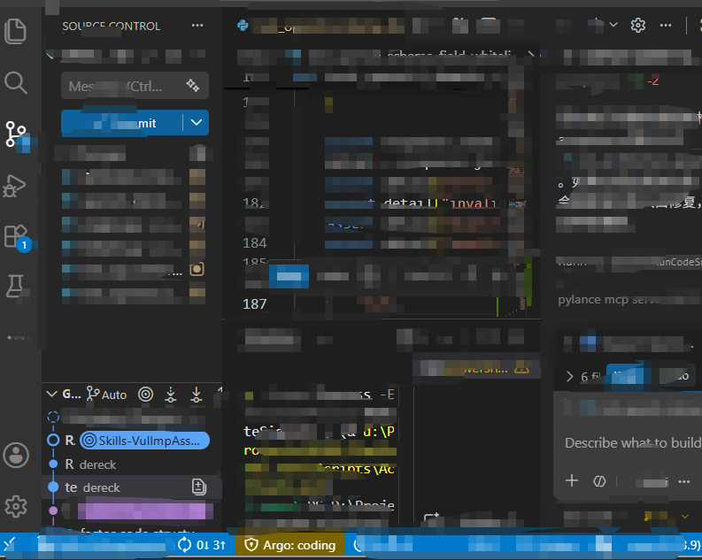
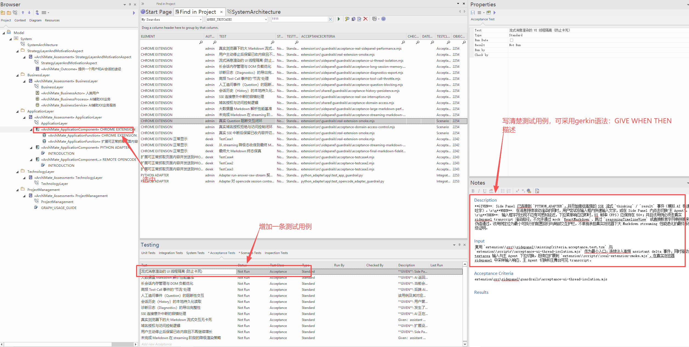
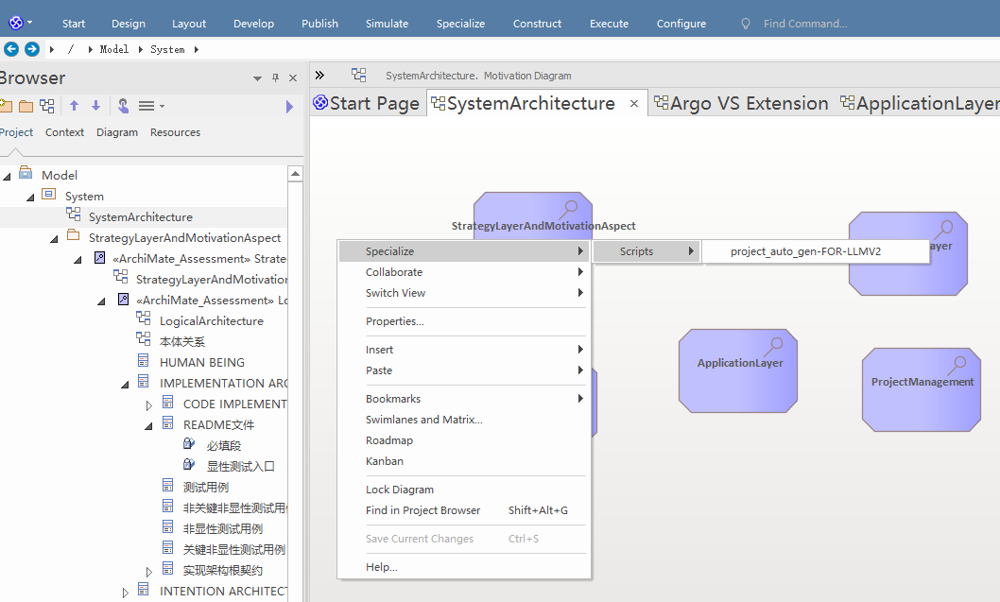

# Argo

Argo 是一个 VS Code Chat 扩展，用来把意图架构、实现架构设计、编码修复和测试执行串成一个受约束的闭环。

当前扩展在 VS Code 中的显示名称是 `Argo - Agentic Workflow Orchestrator`，聊天参与者名称是 `@argowork`。

## 这个工具能做什么

Argo 的核心价值，是把“架构意图”变成“可执行、可交接、可回归”的工程流程。

### 1. 基于意图架构驱动后续工作

Argo 以 `design/KG/SystemArchitecture.json` 作为核心输入，围绕其中定义的意图元素和测试边界组织后续动作，而不是直接从零开始猜需求。

### 2. 生成面向主代理的结构化交接提示

Argo 不直接替代 Coding Agent，而是通过固定命令生成高约束的 handoff prompt，把任务明确切到不同阶段：

- `/brief`：生成对外产品介绍提示。
- `/intentinarchitecturedesign`：生成意图架构设计提示。
- `/implementationdesign`：生成实现架构设计提示。
- `/work`：执行测试并生成编码修复交接。
- `/idle`：退出当前 guard 阶段。

### 3. 执行架构关联测试并生成失败记录

`/work` 会运行 `design/KG/SystemArchitecture.json` 中声明的测试入口，汇总结果，并把失败信息写入 `design/KG/test-failure-records.json`，供后续修复继续使用。

### 4. 保护测试边界不被编码阶段随意改写

进入 `/work` 对应的编码阶段后，Argo 会启用 guard 机制，阻止代理直接修改被保护的测试入口，从而减少“通过改测试让测试通过”的漂移行为。



当界面下方显示 `Argo:coding` 时，表示当前处于编码 guard 阶段。

### 5. 固化一个清晰的工程闭环

Argo 期望推动的流程如下：

```text
意图架构（含显性测试用例定义的验收标准） -> 【实现架构设计】 -> 实现架构（含具体实现的显性和非显性测试用例） -> 【编码】 -> 代码
```

从实现关系看，编码阶段要做的事情是：

```text
【编码】通过满足所有测试用例，实现代码对实现架构、意图架构的实现
```

## 使用指导

### 1. 安装插件

1. 打开 VS Code 插件市场。
2. 搜索 `Argo - Agentic Workflow Orchestrator`。
3. 点击安装。
4. 用 VS Code 打开你的目标项目工作区。

### 2. 在 EA 中建模并导出意图架构图谱

1. 在 EA 中完成意图架构建模。
2. 在相关意图元素上挂显性测试用例。
3. 为每个显性测试用例填写 `acceptanceCriteria`。

4. 通过 EA 导出脚本生成 `design/KG/SystemArchitecture.json`。

5. 确认目标项目中存在 `design/KG/SystemArchitecture.json`。

### 3. 准备目标项目目录

目标项目至少准备以下内容：

```text
your-project/
├── design/
│   └── KG/
│       ├── SystemArchitecture.json
│       └── test-failure-records.json
└── tests/
```

显性测试入口使用的脚本文件后缀应为以下之一：

- `.js`
- `.cjs`
- `.mjs`
- `.py`
- `.ps1`
- `.cmd`
- `.bat`

### 4. 执行 `/implementationdesign`

1. 打开 VS Code Chat。
2. 输入以下命令：

```text
@argowork /implementationdesign
```

3. 复制生成的提示词。
4. 将提示词交给 Coding Agent。
5. 让 Coding Agent 基于意图架构和显性测试用例完成实现架构设计。

### 5. 接收实现架构设计交付物

执行完 `/implementationdesign` 后，检查仓库中是否已交付以下内容：

1. 目录和文件结构。
2. 根目录 `OVERALL_ARCHITECTURE.md`。
3. 各关键目录下的 `ARCHITECTURE.md`。
4. 回填后的显性测试入口。
5. 关键非显性测试用例。
6. 非关键非显性测试用例。

### 6. 执行 `/work`

1. 在 VS Code Chat 中输入以下命令：

```text
@argowork /work
```

2. 等待显性测试执行完成。
3. 检查生成的 `design/KG/test-failure-records.json`。
4. 复制 `/work` 生成的提示词。
5. 将提示词交给 Coding Agent。

### 7. 让 Coding Agent 编码

1. 让 Coding Agent 基于以下输入进行实现：`design/KG/SystemArchitecture.json`、`OVERALL_ARCHITECTURE.md`、相关目录下的 `ARCHITECTURE.md`、显性测试入口、非显性测试用例、`design/KG/test-failure-records.json`。
2. 让 Coding Agent 以通过所有测试用例为目标完成编码。

### 8. 回归验证

1. 再次执行：

```text
@argowork /work
```

2. 重复“编码 -> `/work` 回归”直到所有测试通过。

## 命令清单

### `@argowork /brief`

用途：生成面向外部团队或潜在采用方的项目介绍提示词。

### `@argowork /intentinarchitecturedesign`

用途：生成意图架构设计提示词。

### `@argowork /implementationdesign`

用途：生成实现架构设计提示词。

### `@argowork /work`

用途：执行显性测试，生成失败记录和编码提示词。

### `@argowork /idle`

用途：退出当前 guard 阶段。