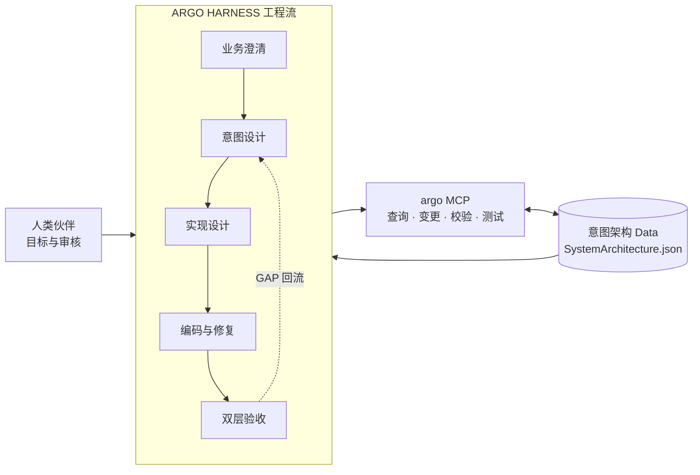

# ARGO HARNESS

ARGO 是一套由**架构知识图谱驱动**的 AI Coding Harness，面向企业级复杂项目，把业务意图、架构决策、测试门禁和 Agent 协作组织成可追溯、可验证、可回归的交付闭环。

它不假设模型天然稳定，而是通过工程系统提高交付确定性：

$$Total\ Certainty = C \times \frac{(P \cdot B) \times E}{G}$$

| 因子 | 含义 | ARGO 的工程锚点 |
| --- | --- | --- |
| `C` | 目标清晰度 | 业务拷问、结构化决策、显性验收 |
| `P` | 协议规范 | 意图图谱、实现契约、阶段 handoff |
| `B` | 边界约束 | Schema、MCP validator、测试、人类门禁 |
| `E` | 模型能效 | 聚焦架构子图、稳定事实源、清晰模块边界 |
| `G` | 任务颗粒度 | 架构依赖切分、顺序交付、独立会话 |

完整推导见[ARGO 工程哲学：确定性交付公式的工程化](notes/ai-engineering/ARGO%20工程哲学：确定性交付公式的工程化.md)。

## 核心方法

ARGO 由三个相互制约的构件组成：


```mermaid
flowchart LR
    H[人类伙伴<br/>目标与审核] --> F

    subgraph F[ARGO HARNESS 工程流]
        BP[业务澄清] --> ID[意图设计]
        ID --> IM[实现设计]
        IM --> CR[编码与修复]
        CR --> A[双层验收]
        A -. GAP 回流 .-> ID
    end

    F --> M[argo MCP<br/>查询 · 变更 · 校验 · 测试]
    M <--> K[(意图架构 Data<br/>SystemArchitecture.json)]
    K --> F
```

1. **意图架构 Data**：`design/KG/SystemArchitecture.json` 用 ArchiMate 元素、关系、view 和显性 testcase 保存目标、能力、依赖、约束与验收语义。
2. **架构服务 MCP**：统一 `argo` 服务提供图谱查询、受控 mutation、Schema/语义校验、handoff 校验和架构测试。
3. **HARNESS 工程流**：BusinessPartner、IntentionDesign、ImplementationDesign、CodingAndReparing 与双层验收在明确权限下协作。

深入了解：[总体架构](design/architecture.md) · [意图架构设计](design/intent-architecture/README.md) · [HARNESS 工程流程](design/argo-harness/README.md)

## 一次交付如何运行

```text
业务澄清
  → 决策内化到意图架构
  → 意图设计与人类验收审核
  → 实现设计与人类测试审核
  → 编码/修复直到测试通过
  → 代码实现验收
  → 意图交付验收
```

上层可以读取下层事实做判断，下层不能越权改写上层：

| 阶段 | 负责 | 不负责 |
| --- | --- | --- |
| BusinessPartner | 目标、方案、风险、控制点和观测点 | 实现设计、编码 |
| IntentionDesign | 意图图谱、覆盖、显性 testcase | 业务代码、实现契约 |
| ImplementationDesign | 稳定边界、测试入口、实现 handoff | 直接修改意图图谱 |
| CodingAndReparing | 真实生产行为、失败记录清零 | 冻结测试、架构契约 |

Agent 与 Skill 的完整分工见[Agent 与 Skill 设计](design/argo-harness/agents-and-skills.md)。

## 快速上手

### 部署

平台 bundle 必须与统一 `.argo/` 目录一起复制到目标工作区根目录：

| 版本 | 适用环境 | 部署内容 | 主入口 |
| --- | --- | --- | --- |
| [Cursor 版](.cursor/) | Cursor | `.cursor/` + `.argo/` | `/business-partner`、`/orchestrating` |
| [Copilot 版](.github/) | GitHub Copilot | `.github/` + `.argo/` | `BusinessPartner`、`Orchestrator` |
| [OpenCode 版](.opencode/) | OpenCode | `.opencode/` + `.argo/` | `BusinessPartner`、`Orchestrator`、`/argoinit`、`/argotest` |

三平台都注册名为 `argo` 的 MCP 服务，入口为：

```text
node ${workspaceFolder}/.argo/scripts/argo-mcp-server.js
```

部署后确认：

1. 平台能发现 `argo` MCP；
2. `design/KG/SystemArchitecture.json` 存在；
3. `validateSystemArchitecture` 可执行；
4. 当前工作使用正确的 Agent 或 Skill 入口。

MCP 的工具参数、写入副作用和推荐调用顺序见[意图架构 MCP 功能列表](design/mcp/意图架构%20MCP%20功能列表.md)。

### 选择正确入口

| 当前情况 | 从这里开始 |
| --- | --- |
| 新需求或业务方案 | `BusinessPartner` / `/business-partner`，随后 `/task-tidy` |
| 缺陷或失败测试 | `Orchestrator` / `/orchestrating`，先判断意图、实现或代码问题 |
| 没有可信架构基线 | `/reverse-architecture-extraction` |
| 有可信基线但代码/测试被外部修改 | `/architecture-drift-recovery` |
| 需要发现架构优化候选 | `/improve-codebase-architecture` |
| Agent 重复偏航或规则需要沉淀 | `/distill-agent-rules` |

完整判断条件、输入建议和产出见[使用场景与入口选择](design/argo-harness/usage-scenarios/README.md)。

## 设计文档导航

| 主题 | Deep dive |
| --- | --- |
| 文档体系与事实源 | [设计文档总导航](design/README.md) |
| 三大核心构件 | [总体架构](design/architecture.md) |
| 工程阶段、门禁和 handoff | [HARNESS 工程流程](design/argo-harness/README.md) |
| Agent、Skill 与平台映射 | [Agent 与 Skill 设计](design/argo-harness/agents-and-skills.md) |
| 使用场景 | [使用场景与入口选择](design/argo-harness/usage-scenarios/README.md) |
| ArchiMate、viewpoint 与显性验收 | [意图架构设计](design/intent-architecture/README.md) |
| MCP 工具接口 | [意图架构 MCP 功能列表](design/mcp/意图架构%20MCP%20功能列表.md) |
| 图谱校验和失败引导 | [MCP 校验机制](design/validator/intent-architecture-mcp-validation.md) |
| Schema 与 Enterprise Architect | [Schema 与 EA 映射](design/schema-ea-mapping.md) |
| 方案对比 | [ARGO、OpenSpec、Superpowers、ECC](design/marketing/solution-comparison-argo-openspec-superpower-ecc.md) |

`design/` 保存稳定、已确认的设计规范；`notes/` 保存研究、推导和候选观点。设计文档引用研究依据，但不把研究笔记当作运行时事实源。

## 持续扩展

ARGO 的稳定底座是：

```text
意图架构模板 + argo MCP + HARNESS 工程流
```

不同项目可以在底座上选择领域模板。每个模板可组合：

- 默认意图架构和 viewpoint；
- 领域 Skill 与知识库；
- 编码规范和实现边界；
- 测试环境、设备或外部服务控制接口；
- 构建、运行、观测和验收证据。

| 已有领域 | 能力 |
| --- | --- |
| [HarmonyOS 与跨端移动开发](design/specific-domain/harmonyos/README.md) | ArkTS/ArkUI、设备环境、窗口分析、跨端比较、构建运行和交付预检 |

新增模板应放在 `design/specific-domain/<domain>/`，领域 Skill 放在 `.argo/skills/<domain>/` 或相应平台适配目录。领域能力不能绕过通用意图设计、实现设计和双层验收。

更多扩展约定见[领域模板索引](design/specific-domain/README.md)。
