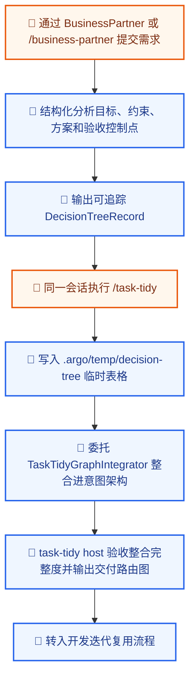
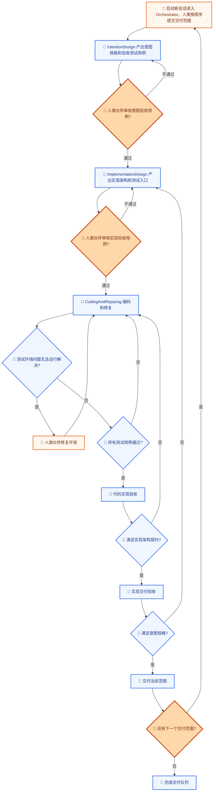
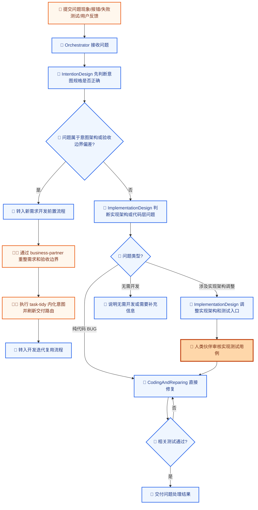
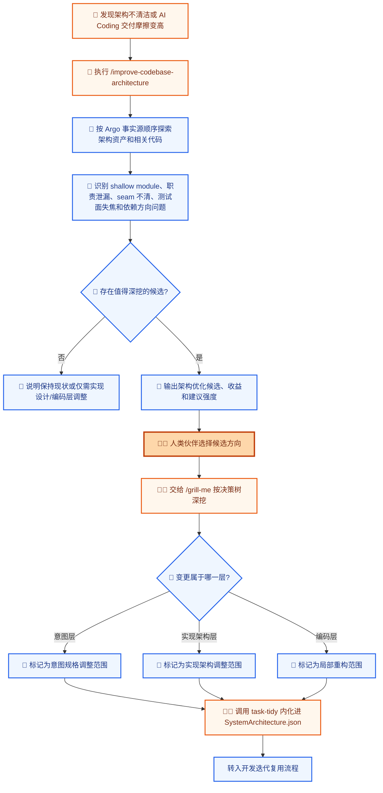
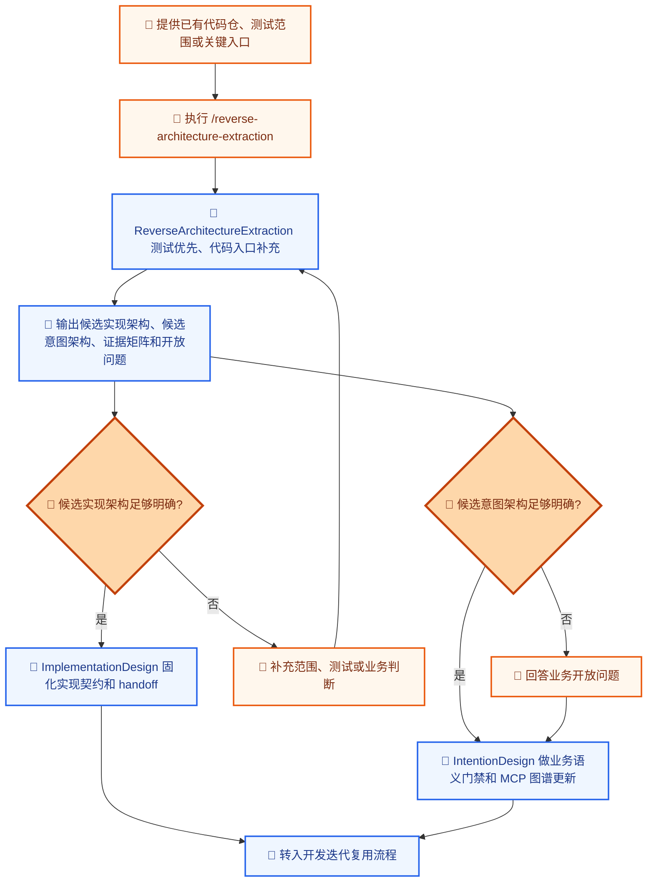
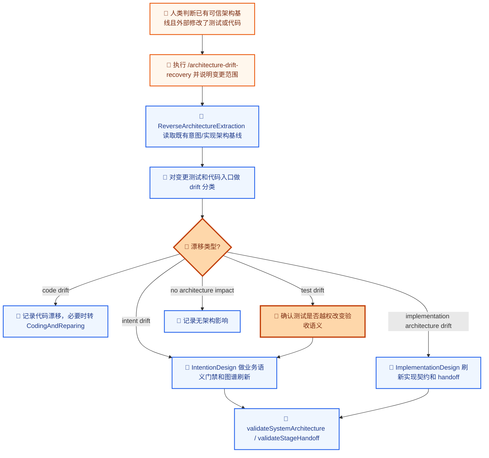
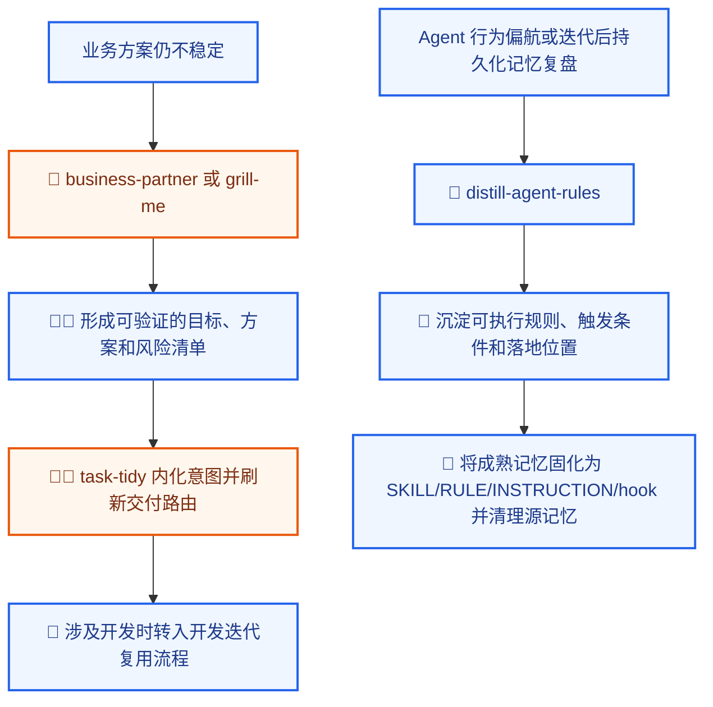

# Argo HARNESS

Argo 是一套AI Coding Harness，主要面向企业级复杂项目开发，实现可追溯、可验证、可回归的高质量AI自动化交付，同时形成产品、架构决策等组织资产沉淀。它基于当前AI Coding主流方法论(SDD、TDD)做了进一步增强，包括：
* SDD增强：采用形式化建模语言进行意图规格编写，并通过工具自动检查AI输出的架构模型，从而使得SPEC的编写更规范、更可控；
* TDD增强：传统的TDD是在编码阶段才开始写测试用例，而本实践是在意图设计阶段就开始设计验收测试用例，实现架构设计阶段基于验收用例进一步构建测试框架并细分出系统测试用例和集成测试用例传递给编码阶段；
* DDD引入：通过意图图谱和实现架构契约显性沉淀领域概念、业务能力、约束、关系和边界，使领域知识不只停留在对话中，而是成为后续设计、编码、验收和回归的稳定上下文；
* 复盘自进化：通过会话偏航复盘和迭代后持久化记忆复盘，将稳定复现的 Agent 行为约束、工作流和守卫固化为 SKILL、RULE、INSTRUCTION 或 hook；各阶段 Agent Behavior 中内置 `distill` EVENT 分支，可在连续犯错后成功后按确定性公式因子自动触发自蒸馏，形成可持续进化的 AI 协作机制；

架构模型、测试用例和复盘提炼出的规则/技能均是天然的项目事实资产，一旦形成便成了AI持续迭代的上下文，从而组织成一个可重复、可验证、可回归、可自进化的闭环。

本项目背后的核心理念见：
 * 《[ARGO工程哲学](notes/ARGO%20工程哲学：确定性交付公式的工程化.md)》；
 * 基于架构依赖、Sequential Gravity Chain 与 G 估算的 AI 任务编排方法论，见《[驯服高维空间的重力：基于架构依赖的 AI 任务编排方法论](notes/驯服高维空间的重力：基于架构依赖的%20AI%20任务编排方法论.MD)》；
 * 三阶段 Agent 如何通过 **Domain Ontology（领域本体）** 与 **Behavior（事件驱动行为流）** 构成可审计的认知规格，见《[ARGO 领域本体与 Agent 行为：认知规格与事件驱动交付](notes/ARGO%20领域本体与%20Agent%20行为：认知规格与事件驱动交付.md)》；
 * 确定性交付公式与 Agent 自进化机制，见《[ARGO 工程哲学：确定性交付公式的工程化.md](notes/ARGO%20工程哲学：确定性交付公式的工程化.md)》。

## 持续扩展
本项目是一个顶层脚手架，不同的项目均可以基于本脚手架进一步扩展，包括：
* 从三大阶段Agent扩展出专业子Agent；
* 为不同类型的项目增加 SKILL，沉淀在 `.argo/skills/` 并配置给各阶段 Agent（如 ArchiMate viewpoint 建模 SKILL、鸿蒙应用开发相关 SKILL）

## 本方案和业界主流AI Coding Harness方案的对比：

本文对比 ARGO、OpenSpec、SUPERPOWER、ECC 四类 AI Coding Harness 方案。完整分析见 `design/marketing/solution-comparison-argo-openspec-superpower-ecc.md`；下表保留最关键的选型维度。

| 对比维度      | ARGO                                   | OpenSpec                                 | SUPERPOWER                                             | ECC                                             |
| --------- | -------------------------------------- | ---------------------------------------- | ------------------------------------------------------ | ----------------------------------------------- |
| 一句话定位     | 面向高确定性交付的架构治理工作流                       | 面向快速协作的轻量规格层                             | 面向高效率执行的技能驱动开发操作流                                      | 面向跨平台、多语言、多场景的 AI 工程操作系统                        |
| 核心目标      | 稳定交付、架构一致性、可追溯、可审计                     | 轻量规格协作、快速迭代、低门槛落地                        | 将优秀工程习惯流程化、自动化，提高开发执行效率                                | 提供跨 harness、跨语言、跨项目的统一工程能力池                     |
| 流程风格      | 强阶段、强门禁、强闭环：意图设计 → 实现设计 → 编码/修复 → 双层验收 | 动作驱动，围绕 proposal/specs/design/tasks 灵活往返 | 技能触发驱动，强调 brainstorming、planning、TDD、code review 等工程动作 | commands、skills、agents、hooks、rules 密集组合，偏工程操作系统 |
| 治理强度      | 高：图谱、Schema、交接物、测试入口和 validator 共同约束   | 中低：规格清晰但更依赖团队补充验收与治理机制                   | 中：对 Agent 跑偏有帮助，但偏执行流程治理                               | 中高：能力完整且可配置，但治理策略需要团队自行设计                       |
| 架构治理能力    | 强：将意图架构、实现架构、冻结测试和双层审计绑定成闭环            | 中：适合规格组织，但复杂场景下容易出现规格与实现漂移               | 中：能规范工程动作，但对契约级架构治理覆盖不足                                | 中高：生态能力强，但需要明确规则与流程才能稳定治理                       |
| 自动化执行深度   | 中高：通过阶段交接、失败记录和 validator 驱动确定性执行      | 中：自动化程度取决于团队如何接入工具链                      | 高：技能、子代理、TDD、评审等动作自动化程度高                               | 高：覆盖会话管理、持续学习、验证、安全和跨平台自动化                      |
| 上手成本      | 高：适合愿意接受强流程和强契约的团队                     | 低：适合快速启动规格先行协作                           | 中：需要理解技能触发与工程动作链路                                      | 中高：能力面广，认知和配置成本较高                               |
| 适合团队/项目规模 | 中大型复杂系统、核心业务链路、高风险交付、多团队协作             | 小中型到中大型项目，尤其适合需求探索频繁阶段                   | 小中型到中大型团队，适合已有基本工程规范但缺自动化执行                            | 中大型、多团队、多技术栈、多 harness 并行的工程平台                  |
| 主要优势      | 偏差可发现、交接可复现、验收可执行、责任边界清晰               | 轻、快、灵活，便于建立规格协作习惯                        | 执行效率高，能把工程最佳实践变成日常动作                                   | 覆盖面广、扩展性强，适合规模化工程能力建设                           |
| 主要不足      | 小需求可能显得重，对流程纪律要求高                      | 严格治理和验收机制不足，需团队自补                        | 若缺少上层治理，容易偏执行而弱一致性控制                                   | 体系复杂，若缺少治理策略容易出现选择负担                            |
| 优先选择场景    | 最在意稳定交付、可追溯、可审计、架构一致性                  | 最在意轻量、快速、低门槛、需求探索                        | 最在意开发节奏自动化和工程习惯落地                                      | 最在意跨平台、规模化能力和统一 AI 工程操作层                        |

推荐组合策略：

- 轻量团队：`OpenSpec + SUPERPOWER`
- 成熟研发团队：`ARGO + SUPERPOWER`
- 平台型团队：`ARGO + ECC`
- 大型多业务团队：`OpenSpec + ARGO + ECC`

## 快速上手

### 部署

各平台 bundle（`.cursor` / `.github` / `.opencode`）依赖统一的 **`.argo`** 目录提供 MCP 服务、validator 脚本、JSON Schema 与跨平台领域 SKILL；部署时须将对应平台目录 **与** `.argo` 一并拷贝到工作区根目录。三平台均注册名为 `argo` 的统一 MCP 服务器（`.argo/scripts/argo-mcp-server.js`）；具体工具清单与调用语义见「MCP 服务与意图架构工具」章节。

| 版本 | 适用环境 | 说明 |
| --- | --- | --- |
| [Copilot 版](.github/) | GitHub Copilot | 拷贝 `.github` 与 `.argo` 到工作区根目录；主流程 Agent 与 Skill 均在 `.github/agents`、`.github/skills` 下维护 |
| [OpenCode 版](.opencode/) | OpenCode | 拷贝 `.opencode` 与 `.argo` 到工作区根目录；初始化用 `/argoinit`，全量架构测试用 `/argotest`，对应 `Init` / `Test` Agent |
| [Cursor 版](.cursor/) | Cursor | 拷贝 `.cursor` 与 `.argo` 到工作区根目录；主入口通过 `.cursor/skills` 模拟，阶段子 Agent 在 `.cursor/agents` 下维护；MCP 入口为 `.argo/scripts/argo-mcp-server.js` |

#### 平台入口

| 平台             | Argo 使用差异                                                            | 注解                                                                 |
| -------------- | -------------------------------------------------------------------- | ------------------------------------------------------------------ |
| OpenCode       | 支持自定义主 Agent，可直接选择 `BusinessPartner` 和 `Orchestrator` 承接完整编排流程；`/argoinit`、`/argotest` 分别由 `Init`、`Test` Agent 承接 | 文件引用使用 `@路径`，适合把需求文档、设计文档、失败记录或相关代码显式加载进上下文                        |
| GitHub Copilot | 支持通过 `BusinessPartner` 和 `Orchestrator` 主 Agent 承接完整编排流程；审计、反推、整合等能力以 Agent/Skill 形式维护              | 文件引用使用 `#路径`，更适合依托 Copilot 的工作区文件引用能力减少 Agent 自行查找误差               |
| Cursor         | 不支持自定义主 Agent，使用 `/business-partner` 和 `/orchestrating` Skill 模拟同等编排职责；`IntentionDesign`、`ImplementationDesign`、`CodingAndReparing` 等仍作为阶段子 Agent 提供 | 主 Agent 仍是 Cursor 默认 Agent，因此要通过 Skill 约束阶段边界；文件引用仍可使用 `@路径` 补充上下文 |

## MCP 服务与意图架构工具

Argo 的统一 MCP 服务名为 `argo`，入口脚本为 `.argo/scripts/argo-mcp-server.js`。它负责把意图图谱读取、子图上下文查询、图谱 mutation、阶段 handoff 校验、显性架构测试、trace proposal 校验、diff 可视化和工作区初始化等能力暴露给 Agent 与 Skill。

README 只保留 MCP 的定位和入口，避免在多个文档中重复维护工具清单。当前工具数量、参数、写入副作用、mutation 校验链、focused `dryRun` 语义、`runArchitectureTests` 的 `deliveryStatus` 刷新规则等实现细节，以《[意图架构 MCP 功能列表](notes/意图架构%20MCP%20功能列表.md)》为准。

## 意图建模与 Viewpoint Skill

`design/KG/SystemArchitecture.json` 的默认入口不再按 ArchiMate 元素 layer 分桶，而是采用 5 个面向业务关注点的 baseline viewpoint：

| Baseline Viewpoint | 建模关注点 | 挂载的官方 ArchiMate viewpoint skill |
| --- | --- | --- |
| `StakeholderIntentViewpoint` | 谁关心、为什么做、成功对谁有价值 | Stakeholder、Goal Realization、Motivation |
| `OutcomeCapabilityViewpoint` | 业务结果、能力边界、价值流、资源和投资焦点 | Strategy、Capability Map、Value Stream、Outcome Realization、Resource Map |
| `BusinessBehaviorViewpoint` | 业务角色、流程、事件、服务、产品和业务对象如何协作 | Organization、Product、Business Process Cooperation、Service Realization |
| `CapabilityRealizationViewpoint` | 业务能力如何被应用服务、组件、数据和技术责任承载 | Requirements Realization、Application Usage、Application Structure、Application Cooperation、Information Structure、Technology Usage、Technology、Implementation and Deployment |
| `AcceptanceDeliveryViewpoint` | 验收语义、风险、横向 concern、纵向依赖和交付顺序 | Project、Migration、Implementation and Migration、Layered、Physical |

每个 baseline viewpoint 元素通过 `attributes[].name = "modelingSkillPaths"` 挂载对应的 `.argo/skills/modeling/*/SKILL.md`。后续 Agent 在对某个 view 建模时，应先读取该属性指向的 skill，再按该 viewpoint 的 stakeholders、concerns、purpose、scope、元素范围和关系语义进行建模。ArchiMate layer 仍由元素 `type` 隐含表达，可用于校验和专门子视图，但不作为默认建模入口。

## 鸿蒙与跨端移动开发支持

Argo 的鸿蒙相关能力作为领域 Skill 和交付边界挂载在 `.argo/skills/mobile-dev/` 下，主要服务于 HarmonyOS NEXT、ArkTS、ArkUI、DevEco Studio、Android 到 HarmonyOS 迁移、跨端页面对齐和交付前证据采集。它们通常由 `CodingAndReparing` 在实现 handoff 约束下使用，也可以作为人工调试、验收和迁移辅助入口。

| 能力 | 入口 | 典型用途 |
| --- | --- | --- |
| HarmonyOS 开发知识 | `/harmonyos-development` | ArkTS、ArkUI、Stage 模型、API 22–26、权限、状态管理、测试与性能等平台开发指导 |
| ArkTS 编码规范 | `/arkts-coding-standard` | 检查 ArkTS 严格类型、对象形状、`any` 使用、运行时形状变更等合规问题 |
| 模拟器准备 | `/emulator-setup` | 启动 Android / HarmonyOS 模拟器，并确认 `adb` / `hdc` 可连接 |
| Android 窗口分析 | `/android-window-analysis` | 通过 `uiautomator` XML 与截图确认 Android 页面结构、文本和视觉状态 |
| HarmonyOS 窗口分析 | `/window-analysis` | 通过组件树与截图确认 HarmonyOS 页面结构、文本和视觉状态 |
| 跨端页面对比 | `/cross-platform-page-compare` | 编排 Android 与 HarmonyOS 页面分析，输出 TOP3 差距规格和视觉验收标准 |
| Harmony 构建/打包/安装/启动 | `/wp-harmony-build-package-run-skill` | 对一个准备好的 HarmonyOS 工作区执行编译、打包、安装和启动，并产出交付观察证据 |
| UI 截图对比 | `/wp-ui-snapshot-comparison-skill` | 对一个 journey step 捕获 Android 与 HarmonyOS 截图，配对比较并产出 `summary`、`evidence`、`comparison` |
| 交付预检 | `/wp-delivery-preflight-skill` | 聚合 Harmony build/package/run 与 UI snapshot comparison，形成候选交付物 readiness 证据 |

这组 Skill 不替代 Argo 的意图设计和实现设计阶段：涉及业务语义、验收边界或实现契约变化时，仍应先走 `BusinessPartner` / `IntentionDesign` / `ImplementationDesign` 的阶段闭环；它们只在编码、调试、迁移和交付验证阶段提供平台知识与可观察证据。

### 主要使用场景

#### 场景清单

流程图中，`👤` / 橙色表示需要人类参与的输入、审核、选择、求助或触发环节；`🤖` / 蓝色表示由 AI Agent 或 Skill 执行的环节。

##### 新需求开发


```mermaid
flowchart TD
    A[👤 通过 BusinessPartner 或 /business-partner 提交需求] --> B[🤖 结构化分析目标、约束、方案和验收控制点]
    B --> C[🤖 输出可追踪 DecisionTreeRecord]
    C --> D[👤 同一会话执行 /task-tidy]
    D --> E[🤖 写入 .argo/temp/decision-tree 临时表格]
    E --> F[🤖 委托 TaskTidyGraphIntegrator 整合进意图架构]
    F --> G[🤖 task-tidy host 验收整合完整度并输出交付路由图]
    G --> H[🤖 转入开发迭代复用流程]
    classDef human fill:#fff7ed,stroke:#ea580c,color:#7c2d12,stroke-width:2px
    classDef ai fill:#eff6ff,stroke:#2563eb,color:#1e3a8a,stroke-width:2px
    class A,D human
    class B,C,E,F,G,H ai
```

新需求不要先进入普通开发会话，更不要直接进入编码。应通过 `BusinessPartner` Agent 或 `/business-partner` Skill 提交需求，让它作为需求入口把目标、约束、方案、风险、验收控制点和观测点分析清楚，并输出可追踪的 `DecisionTreeRecord`。分析完成后，在同一个会话继续执行 `/task-tidy`：它先将决策树规范化为 `.argo/temp/decision-tree/[timestamp]-[sessionname-id].md` Markdown 表格，再把具体文件路径传给 `TaskTidyGraphIntegrator` 子 Agent，由子 Agent 产出图谱整合候选。随后 `/task-tidy` 所在 host agent 负责验收“决策树整理进意图架构”的完整度、合理性和可追踪性；如发现遗漏、冲突或不可追踪节点，必须 resume 同一个 `TaskTidyGraphIntegrator` 会话继续修正。通过验收后，`/task-tidy` 通过 `argo` MCP 将结论内化进 `design/KG/SystemArchitecture.json`，优先落到 5 个 baseline viewpoint 或其下游子 view，并按 view 挂载的 `.argo/skills/modeling/*/SKILL.md` 选择建模规则、挂载验收标准，再调用 `/architecture-diff-plantuml` 输出 PlantUML ArchiMate 依赖图、Sequential Gravity Chain 和 G 估算。**不得**创建 `design/tasks/` 下的独立任务 Markdown；仅在无法完全内化为 durable architecture intent 时，才保留残余协调事项。横向切分与纵向依赖应体现为图谱元素、关系与 view，而不是独立 task 文件。意图内化完成后，涉及开发交付的范围统一转入下面的开发迭代复用流程。

##### 开发迭代复用流程


```mermaid
flowchart TD
    A[👤 启动新会话进入 Orchestrator，人类按顺序提交交付范围] --> G[🤖 IntentionDesign 产出意图规格和验收测试用例]
    G --> H{👤 人类伙伴审核意图验收用例?}
    H -- 不通过 --> G
    H -- 通过 --> I[🤖 ImplementationDesign 产出实现架构和测试入口]
    I --> J{👤 人类伙伴审核实现验收用例?}
    J -- 不通过 --> I
    J -- 通过 --> K[🤖 CodingAndReparing 编码和修复]
    K --> L{🤖 测试环境问题无法自行解决?}
    L -- 是 --> M[👤 人类伙伴修复环境]
    M --> K
    L -- 否 --> N{🤖 所有测试用例通过?}
    N -- 否 --> K
    N -- 是 --> O[🤖 代码实现验收]
    O --> P{🤖 满足实现架构契约?}
    P -- 否 --> K
    P -- 是 --> Q[🤖 实现交付验收]
    Q --> R{🤖 满足意图规格?}
    R -- 否 --> I
    R -- 是 --> S[🤖 交付当前范围]
    S --> T{👤 还有下一个交付范围?}
    T -- 是 --> A
    T -- 否 --> U[🤖 完成交付队列]
    classDef human fill:#fff7ed,stroke:#ea580c,color:#7c2d12,stroke-width:2px
    classDef humanDecision fill:#fed7aa,stroke:#c2410c,color:#7c2d12,stroke-width:3px
    classDef ai fill:#eff6ff,stroke:#2563eb,color:#1e3a8a,stroke-width:2px
    class A,M human
    class H,J,T humanDecision
    class G,I,K,L,N,O,P,Q,R,S,U ai
```

意图内化完成后，由人类伙伴优先按 `/task-tidy` 输出的 Intent Delivery Roadmap / PlantUML ArchiMate Dependency Graph 顺序逐个启动新会话，并将当前范围提交给 `Orchestrator`。每个交付范围都应走完整的 **意图设计 → 实现设计 → 编码/修复 → 代码实现验收 → 实现交付验收** 迭代；若 `G_cumulative > 10` 或存在高熵风险，应优先分段交付，不建议并发执行多个范围，避免多个 Agent 同时修改架构事实、测试入口或代码边界导致上下文漂移。当前范围交付后，如果还有下一个范围，应再次启动新会话进入 `Orchestrator`，由人类伙伴继续按顺序提交。`IntentionDesign` 和 `ImplementationDesign` 产出的验收测试用例必须经过人类伙伴审核；只有验收边界被确认后，才进入编码阶段。编码阶段如果遇到测试环境、依赖安装、外部服务、权限、设备等问题且 Agent 无法自行解决，应明确求助人类伙伴，环境恢复后继续执行，直到当前 handoff 范围内的显性 testcase 全部通过再交付。

##### 问题处理


```mermaid
flowchart TD
    A[👤 提交问题现象/报错/失败测试/用户反馈] --> B[🤖 Orchestrator 接收问题]
    B --> C[🤖 IntentionDesign 先判断意图规格是否正确]
    C --> D{🤖 问题属于意图架构或验收边界偏差?}
    D -- 是 --> E[🤖 转入新需求开发前置流程]
    E --> F[👤🤖 通过 business-partner 重整需求和验收边界]
    F --> G[👤🤖 执行 task-tidy 内化意图并刷新交付路由]
    G --> P[🤖 转入开发迭代复用流程]
    D -- 否 --> H[🤖 ImplementationDesign 判断实现架构或代码层问题]
    H --> I{🤖 问题类型?}
    I -- 纯代码 BUG --> J[🤖 CodingAndReparing 直接修复]
    I -- 涉及实现架构调整 --> K[🤖 ImplementationDesign 调整实现架构和测试入口]
    K --> L[👤 人类伙伴审核实现测试用例]
    L --> J
    J --> M{🤖 相关测试通过?}
    M -- 否 --> J
    M -- 是 --> N[🤖 交付问题处理结果]
    I -- 无需开发 --> O[🤖 说明无需开发或需要补充信息]
    classDef human fill:#fff7ed,stroke:#ea580c,color:#7c2d12,stroke-width:2px
    classDef humanDecision fill:#fed7aa,stroke:#c2410c,color:#7c2d12,stroke-width:3px
    classDef ai fill:#eff6ff,stroke:#2563eb,color:#1e3a8a,stroke-width:2px
    class A,F,G human
    class L humanDecision
    class B,C,D,E,P,H,I,J,K,M,N,O ai
```

问题处理也必须先经过意图设计，因为“问题”不一定是代码 BUG。它可能来自需求理解错误、验收边界遗漏、意图图谱表达不准确，也可能来自实现架构契约、测试入口或编码实现偏差。先由 `IntentionDesign` 判断问题是否属于意图架构问题；如果是，应转入新需求开发前置流程，通过 `business-partner` 重新整理需求与验收边界，再通过 `task-tidy` 将结论内化进意图架构，并转入开发迭代复用流程。若意图正确，再由 `ImplementationDesign` 判断问题属于纯代码 BUG 还是涉及实现架构调整：纯代码 BUG 直接交给 `CodingAndReparing` 修复；如果涉及实现架构调整，则先由 `ImplementationDesign` 更新实现架构和测试入口，经人类伙伴审核后再交给 `CodingAndReparing` 修复并跑通相关测试。

处理问题时，输入应尽量包含现象、复现步骤、失败命令、日志摘要、期望行为和已知影响范围。修复过程中如果更新了意图验收 testcase 或实现阶段测试入口，同样需要人类伙伴审核，避免 Agent 用错误测试固化错误理解。最终交付不只看单个失败是否消失，还要通过双层验收确认没有破坏意图规格和实现架构契约。

##### 架构优化


```mermaid
flowchart TD
    A[👤 发现架构不清洁或 AI Coding 交付摩擦变高] --> B[👤 执行 /improve-codebase-architecture]
    B --> C[🤖 按 Argo 事实源顺序探索架构资产和相关代码]
    C --> D[🤖 识别 shallow module、职责泄漏、seam 不清、测试面失焦和依赖方向问题]
    D --> E{🤖 存在值得深挖的候选?}
    E -- 否 --> F[🤖 说明保持现状或仅需实现设计/编码层调整]
    E -- 是 --> G[🤖 输出架构优化候选、收益和建议强度]
    G --> H[👤🤖 人类伙伴选择候选方向]
    H --> I[👤🤖 交给 /grill-me 按决策树深挖]
    I --> J{🤖 变更属于哪一层?}
    J -- 意图层 --> K[🤖 标记为意图规格调整范围]
    J -- 实现架构层 --> L[🤖 标记为实现架构调整范围]
    J -- 编码层 --> M[🤖 标记为局部重构范围]
    K --> N[👤🤖 调用 task-tidy 内化进 SystemArchitecture.json]
    L --> N
    M --> N
    N --> O[转入开发迭代复用流程]
    classDef human fill:#fff7ed,stroke:#ea580c,color:#7c2d12,stroke-width:2px
    classDef humanDecision fill:#fed7aa,stroke:#c2410c,color:#7c2d12,stroke-width:3px
    classDef ai fill:#eff6ff,stroke:#2563eb,color:#1e3a8a,stroke-width:2px
    class A,B,I,N human
    class H humanDecision
    class C,D,E,F,G,J,K,L,M,O ai
```

AI Coding 的质量和架构 clean 程度密切相关。干净整洁的架构会把知识、改动和 bug 面集中在少数清晰位置，让 Agent 更容易在有限上下文中理解模块职责、依赖方向和测试入口，从而更快完成交付并降低误改、漏改、越权修改的概率。相反，如果模块很浅、接口暴露过多实现细节、seam 放错位置、测试穿透内部实现，Agent 就会在多个文件之间反复跳转，既更慢，也更容易把局部修补误当成系统性修复。

当前 `/improve-codebase-architecture` 的定位是意图设计阶段的前置探索步骤，不是新的主流程，也不是新的事实源。它优先按 Argo 事实源顺序读取 `design/KG/SystemArchitecture.json`、`OVERALL_ARCHITECTURE.md`、局部 `ARCHITECTURE.md`、相关 handoff JSON；只有这些不足以回答问题时，才继续读取代码、测试、脚本和配置。它只先输出候选，不直接修改代码、测试或设计资产；用户选中候选后，再交给 `/grill-me` 继续深挖。深挖完成后，需要先调用 `task-tidy` 将架构优化方向内化进 `design/KG/SystemArchitecture.json`；凡涉及开发交付的范围，统一转入开发迭代复用流程。

该 Skill 使用的核心架构优化原则包括：用 **deletion test** 判断模块是否只是 pass-through；用 **depth** 判断接口是否真正替调用方隐藏复杂度；优先让测试跨 **interface** 断言可观察行为，而不是穿透实现内部；用 “一个 adapter 可能是假 seam，两个 adapter 才更像真实 seam” 判断间接层是否必要；同时评估 **locality**、**leverage**、**testability** 三类收益。依赖也会被区分为进程内、本地可替换、远程但自有、真正外部四类，以决定是加深模块、定义稳定 port、隔离 adapter，还是删除不必要的间接层。

##### 架构初始化提取-既有代码仓架构反推


```mermaid
flowchart TD
    A[👤 提供已有代码仓、测试范围或关键入口] --> B[👤 执行 /reverse-architecture-extraction]
    B --> C[🤖 ReverseArchitectureExtraction 测试优先、代码入口补充]
    C --> D[🤖 输出候选实现架构、候选意图架构、证据矩阵和开放问题]
    D --> E{🤖 候选实现架构足够明确?}
    E -- 是 --> F[🤖 ImplementationDesign 固化实现契约和 handoff]
    E -- 否 --> G[👤 补充范围、测试或业务判断]
    G --> C
    D --> H{🤖 候选意图架构足够明确?}
    H -- 是 --> I[🤖 IntentionDesign 做业务语义门禁和 MCP 图谱更新]
    H -- 否 --> J[👤 回答业务开放问题]
    J --> I
    F --> K[🤖 转入开发迭代复用流程]
    I --> K
    classDef human fill:#fff7ed,stroke:#ea580c,color:#7c2d12,stroke-width:2px
    classDef humanDecision fill:#fed7aa,stroke:#c2410c,color:#7c2d12,stroke-width:3px
    classDef ai fill:#eff6ff,stroke:#2563eb,color:#1e3a8a,stroke-width:2px
    class A,B,G,J human
    class E,H humanDecision
    class C,D,F,I,K ai
```

当项目已经有实现和测试，但缺少可靠的 `SystemArchitecture.json`、`OVERALL_ARCHITECTURE.md` 或局部 `ARCHITECTURE.md` 时，不应直接让 `IntentionDesign` 或 `ImplementationDesign` 猜测架构。先执行 `/reverse-architecture-extraction`，由 `ReverseArchitectureExtraction` 以测试为第一证据源、代码入口为边界校验源，生成候选实现架构、候选意图架构、证据矩阵和开放问题。该 Skill 与 Agent 均采用 **Domain Ontology + Behavior** 作为可审计规则规格：Ontology 明确人类选择、证据、本体对象、候选报告、控制规则和下游阶段；Behavior 明确事件流、路由条件、验收门禁和阻塞报告。该阶段只产出候选，不直接修改正式图谱、实现契约或 handoff。

反推结果再分流到两个正式阶段：候选实现架构交给 `ImplementationDesign`，由它固化稳定边界、依赖方向、测试归属、实现契约和 `.argo/temp/ImplementationToCodingHandoff.json`；候选意图架构交给 `IntentionDesign`，由它执行业务可观察、业务可决策、业务可验收的语义门禁，并通过 `argo` MCP preview/apply/validate 更新 `design/KG/SystemArchitecture.json`。没有测试覆盖的代码只能作为低置信实现事实；纯技术细节只能作为实现锚点、排除项或开放问题，不得直接提升为业务意图。所有 guardrail、输出契约和 acceptance gate 都应被表达在 Ontology 或 Behavior 图中，避免在规则文档中形成第二套散落文本事实。

##### 架构漂移恢复-多人协作变更后的测试和代码处理


```mermaid
flowchart TD
    A[👤 人类判断已有可信架构基线且外部修改了测试或代码] --> B[👤 执行 /architecture-drift-recovery 并说明变更范围]
    B --> C[🤖 ReverseArchitectureExtraction 读取既有意图/实现架构基线]
    C --> D[🤖 对变更测试和代码入口做 drift 分类]
    D --> E{🤖 漂移类型?}
    E -- intent drift --> F[🤖 IntentionDesign 做业务语义门禁和图谱刷新]
    E -- implementation architecture drift --> G[🤖 ImplementationDesign 刷新实现契约和 handoff]
    E -- code drift --> H[🤖 记录代码漂移，必要时转 CodingAndReparing]
    E -- test drift --> I[👤 确认测试是否越权改变验收语义]
    E -- no architecture impact --> J[🤖 记录无架构影响]
    F --> K[🤖 validateSystemArchitecture / validateStageHandoff]
    G --> K
    I --> F
    classDef human fill:#fff7ed,stroke:#ea580c,color:#7c2d12,stroke-width:2px
    classDef humanDecision fill:#fed7aa,stroke:#c2410c,color:#7c2d12,stroke-width:3px
    classDef ai fill:#eff6ff,stroke:#2563eb,color:#1e3a8a,stroke-width:2px
    class A,B human
    class E,I humanDecision
    class C,D,F,G,H,J,K ai
```

当人类明确判断当前已有可信 `SystemArchitecture.json`、`OVERALL_ARCHITECTURE.md`、局部 `ARCHITECTURE.md` 或 handoff，且多人协作导致测试和代码被外部修改时，应执行 `/architecture-drift-recovery`，而不是让 LLM 自行判断使用 bootstrap 还是 drift recovery。该 Skill 同样采用 **Domain Ontology + Behavior** 作为规则规格：Ontology 把可信基线、外部变更、漂移类型、控制规则和下游阶段显式建模；Behavior 描述 drift recovery 事件流、drift 分类、分流规则和验收门禁。此时既有意图图谱和实现契约是架构基线，测试/代码变更只是漂移证据。`ReverseArchitectureExtraction` 需要把每个变更归类为 `intent drift`、`implementation architecture drift`、`code drift`、`test drift` 或 `no architecture impact`。

只有 `intent drift` 才能交给 `IntentionDesign` 评估是否刷新意图图谱；只有 `implementation architecture drift` 才能交给 `ImplementationDesign` 刷新实现契约、测试归属或 handoff。`code drift` 说明代码偏离或扩展了实现但架构仍有效，应记录并必要时转编码修复；`test drift` 说明测试可能越权改变验收语义，必须先由人类确认业务意图，不能让测试直接覆盖架构事实。该流程的核心目标是让多人协作后的测试/代码现实重新对齐架构资产，同时防止未经确认的实现变化污染意图图谱。

选择哪个入口由人类负责：缺少可靠意图/实现架构基线时使用 `/reverse-architecture-extraction` 做初始化提取；已有可信架构基线且测试/代码被外部修改时使用 `/architecture-drift-recovery` 做漂移恢复。Agent 不自行切换入口；如果调用意图不清楚，应停止并要求人类选择正确 Skill。相关 PlantUML Behavior 图应使用可稳定解析的 activity 语法；事件、约束、输出契约和验收条件通过 action 与 note 表达，不使用独立散落章节替代图内规则。

##### 其他关键业务流程


```mermaid
flowchart TD
    A[业务方案仍不稳定] --> B[👤 business-partner 或 grill-me]
    B --> C[👤🤖 形成可验证的目标、方案和风险清单]
    C --> D[👤🤖 task-tidy 内化意图并刷新交付路由]
    D --> E[🤖 涉及开发时转入开发迭代复用流程]

    K[Agent 行为偏航或迭代后持久化记忆复盘] --> L[👤 distill-agent-rules]
    L --> M[🤖 沉淀可执行规则、触发条件和落地位置]
    M --> N[🤖 将成熟记忆固化为 SKILL/RULE/INSTRUCTION/hook 并清理源记忆]
    classDef human fill:#fff7ed,stroke:#ea580c,color:#7c2d12,stroke-width:2px
    classDef ai fill:#eff6ff,stroke:#2563eb,color:#1e3a8a,stroke-width:2px
    class B,D human
    class A,C,E,K,L,M,N ai
```

除新需求和问题处理外，建议把两类流程作为日常治理入口。第一类是业务方案探索：需求尚不稳定时，不要急于进入开发交付，先用 `business-partner` 或 `/grill-me` 把问题定义、方案分支、控制点和观测点收敛为结构化决策树，再用 `/task-tidy` 写入 `.argo/temp/decision-tree/` 临时表格，并委托 `TaskTidyGraphIntegrator` 将其整合进意图架构；如果范围涉及开发，则转入开发迭代复用流程。第二类是 Agent 行为与记忆治理：当 Agent 出现越权修改、漏读契约、误改冻结测试、反复跳阶段等问题时，用 `/distill-agent-rules` 将偏差提炼为可复用规则，而不是只在当前会话中口头纠正；迭代结束后，也可以用它复盘 `design/persistant-memory` 下的三个持久化文件，把稳定复现的工作流、约束或守卫固化为 `SKILL`、`RULE`、`INSTRUCTION` 或 hook，并从持久化记忆中移除对应片段，避免同一规则同时存在于 memory 和正式机制中。

| 场景                 | 适用时机                                                    | 推荐入口                                                    | 期望产出                                                                                                  |
| ------------------ | ------------------------------------------------------- | ------------------------------------------------------- | ----------------------------------------------------------------------------------------------------- |
| 新需求开发              | 已有明确业务需求、PRD、用户故事或功能描述，需要进入完整交付链路                       | `BusinessPartner` 或 `/business-partner`，随后 `/task-tidy` | 先形成结构化 `DecisionTreeRecord`，由 `/task-tidy` 写入 `.argo/temp/decision-tree/` 表格并委托 `TaskTidyGraphIntegrator` 整合进意图架构，host agent 验收后输出 PlantUML 交付路由图与 G 估算，再转入开发迭代复用流程 |
| 缺陷修复               | 已知问题、失败现象、报错日志、回归缺陷或测试失败，需要定位并修复                        | OpenCode/Copilot：`Orchestrator`；Cursor：`/orchestrating` | 先判断是否属于意图架构问题；纯代码 BUG 直接进入 `CodingAndReparing`，涉及实现架构调整时先更新实现架构再编码修复 |
| 架构优化/重构候选梳理        | 不新增功能，目标是改善模块边界、降低耦合、修复浅模块、提升可测试性或提升 AI 可导航性            | `/improve-codebase-architecture`，必要时接 `/grill-me`       | 先输出候选并深挖收敛，再通过 `/task-tidy` 内化进意图架构；凡涉及开发交付的范围，统一转入开发迭代复用流程 |
| 既有代码仓架构反推        | 已有实现和测试，但缺少可靠意图图谱、实现架构契约或 handoff，需要从下到上恢复候选架构事实            | `/reverse-architecture-extraction`                         | 以 Ontology + Behavior 规则调度 `ReverseArchitectureExtraction`，从测试和代码生成候选实现架构、候选意图架构、证据矩阵和开放问题，再分别交 `ImplementationDesign` 固化契约、交 `IntentionDesign` 审核并提升意图图谱 |
| 多人协作后的架构漂移恢复        | 人类已确认存在可信意图/实现架构基线，且测试或代码被外部修改，需要判断是否刷新架构资产或回退漂移            | `/architecture-drift-recovery`                              | 以 Ontology + Behavior 规则对变更测试/代码做 drift 分类；`intent drift` 交 `IntentionDesign`，`implementation architecture drift` 交 `ImplementationDesign`，`code/test drift` 不得直接污染正式架构 |
| 业务方案拷问             | 需求还不稳定，需要先验证业务问题是否清晰、目标是否 SMART、拆解是否 MECE               | `BusinessPartner` 或 `/business-partner`                 | 结构化 `DecisionTreeRecord`、关键追问、推荐答案、架构依赖分析，以及从验收方视角定义的控制点和观测点                                                               |
| 意图内化与交付排序        | 业务分析或拷问已经完成，需要把结果写入意图架构，并确定后续交付顺序                   | `/task-tidy`                                            | 将 `DecisionTreeRecord` 写入 `.argo/temp/decision-tree/[timestamp]-[sessionname-id].md` 表格，传具体路径给 `TaskTidyGraphIntegrator`，再由 host agent 验收整合完整度、合理性和可追踪性；通过 `argo` MCP 刷新图谱、挂载 acceptance criteria/testcases、建立 ArchiMate 依赖关系，并输出 PlantUML ArchiMate 依赖图与 G 估算；不创建 `design/tasks/` 独立 Markdown |
| 市场/竞品/技术趋势研究       | 需要在开发前判断市场机会、竞品差异、技术方向或投资人信息                            | `/market-research`                                      | 带来源归因的事实、推断、风险和建议，服务于是否进入后续需求设计                                                                       |
| 意图图谱语义审计           | 担心 `SystemArchitecture.json` 的 ArchiMate 元素、关系、方向或措辞不准确 | `ArchimateLanguagistAudit`                              | 输出 schema、ArchiMate 语义、语言精确性、视图一致性和追踪质量的审计发现                                                          |
| 外部说明文档刷新           | 实现或接口稳定后，需要更新面向采用者的产品简介                                 | `/brief`                                                | 仅基于架构来源生成或更新 `INTRODUCTION.md`，覆盖产品概览、能力、接口、约束和使用方式                                                   |
| 交付归档               | `Orchestrator` 迭代已验收或准备结束，需要沉淀 PRD、设计、交付和验收证据            | `/delivery-archive`                                     | 在 `docs/YYYY-MM-DD-[需求或问题名称]/` 下创建 `PRD.md`、`架构设计.md`、`代码交付自测试.md`、`规格验收.md`，所有结论标注证据或缺口 |
| 架构子图讲稿             | 需要基于指定 ArchiMate view/element/子图，做结构化 PPT 路演或内部分享              | `/architecture-talk-deck`                               | 先判断项目类型并归纳 Architecture Thesis 与 Governing Thought，再按依赖关系逐步展开主链、关键子图和关键元素，并用金字塔原理组织 SCQA、MECE 论证、意图→设计机制→落地证据链；采用 executive architecture briefing 视觉标准；最终产出 `deck.pptx`，并保留 `deck.md`、`traceability.md`、`scope.json` |
| Agent 行为与记忆治理       | Agent 在会话中越权、漏读契约、误改冻结测试、反复出现同类偏差，或迭代后需要复盘 `design/persistant-memory` | `/distill-agent-rules`（人工触发）或各 Agent Behavior 内置 `distill` EVENT（自动触发） | 将偏差或成熟记忆提炼为可执行规则、适用范围、触发条件和推荐落地位置；固化为 `SKILL`/`RULE`/`INSTRUCTION`/hook 后清理源记忆 |
| HarmonyOS/ArkTS 开发 | 项目涉及 HarmonyOS NEXT、ArkTS、ArkUI、DevEco Studio 或鸿蒙原生应用   | `/harmonyos-development` + `/arkts-coding-standard`     | 获取鸿蒙平台开发知识与 ArkTS 严格编码规范，辅助编码、审查、调试或迁移                                                                |

#### 输入建议

| 输入内容 | 建议写法 | 原因 |
| --- | --- | --- |
| 需求/问题描述 | 先写目标，再写当前现象、约束、期望结果 | 便于 `IntentionDesign` 判断是否需要更新意图架构、实现架构或只修代码 |
| 文件引用 | OpenCode 用 `@路径`，Copilot 用 `#路径`，Cursor 用 `@路径` | 直接把关键文件放进上下文，减少 Agent 漏读或误读 |
| 验收标准 | 尽量写清控制点和观测点 | Argo 会把验收边界转成显性 testcase 或实现阶段测试入口 |
| 已知失败 | 附上失败命令、错误摘要、日志片段、失败测试路径 | 便于 `CodingAndReparing` 将失败记录转化为修复队列 |
| 不确定的方案 | 先用 `BusinessPartner`、`/business-partner` 或 `/grill-me` | 在进入实现前先收敛业务和设计分支，避免后续返工 |

## 分层认知模型与自进化机制

### Agent 认知分层

Argo 的 Agent 认知模型遵循 **"上可见下，下不越上"** 的分层原则：

```
BusinessPartner (最高层)  → 看到全部六层本体，只读分析
    ↓
IntentionDesign           → 拥有 Intent/Coverage(标准)/Handoff，可见下层 Impl/Code/Test
    ↓
ImplementationDesign      → 拥有 Impl/Code/Test/Handoff，不将 Intent/Coverage 纳入认知
    ↓
CodingAndReparing (底层)  → 仅拥有 Code/Repair/ForbiddenShortcut，其余层通过数据文件读取
```

上层 Agent 可以在认知模型中完整理解下层世界，以做出更精准的设计决策；下层 Agent 不纳入上层本体类，跨层引用通过 ID 实现（如 `ImplementsMapping.intentElementId`、`TraceabilityPointer.intentElementId`）。

### 连续犯错后的自蒸馏

每个阶段 Agent 的行为规范中均包含 `EVENT: Self-improvement after iterative error-followed-by-success?` (distill) 分支。
当 Agent 在某一类任务中连续犯错并最终成功后，可触发该分支：

1. 读取 `design/persistant-memory/*.md` 中的重复错误模式
2. 按确定性公式因子（$\mathcal{C}, P, \sigma, B, \mathcal{E}, G, \prod \mathcal{R}$）分类根因
3. 按照 `/distill-agent-rules` 方法论提炼 1-3 条可执行规则
4. 选择最小必要承载位置（agent spec / skill / instructions / hook）写入
5. 从 persistent-memory 中删除已蒸馏内容，避免双重事实源

这使 Argo 不仅能在当前会话中走强阶段闭环，还能将 Agent 的失败经验持续固化为长期机制。详见《[ARGO 工程哲学：确定性交付公式的工程化.md](notes/ARGO%20工程哲学：确定性交付公式的工程化.md)》。

### 阶段交付自检清单

为解决长上下文下 Agent 注意力稀释导致的交付遗漏问题，每个阶段都有独立的交付件自检清单，Agent 在关键门禁点通过 `read_file` 显式加载并逐项确认：

| 阶段 | 清单文件 | 门禁点 | 项数 | 人类审批 |
|------|----------|--------|------|----------|
| IntentionDesign | `.argo/rules/INTENTION_DESIGN_CHECKLIST.md` | emit IntentToImplementationHandoff 前 | 18 | ✅ 需要（per-testcase + handoff 全局） |
| ImplementationDesign | `.argo/rules/IMPLEMENTATION_DESIGN_CHECKLIST.md` | emit ImplementationToCodingHandoff 前 | 18 | ✅ 需要（handoff 摘要审批） |
| CodingAndReparing | `.argo/rules/CODING_DELIVERY_ACCEPTANCE.md` | 修复队列清空后 | 23 | ❌ 无需（机器可验证；ImplementationDesign audit 审计） |

清单作为独立文件而非内嵌在 Agent 定义中，利用检索增强效应确保 Agent 在门禁点获得高密度、结构化的交付要求，而非从数百行的 Domain Ontology 和 Behavior 中隐式提取。

## 当前已录入 Agents 和 Skills

Argo 主流程分为 **意图设计 → 实现设计 → 编码/修复 → 双层验收** 四个阶段；另有 **编排、前置业务、治理复盘、辅助工具** 等横切能力。下表说明每个 Agent 与 Skill 的适用阶段及其作用。

### Agents

| 名称                              | 适用阶段           | 作用                                                                                                                                                                                                                                                | 平台                                                           |
| ------------------------------- | -------------- | ------------------------------------------------------------------------------------------------------------------------------------------------------------------------------------------------------------------------------------------------- | ------------------------------------------------------------ |
| `Orchestrator`                  | 编排（全阶段）        | 总调度者：接收需求或问题后按阶段转交子 Agent，强制执行 `validateStageHandoff`、显性 testcase 人类审核、实现测试设计审计、编码交付审计与意图交付审计；遇到 `ImplementationToIntentTraceProposal` 时回路到意图设计；禁止直接处理需求或修改实现产物                                                                                   | Copilot、OpenCode（主 Agent）；Cursor 由 `/orchestrating` Skill 承担 |
| `IntentionDesign`               | 意图设计           | 以 `design/KG/SystemArchitecture.json` 为唯一可变更事实源；Domain Ontology 包含 Intent（OWNED）、Coverage 标准侧（OWNED）、Handoff 桥接（OWNED），以及 Impl/Code/Test 层（READ-ONLY 认知参考）；澄清需求，维护意图元素/关系/视图/原则/约束/显性验收 testcase，emit 前自检 `.argo/rules/INTENTION_DESIGN_CHECKLIST.md` 全部 18 项；产出并校验 `.argo/temp/IntentToImplementationHandoff.json`；禁止修改业务代码、测试代码与实现契约 | 全平台                                                          |
| `ImplementationDesign`          | 实现设计           | Domain Ontology 包含 Impl/Code/Test/Handoff（OWNED），Intent/Coverage 不在其认知模型中（通过 ID 引用上层元素）；将意图架构落盘为实现架构契约（`OVERALL_ARCHITECTURE.md`、局部 `ARCHITECTURE.md`）、显性 testcase 物理入口、关键非显性测试护栏与 `TraceabilityPointer`，emit 前自检 `.argo/rules/CODING_DELIVERY_ACCEPTANCE.md` 全部 18 项；产出包含 `expectedFailureRecordsPath`、`frozenFiles` 与执行计划的 `.argo/temp/ImplementationToCodingHandoff.json`；发现意图追踪缺口时写 `ImplementationToIntentTraceProposal`；禁止直接修改意图图谱 | 全平台                                                          |
| `CodingAndReparing`             | 编码/修复          | Domain Ontology 仅包含 Code/Repair/ForbiddenShortcut（OWNED）；Intent/Impl/Coverage/Test/Handoff 不在其认知模型中（通过读取数据文件获取上下文）；依据 `.argo/temp/ImplementationToCodingHandoff.json`、`expectedFailureRecordsPath` 与 `test-failure-records.json` 修复真实实现，执行当前 handoff 范围内的测试入口直至全部通过（非本 handoff 范围的测试失败不阻塞）；完成前自检 `.argo/rules/CODING_DELIVERY_ACCEPTANCE.md` 全部 23 项（机器可验证，无需人类报告；由 ImplementationDesign audit 事件审计）；禁止修改冻结测试与架构契约 | 全平台                                                          |
| `ReverseArchitectureExtraction` | 反推启动/架构发现/漂移恢复 | 以 `Domain Ontology` + `Behavior` 作为可审计认知规格，服从人类选择的 Skill：`reverse-architecture-extraction` 用于初始化反推，`architecture-drift-recovery` 用于已有架构基线下的漂移恢复；输出候选架构、drift 分类、证据矩阵、下游路由和开放问题；不直接修改正式图谱、契约或 handoff                                              | 全平台                                                          |
| `ArchimateLanguagistAudit`      | 意图设计（审计）       | 从 ArchiMate 语言学家视角审计 `SystemArchitecture.json` 的 schema 合规、元素/关系语义、措辞精确性、视图一致性与追踪质量；默认只审计不改文件                                                                                                                                                     | 全平台                                                          |
| `CleanArchitectureAuditor`       | 跨阶段架构审计       | 从 Clean Architecture 视角审计意图架构、实现契约、目录边界和依赖方向，重点检查依赖规则、稳定依赖、组件原则和跨边界耦合风险；默认只审计不改文件                                                                                                                                             | 全平台                                                          |
| `BusinessPartner`               | 前置/业务          | 以 MECE 决策树和 SMART 标准严苛拆解业务问题，逐分支追问直到逻辑无懈可击，输出结构化 `DecisionTreeRecord`、架构依赖分析、控制点与观测点；聚焦业务本身，不进入实现设计和编码                                                                                                                                                                        | Copilot、OpenCode（主 Agent）；Cursor 由 `/business-partner` Skill 承担                                             |
| `TaskTidyGraphIntegrator`       | 前置/意图整合       | 接收 `/task-tidy` 写入的 `.argo/temp/decision-tree/[timestamp]-[sessionname-id].md` 决策树表格，将每个决策节点映射为意图架构元素、关系、属性、view、testcase 或 residual coordination，并产出覆盖证据供 host agent 验收；不重新审判业务决策树本身                                                                                                      | 全平台                                                          |
| `Init`                          | 初始化            | 承接 `/argoinit`，调用统一 `argo` MCP tool `initializeWorkspace` 初始化 Argo 工作区（复制 EA 模板、重置阶段交接文件）                                                                                                                                                         | OpenCode                                                     |
| `Test`                          | 编码/修复（验收执行）    | 承接 `/argotest`，调用统一 `argo` MCP tool `runArchitectureTests` 执行全量显性 testcase 并刷新 `test-failure-records.json`，为编码阶段提供修复队列                                                                                                                            | OpenCode                                                     |
| `teacher`                       | 辅助/通用          | 循序渐进的教学伙伴，帮助用户深入理解任意主题并形成共同认知；不承担主交付链路                                                                                                                                                                                                            | 全平台                                                          |

> **Cursor 说明**：Cursor 不支持自定义主 Agent，因此 `Orchestrator` 的角色由 `/orchestrating` Skill 承担（见下表）。

### Skills

| 名称                                   | 适用阶段        | 作用                                                                                                                                                                                                                                     | 调用方式                                  |
| ------------------------------------ | ----------- | -------------------------------------------------------------------------------------------------------------------------------------------------------------------------------------------------------------------------------------- | ------------------------------------- |
| `orchestrating`                      | 编排（全阶段）     | Cursor 版总调度：固化意图设计 → 实现设计 → 编码/修复 → 实现测试设计审计 → 编码交付审计 → 意图交付审计的完整工作流；强制 handoff 校验、人类审核、返工路由与环境阻塞求助，禁止主 Agent 越权直接实现                                                                                                                   | `/orchestrating`                      |
| `reverse-architecture-extraction`    | 反推启动/架构发现   | 人类明确选择初始化提取时使用；以 Ontology + Behavior 规则调度 `ReverseArchitectureExtraction` 从只有测试和代码、缺少可靠架构基线的仓库中恢复候选实现架构与候选意图架构，再由正式阶段固化契约和图谱；禁止直接修改正式架构资产                                                                                              | `/reverse-architecture-extraction`    |
| `architecture-drift-recovery`        | 架构漂移恢复      | 人类明确选择漂移恢复时使用；以 Ontology + Behavior 规则调度 `ReverseArchitectureExtraction` 对外部测试/代码变更做 drift 分类，再把 `intent drift` 交 `IntentionDesign`、`implementation architecture drift` 交 `ImplementationDesign`；禁止由测试/代码漂移直接覆盖正式架构资产                  | `/architecture-drift-recovery`        |
| `grill-me`                           | 意图设计 / 通用   | 以强批判性思维无情拷问计划或设计，逐分支遍历决策树直到达成共识；可从仓库自行取证；各阶段均可使用但效果因阶段边界而异                                                                                                                                                                             | `/grill-me`                           |
| `improve-codebase-architecture`      | 意图设计（前置探索）  | 在不引入功能需求的前提下，先识别 shallow module、接缝泄漏、测试面失焦等架构优化候选，再将选中方向交给 `grill-me` 深挖；宜作为独立迭代的需求输入而非单次指令                                                                                                                                            | `/improve-codebase-architecture`      |
| `business-partner`                   | 前置/业务       | 与 `BusinessPartner` Agent 等效的业务方案拷问流程：MECE 决策树拆解、SMART 问题定义、结构化 `DecisionTreeRecord`、验收控制点和观测点输出                                                                                                                                                             | `/business-partner`                   |
| `task-tidy`                          | 前置/意图       | 在 `business-partner` 或 `/grill-me` 产出后，将决策树整理为 `.argo/temp/decision-tree/[timestamp]-[sessionname-id].md` 表格，把具体路径传给 `TaskTidyGraphIntegrator`，再由 host agent 验收整合完整度、合理性和可追踪性；通过 `argo` MCP 内化进 `SystemArchitecture.json`，并输出 PlantUML 依赖图与 G 估算；**禁止**创建 `design/tasks/` 独立 Markdown | `/task-tidy`                          |
| `market-research`                    | 前置/业务       | 市场、竞品、投资人或技术趋势研究，要求来源归因，区分事实/推断/建议，输出面向决策的结论                                                                                                                                                                                           | `/market-research`                    |
| `implementation-delivery-acceptance` | 双层验收（意图架构侧） | 审计当前实现是否满足意图架构设计要求；不一致时写出实现 GAP 并给实现架构设计师下一步建议                                                                                                                                                                                         | `/implementation-delivery-acceptance` |
| `impl-gap-report`                    | 双层验收（意图架构侧） | 当实现仍存在 GAP 时，分析是否需要修改实现架构并下发后续开发任务                                                                                                                                                                                                     | `/impl-gap-report`                    |
| `coding-delivery-acceptance`         | 双层验收（实现架构侧） | 审计编码交付是否满足实现架构契约；不一致时给出 GAP 与下一步开发建议                                                                                                                                                                                                   | `/coding-delivery-acceptance`         |
| `coding-gap-report`                  | 编码/修复       | 当编码交付仍存在 GAP 时，驱动继续开发直至所有缺口补齐                                                                                                                                                                                                          | `/coding-gap-report`                  |
| `brief`                              | 交付后/文档      | 仅基于 `OVERALL_ARCHITECTURE.md`、局部 `ARCHITECTURE.md` 与意图图谱，创建或更新面向外部采用者的 `INTRODUCTION.md`                                                                                                                                               | `/brief`                              |
| `delivery-archive`                   | 交付后/归档      | 在一次 `Orchestrator` 交付迭代验收或结束后，基于需求、handoff、代码变更、测试和验收证据归档 PRD、架构设计、代码交付自测试与规格验收文档                                                                                                                                                      | `/delivery-archive`                   |
| `architecture-talk-deck`             | 讲解/文档       | 以 Ontology + Behavior（PlantUML）约束讲稿生成认知流程；从用户指定的 ArchiMate 架构子图出发，先形成架构命题和中心结论，再沿依赖关系逐步展开；关键子图与关键架构元素单独起页讲解；最终必须输出可演示 `deck.pptx`                                                                                                      | `/architecture-talk-deck`             |
| `distill-agent-rules`                | 治理/复盘       | 当 Agent 行为偏离预期，或迭代后需要复盘 `design/persistant-memory` 时，将偏差或成熟记忆提炼为可复用的原则、约束、触发条件与落地位置（memory / instructions / skill / hook 等）；已固化内容应从持久化记忆中清理，减少同类偏差和双重事实来源。各 Agent 的 Behavior 中也内置了 `distill` EVENT 分支，可在连续犯错后成功后自动触发自蒸馏 | `/distill-agent-rules`                |
| `harmonyos-development`              | 编码/修复（领域）   | HarmonyOS NEXT 原生应用开发指南：ArkTS、ArkUI、Stage 模型、API 22–26、权限、状态管理、测试与性能等鸿蒙开发工作流                                                                                                                                                           | `/harmonyos-development`              |
| `arkts-coding-standard`              | 编码/修复（领域）   | ArkTS 严格类型与编码规范：禁止 `any`、对象字面量类型、运行时形状变更等，确保 HarmonyOS 代码合规                                                                                                                                                                            | `/arkts-coding-standard`              |
| `emulator-setup`                     | 编码/修复（领域）   | 启动 Android 与 HarmonyOS 模拟器，并确认 `adb` / `hdc` 连接状态；适合跨端调试前的设备环境准备                                                                                                                                                                   | `/emulator-setup`                     |
| `android-window-analysis`            | 编码/修复（领域）   | 分析 Android 页面窗口：通过 `uiautomator` XML 和截图确认页面、组件结构、文本内容与视觉状态                                                                                                                                                                      | `/android-window-analysis`            |
| `window-analysis`                    | 编码/修复（领域）   | 分析 HarmonyOS 页面窗口：通过组件树和截图确认页面、组件结构、文本内容与视觉状态                                                                                                                                                                               | `/window-analysis`                    |
| `cross-platform-page-compare`        | 编码/修复（领域）   | 编排 Android 与 HarmonyOS 页面窗口分析，捕获布局、截图和元素差异，输出 TOP3 差距规格与视觉验收标准                                                                                                                                                              | `/cross-platform-page-compare`        |
| `wp-harmony-build-package-run-skill` | 编码/修复（交付边界） | 通过公开入口对一个已准备好的 HarmonyOS 工作区执行编译、打包、安装和启动，并以 `summary`、`artifacts` 作为观察边界                                                                                                                                                 | `/wp-harmony-build-package-run-skill` |
| `wp-ui-snapshot-comparison-skill`    | 编码/修复（交付边界） | 对一个命名 journey step 执行 Android 与 HarmonyOS 截图捕获、配对和比较，产出 `summary`、`evidence`、`comparison` 等交付证据                                                                                                                               | `/wp-ui-snapshot-comparison-skill`    |
| `wp-delivery-preflight-skill`        | 编码/修复（交付边界） | 聚合 Harmony build/package/run 与 UI snapshot comparison，形成候选 Harmony 交付物的一次性 readiness 检查与证据边界                                                                                                                                       | `/wp-delivery-preflight-skill`        |
