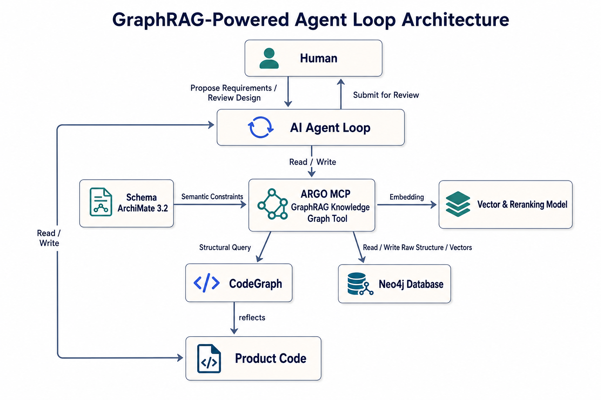
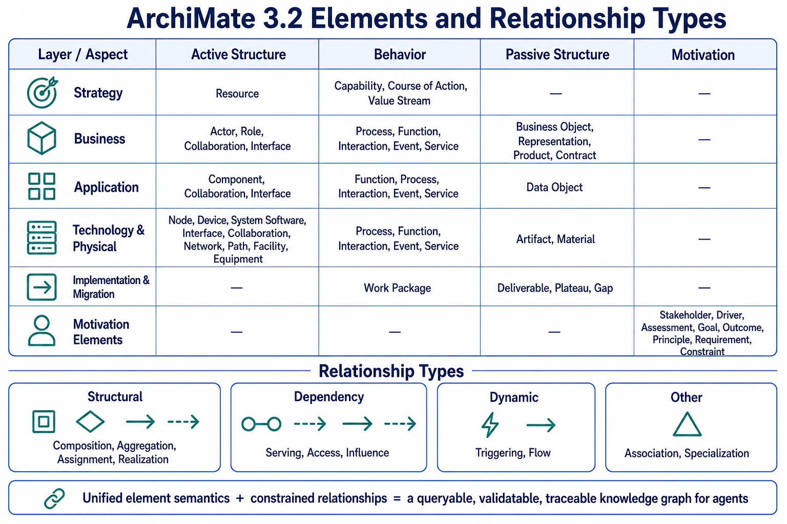
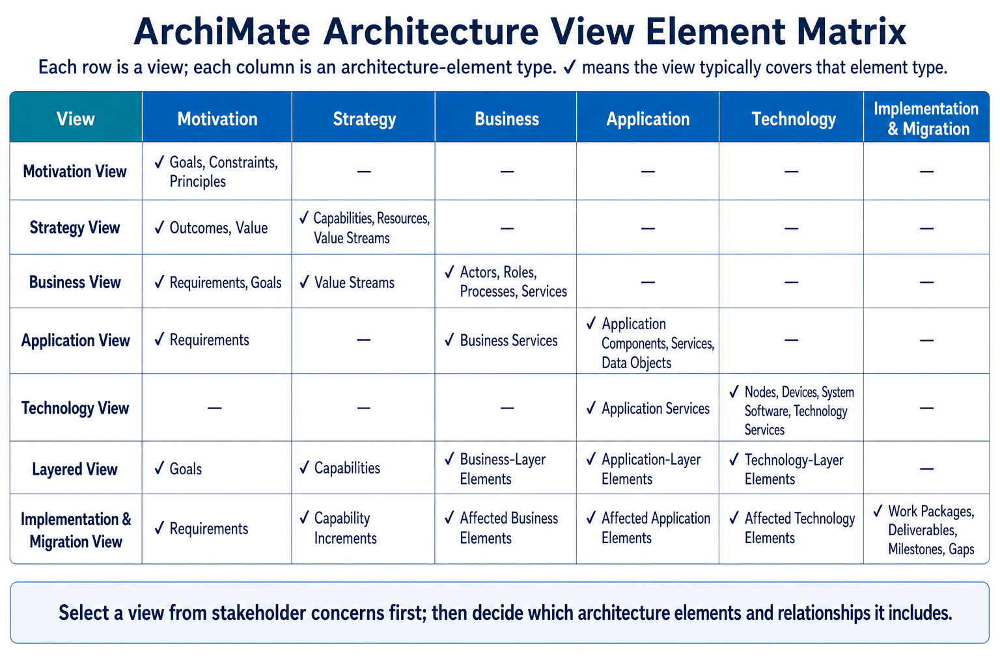
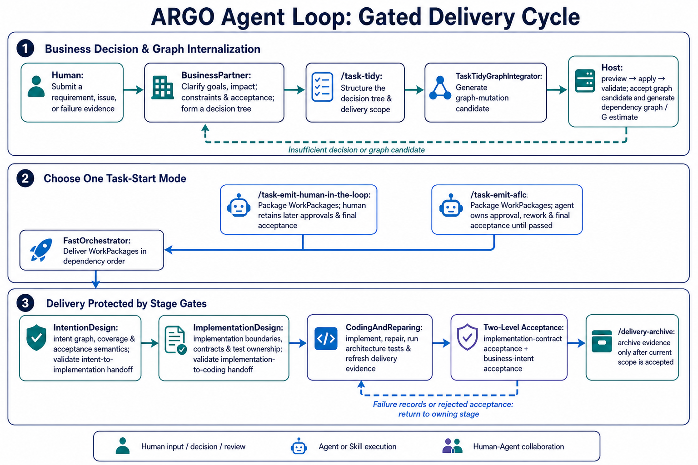

# ARGO HARNESS

ARGO is a vector knowledge-graph-driven (so called GraphRAG) Agent Loop framework that uses the ArchiMate enterprise architecture language to structure its knowledge graph. It covers the full software delivery lifecycle—from requirements analysis and architecture design through development, testing, and delivery archival—and provides human-in-the-loop and human-on-the-loop delivery modes.

ArchiMate 3.2 connects business intent, application behavior, and technology infrastructure through a unified, validatable semantic model. Its constrained relationship types make architectural context queryable, traceable, and usable by agents throughout the delivery loop.

## Quick start

### Install

Copy the platform bundle together with the shared `.argo/` directory to the target workspace root, then confirm that the target platform can discover the MCP service named `argo`:

| Edition | Environment | Deploy | Primary entrypoints |
| --- | --- | --- | --- |
| [Cursor](.cursor/) | Cursor | `.cursor/` + `.argo/` | `/business-partner`; choose `/task-emit-human-in-the-loop` or `/task-emit-afk` when starting tasks |
| [Copilot](.github/) | GitHub Copilot | `.github/` + `.argo/` | `BusinessPartner`; choose `task-emit-human-in-the-loop` or `task-emit-afk` when starting tasks |
| [OpenCode](.opencode/) | OpenCode | `.opencode/` + `.argo/` | `BusinessPartner`; choose `task-emit-human-in-the-loop` or `task-emit-afk` when starting tasks; also `/argo-init`, `/argotest` |

After installation, run `/argo-init`. It checks the readiness of the `argo` MCP tools and GraphRAG (the vector knowledge graph), then initializes the knowledge graph's semantic lifecycle. Automatic embedding and persistence run only when a vector-ranking model is configured.

### Choose the right entrypoint

All new requirements and issue reports—including defects and failing tests—start with `BusinessPartner`. It clarifies the business goal, impact scope, and acceptance boundary. Once the decision is complete, it passes the converged decision tree to `/task-tidy`. When task packages are ready, choose a task-start mode:

1. `/task-emit-human-in-the-loop`: a human continuously performs stage approvals and final acceptance.
2. `/task-emit-afk`: the agent independently continues work and returns tasks that fail acceptance until they pass.

| Situation | Start here |
| --- | --- |
| New requirement, business proposal, defect, or failing test | `BusinessPartner` / `/business-partner` → `/task-tidy` → choose `/task-emit-human-in-the-loop` or `/task-emit-afk`; after acceptance, use `/delivery-archive` to archive iteration-delivery documentation |
| Architecture improvement | `BusinessPartner` / `/business-partner` → `/improve-codebase-architecture` → `/task-tidy` → choose `/task-emit-human-in-the-loop` or `/task-emit-afk`; after acceptance, use `/delivery-archive` to archive iteration-delivery documentation |

For detailed selection criteria, suggested inputs, and outputs, see [Usage scenarios and entrypoint selection](design/argo-harness/usage-scenarios/README.md).

## Preparation before starting

Before delivery starts, prefill known facts into the intent architecture knowledge graph so that `BusinessPartner` begins with verifiable business and architecture context rather than recreating already-made decisions.

Prefill:

- **Business requirements**: goals, stakeholders, constraints, business rules, acceptance criteria, and known risks;
- **Architecture design**: existing capabilities, processes, applications, technology, dependencies, architecture viewpoints, and approved boundaries;
- **Work packages**: independently acceptable delivery scopes, their architecture elements, and their acceptance testcases.

Each work package should also declare the required:

- domain skills and specialist knowledge;
- tools, test environments, devices, or external-service controls;
- implementation boundaries, delivery evidence, and acceptance conditions.

Prefilled content must pass the common graph validation and human acceptance. It establishes facts for later decisions; it does not bypass `BusinessPartner`, intent design, implementation design, or two-level acceptance.

Organize these materials through domain templates: define domain architecture and knowledge in `design/specific-domain/<domain>/`, and provide domain skills in `.argo/skills/<domain>/` or the relevant platform-adaptation directory. See the [domain template index](design/specific-domain/README.md) for conventions.
