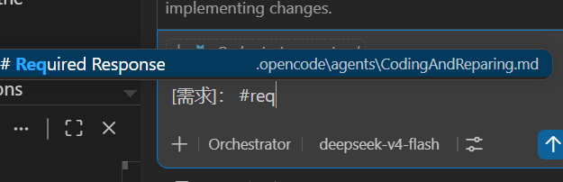
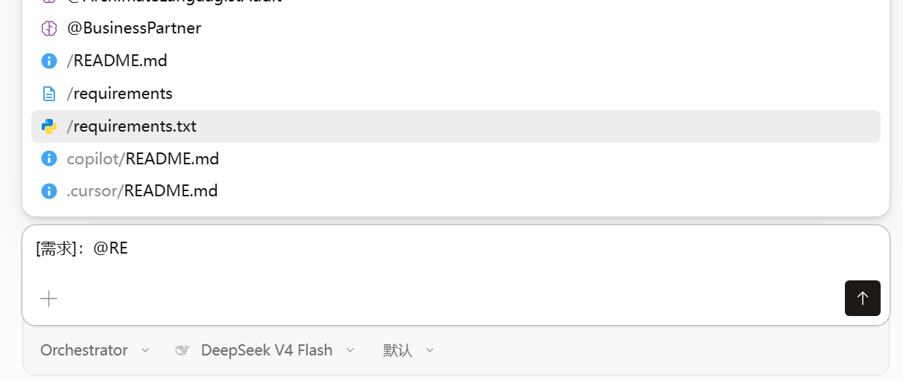
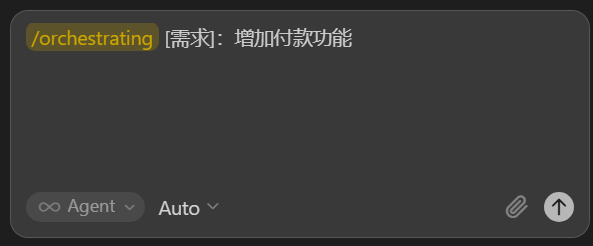

# Argo HARNESS

Argo 是一套面向 AI Coding 的 HARNESS 工程方法与配套实现。它把意图架构、实现架构、测试边界、失败记录和阶段交接组织成一个可重复、可验证、可回归的闭环。

## 快速上手

### 部署

| 版本 | 适用环境 | 说明 |
| --- | --- | --- |
| [Copilot 版](.github/README.md) | GitHub Copilot | 拷贝`.github`目录到您的工作区根目录 |
| [OpenCode 版](.opencode/README.md) | OpenCode | 拷贝`.opencode`目录到您的工作区根目录 |
| [Cursor 版](.cursor/README.md) | Cursor | 拷贝`.cursor`目录到您的工作区根目录 |

### 主要使用场景

| 场景 | 目的 | 操作 |
| --- | --- | --- |
| 新需求开发或新问题处理 | 开发需求或解决问题 | `opencode`和`github copilot` ：选择Orchestrator主agent，建议输入：[需求/问题] 具体描述（或opencode中用`@`(copilot中用`#`)引用文件路径） //使用`@`或`#`可以将文本内容直接加载进上下文，省去Agent读文件过程并确保完整文件内容进入上下文   `cursor` ：直接在主Agent中通过`/orchestrating` skill + [需求/问题] 具体描述   //`cursor`不支持自定义主Agent，因此通过skill发起编排调度流程|

`github copilot`使用示例：

`opencode`使用示例：首先切换到Orchestrator主Agent，然后通过@引用需求文档

`cursor`使用示例：首先调用orchestrating skill，然后跟上需求，也可以通过@引用文档

## 长期建设方向

### 意图架构设计阶段
* 业务领域本体模型，建议都做出本体推理MCP服务，接入意图架构设计AGENT，作为业务边界定义和作业纠错护栏

### 实现架构设计阶段

* 实现架构设计规则丰富，目标是CLEAN架构

### 编码阶段
* 可信编码SKILL构建和接入，目标是CLEAN CODE
* AI Agent友好的测试环境部署，提升自动化测试效率