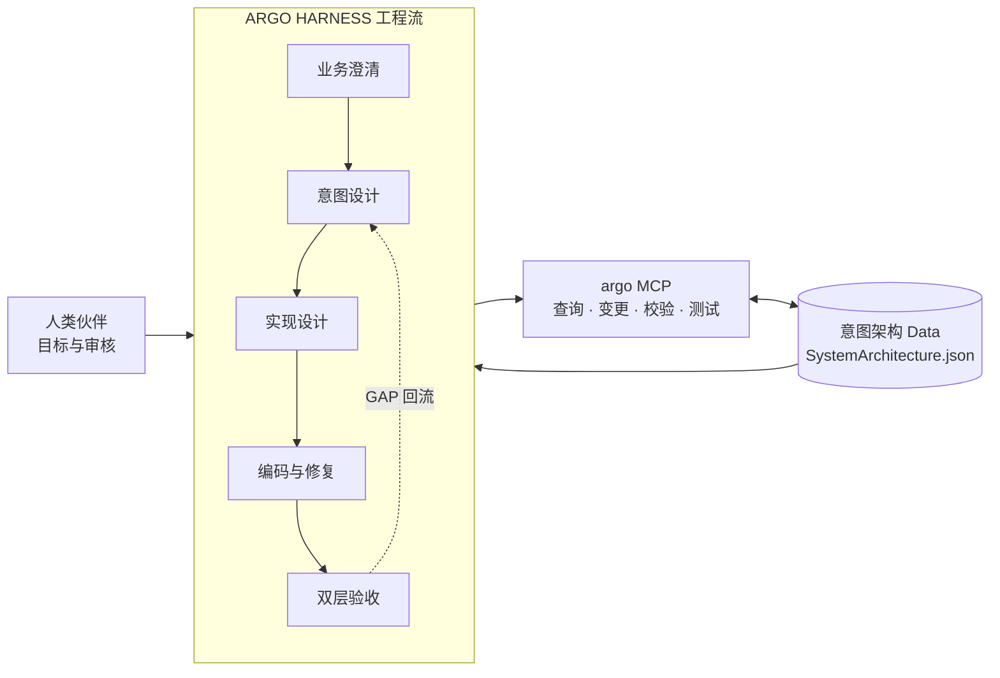
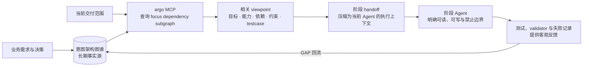

# ARGO HARNESS

ARGO 是一套由**架构知识图谱驱动**的 AI Coding Harness，面向企业级复杂项目，通过精准上下文管理，把业务意图、架构决策、测试门禁和 Agent 协作组织成可追溯、可验证、可回归的交付闭环。

它不假设模型天然稳定，而是通过工程系统提高交付确定性：

$$Total\ Certainty = C \times \frac{(P \cdot B) \times E}{G}$$

| 因子 | 含义 | ARGO 的工程锚点 |
| --- | --- | --- |
| `C` | 目标清晰度 | 业务拷问、结构化决策、显性验收 |
| `P` | 协议规范 | 意图图谱、实现契约、阶段 handoff |
| `B` | 边界约束 | Schema、MCP validator、测试、人类门禁 |
| `E` | 模型能效 | 聚焦架构子图、稳定事实源、清晰模块边界 |
| `G` | 任务颗粒度 | 架构依赖切分、顺序交付、独立会话 |

完整推导见[ARGO 工程哲学：确定性交付公式的工程化](notes/ai-engineering/ARGO%20工程哲学：确定性交付公式的工程化.md)。

## 核心方法

ARGO 由三个相互制约的构件组成：


```mermaid
flowchart LR
    H[人类伙伴<br/>目标与审核] --> F

    subgraph F[ARGO HARNESS 工程流]
        BP[业务澄清] --> ID[意图设计]
        ID --> IM[实现设计]
        IM --> CR[编码与修复]
        CR --> A[双层验收]
        A -. GAP 回流 .-> ID
    end

    F --> M[argo MCP<br/>查询 · 变更 · 校验 · 测试]
    M <--> K[(意图架构 Data<br/>SystemArchitecture.json)]
    K --> F
```

1. **意图架构 Data**：`design/KG/SystemArchitecture.json` 用 ArchiMate 元素、关系、view 和显性 testcase 保存目标、能力、依赖、约束与验收语义。
2. **架构服务 MCP**：统一 `argo` 服务提供图谱查询、受控 mutation、Schema/语义校验、handoff 校验和架构测试。
3. **HARNESS 工程流**：BusinessPartner、IntentionDesign、ImplementationDesign、CodingAndReparing 与双层验收在明确权限下协作。

深入了解：[总体架构](design/architecture.md) · [意图架构设计](design/intent-architecture/README.md) · [HARNESS 工程流程](design/argo-harness/README.md)

## 核心优势：精准上下文管理

ARGO 的优势不是向模型一次性塞入更多文件，而是让 Agent 在**正确阶段，只获得完成当前任务所需的正确事实、依赖、权限和验证证据**。这解决了大型项目中最常见的上下文问题：信息过载、事实冲突、跨阶段越权、长会话衰减，以及代码现实无声覆盖业务意图。


```mermaid
flowchart LR
    I[业务需求与决策] --> G[(意图架构图谱<br/>长期事实源)]
    T[当前交付范围] --> Q[argo MCP<br/>查询 focus dependency subgraph]
    G --> Q
    Q --> V[相关 viewpoint<br/>目标 · 能力 · 依赖 · 约束 · testcase]
    V --> H[阶段 handoff<br/>压缩为当前 Agent 的执行上下文]
    H --> A[阶段 Agent<br/>明确可读、可写与禁止边界]
    A --> E[测试、validator 与失败记录<br/>提供客观反馈]
    E -->|GAP 回流| G
```

精准管理由六个机制共同实现：

1. **图谱化，而不是依赖聊天记忆**
   需求、目标、能力、约束、依赖和显性 testcase 被内化到 `SystemArchitecture.json`。跨会话的长期事实从自然语言历史中抽离，避免 Agent 每次重新猜测系统意图。

2. **按架构相关性提取，而不是全仓库灌入**
   Agent 以当前 architecture element 为 focus，通过 `getIntentElementContext` 获取必要的上游依赖、下游影响和关联邻居。Viewpoint 把大图切成面向单一关注点的小视图，使上下文范围由架构语义决定，而不是由关键词搜索或文件距离决定。

3. **按阶段压缩，而不是让每个 Agent 理解全部世界**
   `IntentionDesign`、`ImplementationDesign` 和 `CodingAndReparing` 只拥有本阶段需要的本体、契约和权限。阶段 handoff 将上游结论压缩成结构化输入；下层通过 ID 追踪上层事实，但不能越权修改它。

4. **按依赖切分任务，而不是让单次会话吞下整个需求**
   `/task-tidy` 将决策映射到架构元素和依赖关系，生成 Sequential Gravity Chain 与 G 估算。人类按依赖顺序逐个提交小范围，使每轮上下文保持高信噪比。

5. **把知识、规则与环境按需挂载，而不是永久混入 Prompt**
   Viewpoint 通过 `modelingSkillPaths` 挂载建模 Skill；领域模板按场景组合知识库、编码规范、测试环境和观察工具。Agent 只在触发对应工作时加载它们。

6. **用执行证据刷新上下文，而不是让错误结论继续传播**
   Schema、MCP validator、冻结测试、失败记录和双层验收共同判断当前上下文是否可信。发现 GAP 时回到意图设计、实现设计或编码阶段修正，确保错误不会作为“既定事实”传给下一阶段。

因此，ARGO 的“精准”同时包含四层含义：

| 精准维度 | 回答的问题 | 工程实现 |
| --- | --- | --- |
| 事实精准 | 哪些信息具有权威性？ | 图谱、实现契约、handoff、冻结测试的事实源优先级 |
| 范围精准 | 当前任务真正需要哪些信息？ | focus element、依赖子图、viewpoint、G 切分 |
| 权限精准 | 当前 Agent 能读什么、改什么？ | 分层本体、阶段职责、只读/可写边界 |
| 时机精准 | 何时加载、验证和更新信息？ | Skill 按需加载、阶段门禁、测试反馈与 GAP 回流 |

这种方式直接提高公式中的 `C`、`P` 和 `E`，增强 `B`，同时降低上下文噪声与任务颗粒度 `G`。更完整的机制说明见[意图架构设计](design/intent-architecture/README.md)、[HARNESS 工程流程](design/argo-harness/README.md)和[基于架构依赖的任务编排方法论](notes/ai-engineering/驯服高维空间的重力：基于架构依赖的%20AI%20任务编排方法论.MD)。

## 一次交付如何运行

```text
业务澄清
  → 决策内化到意图架构
  → 意图设计与人类验收审核
  → 实现设计与人类测试审核
  → 编码/修复直到测试通过
  → 代码实现验收
  → 意图交付验收
```

上层可以读取下层事实做判断，下层不能越权改写上层：

| 阶段 | 负责 | 不负责 |
| --- | --- | --- |
| BusinessPartner | 目标、方案、风险、控制点和观测点 | 实现设计、编码 |
| IntentionDesign | 意图图谱、覆盖、显性 testcase | 业务代码、实现契约 |
| ImplementationDesign | 稳定边界、测试入口、实现 handoff | 直接修改意图图谱 |
| CodingAndReparing | 真实生产行为、失败记录清零 | 冻结测试、架构契约 |

Agent 与 Skill 的完整分工见[Agent 与 Skill 设计](design/argo-harness/agents-and-skills.md)。

## 快速上手

### 部署

平台 bundle 必须与统一 `.argo/` 目录一起复制到目标工作区根目录：

| 版本 | 适用环境 | 部署内容 | 主入口 |
| --- | --- | --- | --- |
| [Cursor 版](.cursor/) | Cursor | `.cursor/` + `.argo/` | `/business-partner`、`/orchestrating` |
| [Copilot 版](.github/) | GitHub Copilot | `.github/` + `.argo/` | `BusinessPartner`、`Orchestrator` |
| [OpenCode 版](.opencode/) | OpenCode | `.opencode/` + `.argo/` | `BusinessPartner`、`Orchestrator`、`/argoinit`、`/argotest` |

三平台都注册名为 `argo` 的 MCP 服务，入口为：

```text
node ${workspaceFolder}/.argo/scripts/argo-mcp-server.js
```

部署后确认：

1. 平台能发现 `argo` MCP；
2. `design/KG/SystemArchitecture.json` 存在；
3. `validateSystemArchitecture` 可执行；
4. 当前工作使用正确的 Agent 或 Skill 入口。

MCP 的工具参数、写入副作用和推荐调用顺序见[意图架构 MCP 功能列表](design/mcp/意图架构%20MCP%20功能列表.md)。

### Production Semantic Operator Journey

新项目的语义操作链固定为：工作区初始化、规范结构投影、显式语义回填、持久化就绪验证、语义查询。规范 JSON 始终是权威源；Neo4j 只保存从属投影和索引。`semantic:snapshot` 与无参数 `getSystemArchitecture` 始终返回完整的 `{ status, graphPath, document }` 快照。

生产配置只能来自直接进程环境或仓库内受保护的 `.argo/.env`。该文件必须被 Git 忽略、未跟踪、是非重解析普通文件，并通过当前身份可读且无宽泛主体读取权限的 Windows ACL 检查。必须显式提供这些键，不能使用默认值、别名或回退值：

```text
ARGO_EMBEDDING_BASE_URL
ARGO_EMBEDDING_MODEL
ARGO_EMBEDDING_PROVIDER
ARGO_EMBEDDING_MODEL_VERSION
ARGO_EMBEDDING_DIMENSIONS
ARGO_NEO4J_DATABASE_URL
ARGO_NEO4J_DATABASE_USERNAME
ARGO_NEO4J_DATABASE_PASSWORD
QWEN_KEY
```

默认流程不自动回填：

```text
npm run semantic:init
npm run semantic:backfill -- --explicit-opt-in
npm run semantic:readiness
npm run semantic:query -- --request-json "{\"purpose\":\"implementation-design\",\"intent\":\"Find the required architecture context\"}"
npm run semantic:snapshot
```

`semantic:init` 完成结构投影后返回可操作的 `SemanticIndexPending`，且不会自动启动提供方或数据库写入。显式回填必须由操作者传入 `--explicit-opt-in`；恢复时使用 `npm run semantic:backfill -- --explicit-opt-in --resume`。只有 `semantic:readiness` 显式确认三个通道并通过受限、原子替换写入不含密钥的本地就绪记录后，后续独立进程中的 `semantic:query` 才能执行。该记录采用与规范 JSON 权威一致的“同一操作系统用户 + 本地工作区”信任边界：文件所有者、文件及父目录 ACL/权限、链接/重解析点和完整性必须通过检查；支持的平台还会同步父目录，Windows 则显式验证同目录原子重命名回退。摘要只检测损坏与规范字节漂移，并不是签名。初始化、回填、规范图变更或任一规范/内容/索引/通道漂移都会使记录失效；未就绪、记录不可信或记录过期时查询关闭失败且 `fullSnapshotFallback` 为 `false`。

需要自动回填时，显式运行 `npm run semantic:init -- --automatic-backfill`。系统先验证批准的外部配置，验证通过后才可能启动回填、提供方调用和数据库写入。缺失、不安全、冲突或未批准的配置在任何这些副作用之前被拒绝；修正安全配置后重试，不要改用内嵌值或回退配置。

对应 MCP 工具顺序为：

```text
startNewProjectSemanticJourney
backfillSystemArchitectureSemanticProjection
verifySystemArchitectureSemanticReadiness
getSystemArchitecture
```

仓库验收使用受控组合边界验证顺序、错误脱敏、检查点恢复和规范快照不变性。当前环境没有可用的 live Neo4j（`neo4jUri is required for start`），因此这些确定性结果不是实时提供方或数据库证明，也不声明 `semprod-ready-plateau` 已交付。

### 选择正确入口

| 当前情况 | 从这里开始 |
| --- | --- |
| 新需求或业务方案 | `BusinessPartner` / `/business-partner`，随后 `/task-tidy` |
| 缺陷或失败测试 | `Orchestrator` / `/orchestrating`，先判断意图、实现或代码问题 |
| 没有可信架构基线 | `/reverse-architecture-extraction` |
| 有可信基线但代码/测试被外部修改 | `/architecture-drift-recovery` |
| 需要发现架构优化候选 | `/improve-codebase-architecture` |
| Agent 重复偏航或规则需要沉淀 | `/distill-agent-rules` |

完整判断条件、输入建议和产出见[使用场景与入口选择](design/argo-harness/usage-scenarios/README.md)。

## 设计文档导航

| 主题 | Deep dive |
| --- | --- |
| 文档体系与事实源 | [设计文档总导航](design/README.md) |
| 三大核心构件 | [总体架构](design/architecture.md) |
| 工程阶段、门禁和 handoff | [HARNESS 工程流程](design/argo-harness/README.md) |
| Agent、Skill 与平台映射 | [Agent 与 Skill 设计](design/argo-harness/agents-and-skills.md) |
| 使用场景 | [使用场景与入口选择](design/argo-harness/usage-scenarios/README.md) |
| ArchiMate、viewpoint 与显性验收 | [意图架构设计](design/intent-architecture/README.md) |
| MCP 工具接口 | [意图架构 MCP 功能列表](design/mcp/意图架构%20MCP%20功能列表.md) |
| 图谱校验和失败引导 | [MCP 校验机制](design/validator/intent-architecture-mcp-validation.md) |
| Schema 与 Enterprise Architect | [Schema 与 EA 映射](design/schema-ea-mapping.md) |
| 方案对比 | [ARGO、OpenSpec、Superpowers、ECC](design/marketing/solution-comparison-argo-openspec-superpower-ecc.md) |

`design/` 保存稳定、已确认的设计规范；`notes/` 保存研究、推导和候选观点。设计文档引用研究依据，但不把研究笔记当作运行时事实源。

## 持续扩展

ARGO 的稳定底座是：

```text
意图架构模板 + argo MCP + HARNESS 工程流
```

不同项目可以在底座上选择领域模板。每个模板可组合：

- 默认意图架构和 viewpoint；
- 领域 Skill 与知识库；
- 编码规范和实现边界；
- 测试环境、设备或外部服务控制接口；
- 构建、运行、观测和验收证据。

| 已有领域 | 能力 |
| --- | --- |
| [HarmonyOS 与跨端移动开发](design/specific-domain/harmonyos/README.md) | ArkTS/ArkUI、设备环境、窗口分析、跨端比较、构建运行和交付预检 |

新增模板应放在 `design/specific-domain/<domain>/`，领域 Skill 放在 `.argo/skills/<domain>/` 或相应平台适配目录。领域能力不能绕过通用意图设计、实现设计和双层验收。

更多扩展约定见[领域模板索引](design/specific-domain/README.md)。
