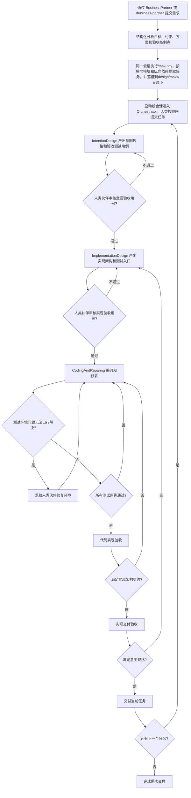
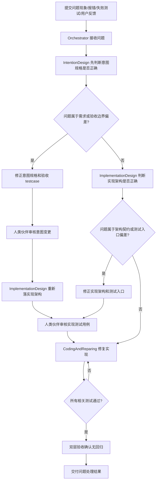
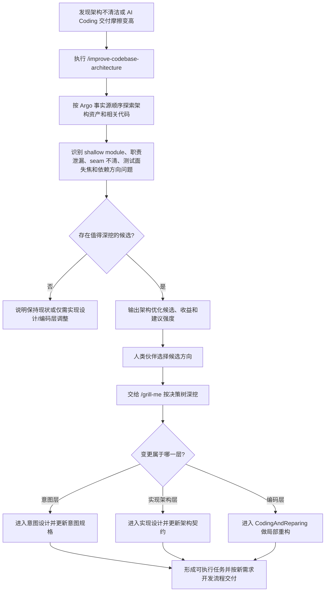
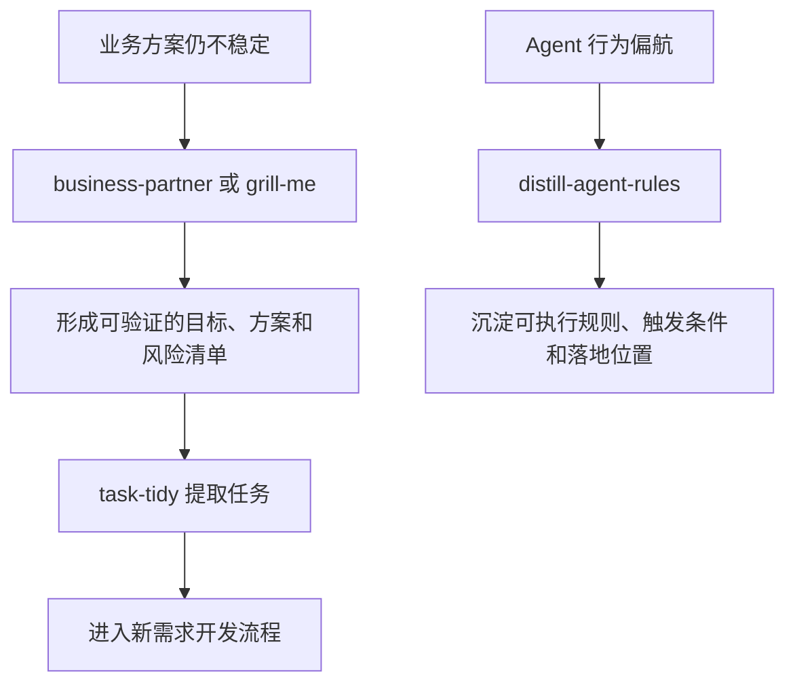

# Argo HARNESS

Argo 是一套AI Coding Harness，主要面向企业级复杂项目开发，实现可追溯、可验证、可回归的高质量AI自动化交付，同时形成产品、架构决策等组织资产沉淀。它基于当前AI Coding主流方法论(SDD、TDD)做了进一步增强，包括：
* SDD增强：采用形式化建模语言进行意图规格编写，并通过工具自动检查AI输出的架构模型，从而使得SPEC的编写更规范、更可控；
* TDD增强：传统的TDD是在编码阶段才开始写测试用例，而本实践是在意图设计阶段就    开始设计验收测试用例，实现架构设计阶段基于验收用例进一步构建测试框架并细分出系统测试用例和集成测试用例传递给编码阶段；

架构模型、测试用例均是天然的项目事实资产，一旦形成便成了AI持续迭代的上下文，从而组织成一个可重复、可验证、可回归的闭环。

## 持续扩展
本项目是一个顶层脚手架，不同的项目均可以基于本脚手架进一步扩展，包括：
* 从三大阶段Agent扩展出专业子Agent；
* 为不同类型的项目增加SKILL，配置给各阶段Agent（如鸿蒙应用开发相关的SKILL可配置给编码Agent）

## 本方案和业界主流AI Coding Harness方案的对比：

本文对比 ARGO、OpenSpec、SUPERPOWER、ECC 四类 AI Coding Harness 方案。完整分析见 `design/marketing/solution-comparison-argo-openspec-superpower-ecc.md`；下表保留最关键的选型维度。

| 对比维度 | ARGO | OpenSpec | SUPERPOWER | ECC |
| --- | --- | --- | --- | --- |
| 一句话定位 | 面向高确定性交付的架构治理工作流 | 面向快速协作的轻量规格层 | 面向高效率执行的技能驱动开发操作流 | 面向跨平台、多语言、多场景的 AI 工程操作系统 |
| 核心目标 | 稳定交付、架构一致性、可追溯、可审计 | 轻量规格协作、快速迭代、低门槛落地 | 将优秀工程习惯流程化、自动化，提高开发执行效率 | 提供跨 harness、跨语言、跨项目的统一工程能力池 |
| 流程风格 | 强阶段、强门禁、强闭环：意图设计 → 实现设计 → 编码/修复 → 双层验收 | 动作驱动，围绕 proposal/specs/design/tasks 灵活往返 | 技能触发驱动，强调 brainstorming、planning、TDD、code review 等工程动作 | commands、skills、agents、hooks、rules 密集组合，偏工程操作系统 |
| 治理强度 | 高：图谱、Schema、交接物、测试入口和 validator 共同约束 | 中低：规格清晰但更依赖团队补充验收与治理机制 | 中：对 Agent 跑偏有帮助，但偏执行流程治理 | 中高：能力完整且可配置，但治理策略需要团队自行设计 |
| 架构治理能力 | 强：将意图架构、实现架构、冻结测试和双层审计绑定成闭环 | 中：适合规格组织，但复杂场景下容易出现规格与实现漂移 | 中：能规范工程动作，但对契约级架构治理覆盖不足 | 中高：生态能力强，但需要明确规则与流程才能稳定治理 |
| 自动化执行深度 | 中高：通过阶段交接、失败记录和 validator 驱动确定性执行 | 中：自动化程度取决于团队如何接入工具链 | 高：技能、子代理、TDD、评审等动作自动化程度高 | 高：覆盖会话管理、持续学习、验证、安全和跨平台自动化 |
| 上手成本 | 高：适合愿意接受强流程和强契约的团队 | 低：适合快速启动规格先行协作 | 中：需要理解技能触发与工程动作链路 | 中高：能力面广，认知和配置成本较高 |
| 适合团队/项目规模 | 中大型复杂系统、核心业务链路、高风险交付、多团队协作 | 小中型到中大型项目，尤其适合需求探索频繁阶段 | 小中型到中大型团队，适合已有基本工程规范但缺自动化执行 | 中大型、多团队、多技术栈、多 harness 并行的工程平台 |
| 主要优势 | 偏差可发现、交接可复现、验收可执行、责任边界清晰 | 轻、快、灵活，便于建立规格协作习惯 | 执行效率高，能把工程最佳实践变成日常动作 | 覆盖面广、扩展性强，适合规模化工程能力建设 |
| 主要不足 | 小需求可能显得重，对流程纪律要求高 | 严格治理和验收机制不足，需团队自补 | 若缺少上层治理，容易偏执行而弱一致性控制 | 体系复杂，若缺少治理策略容易出现选择负担 |
| 优先选择场景 | 最在意稳定交付、可追溯、可审计、架构一致性 | 最在意轻量、快速、低门槛、需求探索 | 最在意开发节奏自动化和工程习惯落地 | 最在意跨平台、规模化能力和统一 AI 工程操作层 |

推荐组合策略：

- 轻量团队：`OpenSpec + SUPERPOWER`
- 成熟研发团队：`ARGO + SUPERPOWER`
- 平台型团队：`ARGO + ECC`
- 大型多业务团队：`OpenSpec + ARGO + ECC`

## 快速上手

### 部署

| 版本 | 适用环境 | 说明 |
| --- | --- | --- |
| [Copilot 版](.github/README.md) | GitHub Copilot | 拷贝`.github`目录到您的工作区根目录 |
| [OpenCode 版](.opencode/README.md) | OpenCode | 拷贝`.opencode`目录到您的工作区根目录 |
| [Cursor 版](.cursor/README.md) | Cursor | 拷贝`.cursor`目录到您的工作区根目录 |

### 主要使用场景

#### 平台入口

| 平台 | 推荐入口 | 典型输入方式 | 说明 |
| --- | --- | --- | --- |
| OpenCode | 选择 `Orchestrator` 主 Agent | `@需求文档路径` + 需求/问题描述 | `@` 会把文件内容加载进上下文，适合需求文档、设计文档、失败记录或相关代码较长的场景 |
| GitHub Copilot | 选择 `Orchestrator` 主 Agent | `#需求文档路径` + 需求/问题描述 | `#` 用于引用工作区文件，减少 Agent 自行查找文件的误差 |
| Cursor | 主 Agent 中调用 `/orchestrating` | `/orchestrating` + 需求/问题描述，可配合 `@文件路径` | Cursor 不支持自定义主 Agent，因此用 Skill 发起同等编排流程 |

#### 场景清单

##### 新需求开发

```mermaid
flowchart TD
    A[通过 BusinessPartner 或 /business-partner 提交需求] --> B[结构化分析目标、约束、方案和验收控制点]
    B --> D[同一会话执行/task-tidy，按横向模块和纵向依赖提取任务，并落盘到design/tasks/目录下]
    D --> E[启动新会话进入 Orchestrator，人类按顺序提交任务]
    E --> G[IntentionDesign 产出意图规格和验收测试用例]
    G --> H{人类伙伴审核意图验收用例?}
    H -- 不通过 --> G
    H -- 通过 --> I[ImplementationDesign 产出实现架构和测试入口]
    I --> J{人类伙伴审核实现验收用例?}
    J -- 不通过 --> I
    J -- 通过 --> K[CodingAndReparing 编码和修复]
    K --> L{测试环境问题无法自行解决?}
    L -- 是 --> M[求助人类伙伴修复环境]
    M --> K
    L -- 否 --> N{所有测试用例通过?}
    N -- 否 --> K
    N -- 是 --> O[代码实现验收]
    O --> P{满足实现架构契约?}
    P -- 否 --> K
    P -- 是 --> Q[实现交付验收]
    Q --> R{满足意图规格?}
    R -- 否 --> I
    R -- 是 --> S[交付当前任务]
    S --> T{还有下一个任务?}
    T -- 是 --> E
    T -- 否 --> U[完成需求交付]
```

新需求不要先进入普通开发会话，更不要直接进入编码。应通过 `BusinessPartner` Agent 或 `/business-partner` Skill 提交需求，让它作为需求入口把目标、约束、方案、风险、验收控制点和观测点分析清楚；分析完成后，在同一个会话继续执行 `task-tidy`，将结论沉淀为 `design/tasks/` 下的任务文档。任务需要同时做横向切分和纵向排序：横向保证任务边界正交，纵向保证依赖顺序清晰。

任务整理完成后，由人类伙伴按任务顺序逐个启动新会话，并将当前任务提交给 `Orchestrator`。每个任务都应走完整的 **意图设计 → 实现设计 → 编码/修复 → 代码实现验收 → 实现交付验收** 迭代，不建议并发执行多个任务，避免多个 Agent 同时修改架构事实、测试入口或代码边界导致上下文漂移。当前任务交付后，如果还有下一个任务，应再次启动新会话进入 `Orchestrator`，由人类伙伴继续按顺序提交。`IntentionDesign` 和 `ImplementationDesign` 产出的验收测试用例必须经过人类伙伴审核；只有验收边界被确认后，才进入编码阶段。编码阶段如果遇到测试环境、依赖安装、外部服务、权限、设备等问题且 Agent 无法自行解决，应明确求助人类伙伴，环境恢复后继续执行，直到所有显性 testcase 和必要测试通过再交付。

##### 问题处理

```mermaid
flowchart TD
    A[提交问题现象/报错/失败测试/用户反馈] --> B[Orchestrator 接收问题]
    B --> C[IntentionDesign 先判断意图规格是否正确]
    C --> D{问题属于需求或验收边界偏差?}
    D -- 是 --> E[修正意图规格和验收 testcase]
    E --> F[人类伙伴审核意图变更]
    F --> G[ImplementationDesign 重新落实现架构]
    D -- 否 --> H[ImplementationDesign 判断实现架构是否正确]
    H --> I{问题属于架构契约或测试入口偏差?}
    I -- 是 --> J[修正实现架构和测试入口]
    J --> K[人类伙伴审核实现测试用例]
    K --> L[CodingAndReparing 修复实现]
    I -- 否 --> L
    G --> K
    L --> M{所有相关测试通过?}
    M -- 否 --> L
    M -- 是 --> N[双层验收确认无回归]
    N --> O[交付问题处理结果]
```

问题处理也必须先经过意图设计，因为“问题”不一定是代码 BUG。它可能来自需求理解错误、验收边界遗漏、意图图谱表达不准确，也可能来自实现架构契约、测试入口或编码实现偏差。先由 `IntentionDesign` 判断问题是否需要修改意图规格；若意图正确，再由 `ImplementationDesign` 判断实现架构是否需要调整；只有确认问题落在代码实现层，才交给 `CodingAndReparing` 直接修复。

处理问题时，输入应尽量包含现象、复现步骤、失败命令、日志摘要、期望行为和已知影响范围。修复过程中如果更新了意图验收 testcase 或实现阶段测试入口，同样需要人类伙伴审核，避免 Agent 用错误测试固化错误理解。最终交付不只看单个失败是否消失，还要通过双层验收确认没有破坏意图规格和实现架构契约。

##### 架构优化主流程

```mermaid
flowchart TD
    A[发现架构不清洁或 AI Coding 交付摩擦变高] --> B[执行 /improve-codebase-architecture]
    B --> C[按 Argo 事实源顺序探索架构资产和相关代码]
    C --> D[识别 shallow module、职责泄漏、seam 不清、测试面失焦和依赖方向问题]
    D --> E{存在值得深挖的候选?}
    E -- 否 --> F[说明保持现状或仅需实现设计/编码层调整]
    E -- 是 --> G[输出架构优化候选、收益和建议强度]
    G --> H[人类伙伴选择候选方向]
    H --> I[交给 /grill-me 按决策树深挖]
    I --> J{变更属于哪一层?}
    J -- 意图层 --> K[进入意图设计并更新意图规格]
    J -- 实现架构层 --> L[进入实现设计并更新架构契约]
    J -- 编码层 --> M[进入 CodingAndReparing 做局部重构]
    K --> N[形成可执行任务并按新需求开发流程交付]
    L --> N
    M --> N
```

AI Coding 的质量和架构 clean 程度密切相关。干净整洁的架构会把知识、改动和 bug 面集中在少数清晰位置，让 Agent 更容易在有限上下文中理解模块职责、依赖方向和测试入口，从而更快完成交付并降低误改、漏改、越权修改的概率。相反，如果模块很浅、接口暴露过多实现细节、seam 放错位置、测试穿透内部实现，Agent 就会在多个文件之间反复跳转，既更慢，也更容易把局部修补误当成系统性修复。

当前 `/improve-codebase-architecture` 的定位是意图设计阶段的前置探索步骤，不是新的主流程，也不是新的事实源。它优先按 Argo 事实源顺序读取 `design/KG/SystemArchitecture.json`、`OVERALL_ARCHITECTURE.md`、局部 `ARCHITECTURE.md`、相关 handoff JSON；只有这些不足以回答问题时，才继续读取代码、测试、脚本和配置。它只先输出候选，不直接修改代码、测试或设计资产；用户选中候选后，再交给 `/grill-me` 继续深挖。

该 Skill 使用的核心架构优化原则包括：用 **deletion test** 判断模块是否只是 pass-through；用 **depth** 判断接口是否真正替调用方隐藏复杂度；优先让测试跨 **interface** 断言可观察行为，而不是穿透实现内部；用 “一个 adapter 可能是假 seam，两个 adapter 才更像真实 seam” 判断间接层是否必要；同时评估 **locality**、**leverage**、**testability** 三类收益。依赖也会被区分为进程内、本地可替换、远程但自有、真正外部四类，以决定是加深模块、定义稳定 port、隔离 adapter，还是删除不必要的间接层。

##### 其他关键业务流程

```mermaid
flowchart TD
    A[业务方案仍不稳定] --> B[business-partner 或 grill-me]
    B --> C[形成可验证的目标、方案和风险清单]
    C --> D[task-tidy 提取任务]
    D --> E[进入新需求开发流程]

    K[Agent 行为偏航] --> L[distill-agent-rules]
    L --> M[沉淀可执行规则、触发条件和落地位置]
```

除新需求和问题处理外，建议把两类流程作为日常治理入口。第一类是业务方案探索：需求尚不稳定时，不要急于创建实现任务，先用 `business-partner` 或 `/grill-me` 把问题定义、方案分支、控制点和观测点收敛，再用 `task-tidy` 转成可交付任务。第二类是 Agent 行为偏航治理：当 Agent 出现越权修改、漏读契约、误改冻结测试、反复跳阶段等问题时，用 `/distill-agent-rules` 将偏差提炼为可复用规则，而不是只在当前会话中口头纠正。

| 场景                 | 适用时机                                                    | 推荐入口                                                    | 期望产出                                                                                                  |
| ------------------ | ------------------------------------------------------- | ------------------------------------------------------- | ----------------------------------------------------------------------------------------------------- |
| 新需求开发              | 已有明确业务需求、PRD、用户故事或功能描述，需要进入完整交付链路                       | OpenCode/Copilot：`Orchestrator`；Cursor：`/orchestrating` | 先由 `IntentionDesign` 澄清意图与验收边界，再由 `ImplementationDesign` 落实现架构与测试入口，最后由 `CodingAndReparing` 完成实现并跑通验收 |
| 缺陷修复               | 已知问题、失败现象、报错日志、回归缺陷或测试失败，需要定位并修复                        | OpenCode/Copilot：`Orchestrator`；Cursor：`/orchestrating` | 判断缺陷属于意图偏差、实现架构偏差还是代码实现问题，并按正确阶段产出修复、测试结果和必要返工闭环                                                      |
| 架构优化/重构候选梳理        | 不新增功能，目标是改善模块边界、降低耦合、修复浅模块、提升可测试性或提升 AI 可导航性            | `/improve-codebase-architecture`，必要时接 `/grill-me`       | 先输出值得深挖的架构优化候选，再通过决策树收敛到可执行的迭代方向                                                                      |
| 业务方案拷问             | 需求还不稳定，需要先验证业务问题是否清晰、目标是否 SMART、拆解是否 MECE               | `BusinessPartner` 或 `/business-partner`                 | 业务决策树、关键追问、推荐答案、任务拆解，以及从验收方视角定义的控制点和观测点                                                               |
| 任务整理               | 业务分析或拷问已经完成，需要把结果整理成可执行任务                               | `/task-tidy`                                            | 在 `design/tasks/` 下形成独立任务文档，每个任务包含背景、相关 PRD、执行内容和验收标准                                                 |
| 市场/竞品/技术趋势研究       | 需要在开发前判断市场机会、竞品差异、技术方向或投资人信息                            | `/market-research`                                      | 带来源归因的事实、推断、风险和建议，服务于是否进入后续需求设计                                                                       |
| 浏览架构图谱             | 需要理解 `SystemArchitecture.json` 中的元素、关系、视图或 testcase 归属  | `/arch-viewer`                                          | 启动本地知识图谱查看器，可搜索、按视图浏览并检查 schema 对齐的详情                                                                 |
| 意图图谱语义审计           | 担心 `SystemArchitecture.json` 的 ArchiMate 元素、关系、方向或措辞不准确 | `ArchimateLanguagistAudit`                              | 输出 schema、ArchiMate 语义、语言精确性、视图一致性和追踪质量的审计发现                                                          |
| 外部说明文档刷新           | 实现或接口稳定后，需要更新面向采用者的产品简介                                 | `/brief`                                                | 仅基于架构来源生成或更新 `INTRODUCTION.md`，覆盖产品概览、能力、接口、约束和使用方式                                                   |
| Agent 行为偏航复盘       | Agent 在会话中越权、漏读契约、误改冻结测试或反复出现同类偏差                       | `/distill-agent-rules`                                  | 将偏差提炼为可执行规则、适用范围、触发条件和推荐落地位置                                                                          |
| HarmonyOS/ArkTS 开发 | 项目涉及 HarmonyOS NEXT、ArkTS、ArkUI、DevEco Studio 或鸿蒙原生应用   | `/harmonyos-development` + `/arkts-coding-standard`     | 获取鸿蒙平台开发知识与 ArkTS 严格编码规范，辅助编码、审查、调试或迁移                                                                |

#### 输入建议

| 输入内容 | 建议写法 | 原因 |
| --- | --- | --- |
| 需求/问题描述 | 先写目标，再写当前现象、约束、期望结果 | 便于 `IntentionDesign` 判断是否需要更新意图架构、实现架构或只修代码 |
| 文件引用 | OpenCode 用 `@路径`，Copilot 用 `#路径`，Cursor 用 `@路径` | 直接把关键文件放进上下文，减少 Agent 漏读或误读 |
| 验收标准 | 尽量写清控制点和观测点 | Argo 会把验收边界转成显性 testcase 或实现阶段测试入口 |
| 已知失败 | 附上失败命令、错误摘要、日志片段、失败测试路径 | 便于 `CodingAndReparing` 将失败记录转化为修复队列 |
| 不确定的方案 | 先用 `BusinessPartner`、`/business-partner` 或 `/grill-me` | 在进入实现前先收敛业务和设计分支，避免后续返工 |

## 当前已录SubAgents 和 Skills

Argo 主流程分为 **意图设计 → 实现设计 → 编码/修复 → 双层验收** 四个阶段；另有 **编排、前置业务、治理复盘、辅助工具** 等横切能力。下表说明每个 SubAgent 与 Skill 的适用阶段及其作用。

### SubAgents

| 名称 | 适用阶段 | 作用 | 平台 |
| --- | --- | --- | --- |
| `Orchestrator` | 编排（全阶段） | 总调度者：接收需求或问题后按阶段转交子 Agent，在编码完成后触发实现架构与意图架构双向审计，审计失败时要求对应阶段返工；禁止直接处理需求或修改实现产物 | Copilot、OpenCode（主 Agent） |
| `IntentionDesign` | 意图设计 | 以 `design/KG/SystemArchitecture.json` 为第一真相源，澄清需求，维护意图元素/关系/视图/原则/约束/显性验收 testcase，产出并校验 `IntentToImplementationHandoff.json`；禁止修改业务代码与测试代码 | 全平台 |
| `ImplementationDesign` | 实现设计 | 将意图架构落盘为实现架构契约（`OVERALL_ARCHITECTURE.md`、局部 `ARCHITECTURE.md`）、显性 testcase 物理入口、关键非显性测试护栏，产出 `ImplementationToCodingHandoff.json`；禁止修改意图图谱 | 全平台 |
| `CodingAndReparing` | 编码/修复 | 依据 `ImplementationToCodingHandoff.json` 与 `test-failure-records.json` 修复真实实现，执行既有测试入口直至显性 testcase 全部通过；禁止修改冻结测试与架构契约 | 全平台 |
| `ArchimateLanguagistAudit` | 意图设计（审计） | 从 ArchiMate 语言学家视角审计 `SystemArchitecture.json` 的 schema 合规、元素/关系语义、措辞精确性、视图一致性与追踪质量；默认只审计不改文件 | 全平台 |
| `BusinessPartner` | 前置/业务 | 以 MECE 决策树和 SMART 标准严苛拆解业务问题，逐分支追问直到逻辑无懈可击，产出含控制点与观测点的验收标准；聚焦业务本身，不进入架构与代码 | Copilot、OpenCode |
| `Init` | 初始化 | 承接 `/argoinit`，调用 `argo_init` 初始化 Argo 工作区（复制 EA 模板、重置阶段交接文件） | OpenCode |
| `Test` | 编码/修复（验收执行） | 承接 `/argotest`，调用 `argo_test` 执行全量显性 testcase 并刷新 `test-failure-records.json`，为编码阶段提供修复队列 | OpenCode |
| `teacher` | 辅助/通用 | 循序渐进的教学伙伴，帮助用户深入理解任意主题并形成共同认知；不承担主交付链路 | 全平台 |

> **Cursor 说明**：Cursor 不支持自定义主 Agent，因此 `Orchestrator` 的角色由 `/orchestrating` Skill 承担（见下表）。

### Skills

| 名称 | 适用阶段 | 作用 | 调用方式 |
| --- | --- | --- | --- |
| `orchestrating` | 编排（全阶段） | Cursor 版总调度：固化意图设计 → 实现设计 → 编码/修复 → 双向审计的完整工作流规则，禁止主 Agent 越权直接处理需求或修改实现 | `/orchestrating` |
| `grill-me` | 意图设计 / 通用 | 以强批判性思维无情拷问计划或设计，逐分支遍历决策树直到达成共识；可从仓库自行取证；各阶段均可使用但效果因阶段边界而异 | `/grill-me` |
| `improve-codebase-architecture` | 意图设计（前置探索） | 在不引入功能需求的前提下，先识别 shallow module、接缝泄漏、测试面失焦等架构优化候选，再将选中方向交给 `grill-me` 深挖；宜作为独立迭代的需求输入而非单次指令 | `/improve-codebase-architecture` |
| `business-partner` | 前置/业务 | 与 `BusinessPartner` Agent 等效的业务方案拷问流程：MECE 决策树拆解、SMART 问题定义、验收 testcase 输出 | `/business-partner` |
| `task-tidy` | 前置/业务 | 在 `business-partner` 产出后，将任务与需求整理为 `design/tasks/` 下的独立 Markdown 文件，确保每项任务可执行且含明确验收标准 | `/task-tidy` |
| `market-research` | 前置/业务 | 市场、竞品、投资人或技术趋势研究，要求来源归因，区分事实/推断/建议，输出面向决策的结论 | `/market-research` |
| `implementation-delivery-acceptance` | 双层验收（意图架构侧） | 审计当前实现是否满足意图架构设计要求；不一致时写出实现 GAP 并给实现架构设计师下一步建议 | `/implementation-delivery-acceptance` |
| `impl-gap-report` | 双层验收（意图架构侧） | 当实现仍存在 GAP 时，分析是否需要修改实现架构并下发后续开发任务 | `/impl-gap-report` |
| `coding-delivery-acceptance` | 双层验收（实现架构侧） | 审计编码交付是否满足实现架构契约；不一致时给出 GAP 与下一步开发建议 | `/coding-delivery-acceptance` |
| `coding-gap-report` | 编码/修复 | 当编码交付仍存在 GAP 时，驱动继续开发直至所有缺口补齐 | `/coding-gap-report` |
| `brief` | 交付后/文档 | 仅基于 `OVERALL_ARCHITECTURE.md`、局部 `ARCHITECTURE.md` 与意图图谱，创建或更新面向外部采用者的 `INTRODUCTION.md` | `/brief` |
| `arch-viewer` | 辅助/通用 | 在本地 schema 驱动的 Web Viewer 中浏览 `SystemArchitecture.json` 知识图谱（元素、关系、视图、详情） | `/arch-viewer` |
| `distill-agent-rules` | 治理/复盘 | 当 Agent 行为偏离预期时，将偏差提炼为可复用的原则、约束、触发条件与落地位置（memory / instructions / skill / hook 等），减少同类偏差重复发生 | `/distill-agent-rules` |
| `harmonyos-development` | 编码/修复（领域） | HarmonyOS NEXT 原生应用开发指南：ArkTS、ArkUI、Stage 模型、API 22–26、权限、状态管理、测试与性能等鸿蒙开发工作流 | `/harmonyos-development` |
| `arkts-coding-standard` | 编码/修复（领域） | ArkTS 严格类型与编码规范：禁止 `any`、对象字面量类型、运行时形状变更等，确保 HarmonyOS 代码合规 | `/arkts-coding-standard` |
