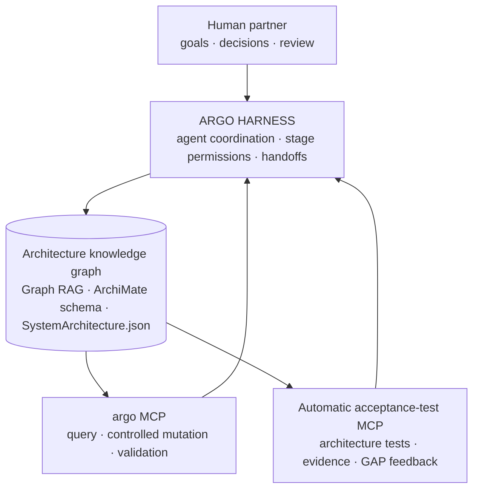
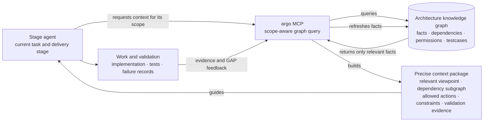
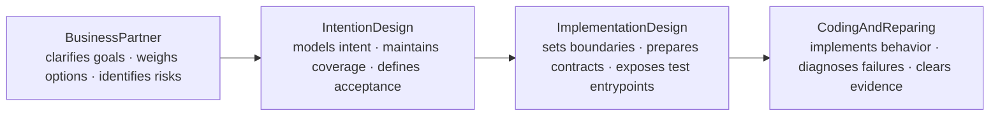

# ARGO HARNESS

ARGO is an **architecture knowledge-graph-driven** AI coding harness for complex enterprise projects. It uses precise context management to organize business intent, architecture decisions, test gates, and agent collaboration into a delivery loop that is traceable, verifiable, and repeatable.


## Core approach

ARGO consists of three mutually reinforcing components:


```mermaid
flowchart TB
    H[Human partner<br/>goals · decisions · review]
    F[ARGO HARNESS<br/>agent coordination · stage permissions · handoffs]
    G[(Architecture knowledge graph<br/>Graph RAG · ArchiMate schema · SystemArchitecture.json)]
    M[argo MCP<br/>query · controlled mutation · validation]
    T[Automatic acceptance-test MCP<br/>architecture tests · evidence · GAP feedback]

    H --> F --> G
    G --> M
    G --> T
    M --> F
    T --> F
```

1. **Intent architecture data**: stores goals, capabilities, dependencies, constraints, and acceptance semantics as ArchiMate elements, relationships, views, and explicit testcases.
2. **Architecture service MCP**: the unified `argo` service provides graph queries, controlled mutations, schema and semantic validation, handoff validation, and architecture tests.
3. **HARNESS delivery flow**: BusinessPartner, IntentionDesign, ImplementationDesign, CodingAndReparing, and two-level acceptance collaborate within explicit permissions.

Learn more: [Overall architecture](design/architecture.md) · [Intent architecture design](design/intent-architecture/README.md) · [HARNESS delivery flow](design/argo-harness/README.md)

## Precise context management

The goal is for an agent to receive **only the facts, dependencies, permissions, and validation evidence needed to complete the current task at the correct stage**. This addresses common large-project context failures: information overload, conflicting facts, cross-stage overreach, long-session degradation, and code reality silently overriding business intent.


```mermaid
flowchart LR
    A[Stage agent<br/>current task and delivery stage]
    M[argo MCP<br/>scope-aware graph query]
    G[(Architecture knowledge graph<br/>facts · dependencies · permissions · testcases)]
    P[Precise context package<br/>relevant viewpoint · dependency subgraph<br/>allowed actions · constraints · validation evidence]
    W[Work and validation<br/>implementation · tests · failure records]

    A -->|requests context for its scope| M
    M -->|queries| G
    G -->|returns only relevant facts| M
    M -->|builds| P
    P -->|guides| A
    A --> W
    W -->|evidence and GAP feedback| M
    M -->|refreshes facts| G
```

Four constraints make this possible:

- **Fact precision**: long-lived facts belong in `SystemArchitecture.json`, implementation contracts, handoffs, and frozen tests—not chat memory.
- **Scope precision**: each task receives context around its architecture focus, dependency subgraph, and viewpoint.
- **Permission precision**: each stage changes only the artifacts it owns; out-of-scope issues move through a handoff or GAP feedback.
- **Timing precision**: MCP validators, architecture tests, and two-level acceptance refresh context with execution evidence.

For the complete mechanism, see [Intent architecture design](design/intent-architecture/README.md), [HARNESS delivery flow](design/argo-harness/README.md), and [Task orchestration based on architectural dependencies](notes/ai-engineering/驯服高维空间的重力：基于架构依赖的%20AI%20任务编排方法论.MD).

## How a delivery runs

```text
Business clarification
  → Internalize decisions in the intent architecture
  → Intent design and human acceptance review
  → Implementation design and human test review
  → Code and repair until tests pass
  → Code implementation acceptance
  → Intent delivery acceptance
```

Upper stages may read lower-stage facts to make decisions; lower stages must not overwrite upper-stage decisions:

| Stage | Owns | Does not own |
| --- | --- | --- |
| BusinessPartner | Goals, options, risks, control points, and observability points | Implementation design and coding |
| IntentionDesign | Intent graph, coverage, and explicit testcases | Business code and implementation contracts |
| ImplementationDesign | Stable boundaries, test entrypoints, and implementation handoffs | Direct intent-graph changes |
| CodingAndReparing | Actual production behavior and clearing failure records | Frozen tests and architecture contracts |

For the complete division of responsibilities between agents and skills, see [Agent and skill design](design/argo-harness/agents-and-skills.md).


```mermaid
flowchart LR
    BP[BusinessPartner<br/>clarifies goals · weighs options · identifies risks]
    ID[IntentionDesign<br/>models intent · maintains coverage · defines acceptance]
    IM[ImplementationDesign<br/>sets boundaries · prepares contracts · exposes test entrypoints]
    CR[CodingAndReparing<br/>implements behavior · diagnoses failures · clears evidence]

    BP --> ID --> IM --> CR
```

## Quick start

### Install

Copy the platform bundle together with the shared `.argo/` directory to the target workspace root, then confirm that the target platform can discover the MCP service named `argo`:

| Edition | Environment | Deploy | Primary entrypoints |
| --- | --- | --- | --- |
| [Cursor](.cursor/) | Cursor | `.cursor/` + `.argo/` | `/business-partner`, `/orchestrating` |
| [Copilot](.github/) | GitHub Copilot | `.github/` + `.argo/` | `BusinessPartner`, `Orchestrator` |
| [OpenCode](.opencode/) | OpenCode | `.opencode/` + `.argo/` | `BusinessPartner`, `Orchestrator`, `/argoinit`, `/argotest` |

After installation, confirm that:

1. the platform discovers the `argo` MCP service;
2. `design/KG/SystemArchitecture.json` exists;
3. `validateSystemArchitecture` can run; and
4. the work uses the correct agent or skill entrypoint.

Stable design references own MCP tool parameters, mutation side effects, validator rules, the production semantic lifecycle, credential boundaries, and command-level operating instructions. See the [Intent architecture MCP feature list](design/mcp/意图架构%20MCP%20功能列表.md) and [MCP validation mechanism](design/validator/intent-architecture-mcp-validation.md). This README helps new readers select an entrypoint; it does not duplicate those operational details.

### Choose the right entrypoint

| Situation                                                                | Start here                                                                                             |
| ------------------------------------------------------------------------ | ------------------------------------------------------------------------------------------------------ |
| New requirement or business proposal                                     | `BusinessPartner` / `/business-partner`, then `/task-tidy`                                             |
| Defect or failing test                                                   | `Orchestrator` / `/orchestrating` to determine whether the issue is in intent, implementation, or code |
| No trustworthy architecture baseline                                     | `/reverse-architecture-extraction`                                                                     |
| A trustworthy baseline exists, but code or tests were changed externally | `/architecture-drift-recovery`                                                                         |
| Find architecture-improvement candidates                                 | `/improve-codebase-architecture`                                                                       |
| Repeated agent drift or rules that should be distilled                   | `/distill-agent-rules`                                                                                 |

For detailed selection criteria, suggested inputs, and outputs, see [Usage scenarios and entrypoint selection](design/argo-harness/usage-scenarios/README.md).

## Extend ARGO

ARGO has a stable foundation:

```text
Intent architecture template + argo MCP + HARNESS delivery flow
```

Projects can extend this foundation with domain templates and work packages. A work package connects a bounded delivery concern to the architecture elements that govern it, then supplies the skills, environment access, and evidence needed to deliver that concern.

Each work package should:

- identify its relevant goals, capabilities, processes, applications, technology, and acceptance testcases in the intent architecture;
- expose only the domain skills, knowledge, test-environment information, devices, or external-service controls required for that architecture scope;
- define its coding boundaries and test entrypoints; and
- return build, run, observability, and acceptance evidence through the common validation flow.

Each domain template can combine:

- default intent architecture and viewpoints;
- domain skills and knowledge bases;
- coding standards and implementation boundaries;
- test environments, devices, or external-service control interfaces; and
- build, run, observability, and acceptance evidence.

| Available domain | Capabilities |
| --- | --- |
| [HarmonyOS and cross-platform mobile development](design/specific-domain/harmonyos/README.md) | ArkTS/ArkUI, device environments, window analysis, cross-platform comparison, build and run workflows, and delivery preflight checks |

Add new templates under `design/specific-domain/<domain>/`, and put domain skills in `.argo/skills/<domain>/` or the corresponding platform-adaptation directory. Domain capabilities must not bypass the common intent design, implementation design, or two-level acceptance flow.

For more extension conventions, see the [domain template index](design/specific-domain/README.md).
