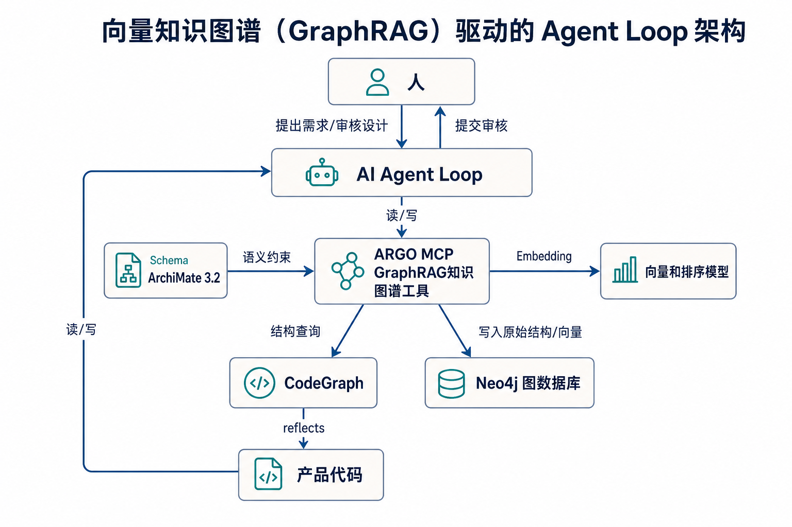

# ARGO HARNESS

ARGO 是一个向量知识图谱(GraphRAG)驱动的Agent Loop框架，以 ArchiMate 企业架构语言作为知识图谱的结构，覆盖从需求分析、架构设计、开发测试到交付归档的整个软件开发周期。并提供“人在环路”和“人在环上”的两种交付模式。

## 快速开始

### 安装

将平台适配包与共享的 `.argo/` 目录一同复制到目标工作区根目录，然后确认目标平台能够发现名为 `argo` 的 MCP 服务：

| 版本 | 环境 | 部署内容 | 主要入口 |
| --- | --- | --- | --- |
| [Cursor](.cursor/) | Cursor | `.cursor/` + `.argo/` | `/business-partner`；任务启动时选择 `/task-emit-human-in-the-loop` 或 `/task-emit-afk` |
| [Copilot](.github/) | GitHub Copilot | `.github/` + `.argo/` | `BusinessPartner`；任务启动时选择 `task-emit-human-in-the-loop` 或 `task-emit-afk` |
| [OpenCode](.opencode/) | OpenCode | `.opencode/` + `.argo/` | `BusinessPartner`；任务启动时选择 `task-emit-human-in-the-loop` 或 `task-emit-afk`，另有 `/argo-init`、`/argotest` |

安装后执行 `/argo-init`。它检查 `argo` MCP工具、GraphRAG（向量知识图谱）的就绪状态，并初始化知识图谱语义生命周期；（注：仅在配置了向量排序模型的情况下才进行自动Embedding并入库）

### 选择正确的入口

所有新需求和问题单（包括缺陷与测试失败）统一先进入 `BusinessPartner` 。它负责澄清业务目标、影响范围和验收边界，当决策完成后，将已收敛的决策树交给 `/task-tidy`。任务包准备完成后，再根据参与方式选择任务启动模式：
1）`/task-emit-human-in-the-loop` ：由人持续进行阶段审批与最终验收；
2）`/task-emit-afk` 由 Agent 自主持续推进、打回未通过验收的任务，直至验收通过；

| 场景               | 从这里开始                                                                                                                                                                                  |
| ---------------- | -------------------------------------------------------------------------------------------------------------------------------------------------------------------------------------- |
| 新需求、业务提案、缺陷或测试失败 | `BusinessPartner` / `/business-partner` → `/task-tidy` → 选择 `/task-emit-human-in-the-loop` 或 `/task-emit-afk`，验收通过后调用：`/delivery-archive`进行迭代交付文档归档                                    |
| 架构优化             | `BusinessPartner` / `/business-partner` → `/improve-codebase-architecture` → `/task-tidy` → 选择 `/task-emit-human-in-the-loop` 或 `/task-emit-afk`，验收通过后调用：`/delivery-archive`进行迭代交付文档归档 |

有关详细的选择标准、建议输入和输出，请参阅[使用场景与入口选择](design/argo-harness/usage-scenarios/README.md)。

## 开始前的准备工作

在启动交付前，可以将已有事实预填充到意图架构知识图谱，使 `BusinessPartner` 从可验证的业务与架构上下文开始，而不是重新猜测已有决策。

预填充范围包括：

- **业务需求**：目标、利益相关者、约束、业务规则、验收标准和已知风险；
- **架构设计**：现有能力、流程、应用、技术、依赖关系、架构视角和已确认的边界；
- **工作包**：可独立验收的交付范围、关联的架构元素及其验收用例。

每个工作包还应声明本次交付所需的：

- 领域 Skill 与专业知识；
- 工具、测试环境、设备或外部服务控制；
- 实现边界、交付证据与验收条件。

预填充的内容必须经过公共的图谱验证和人类验收；它为后续决策提供事实基础，但不绕过 `BusinessPartner`、意图设计、实现设计或两级验收流程。

可按领域模板组织这些准备材料：在 `design/specific-domain/<domain>/` 定义领域架构与知识，在 `.argo/skills/<domain>/` 或相应的平台适配目录中提供领域 Skill。更多约定请参阅[领域模板索引](design/specific-domain/README.md)。
