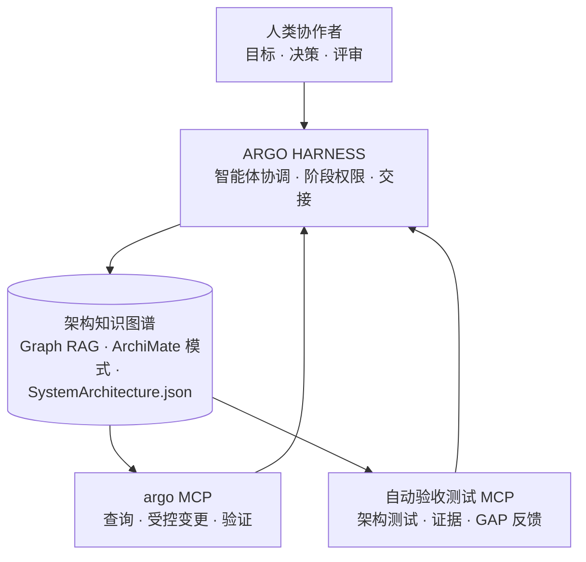
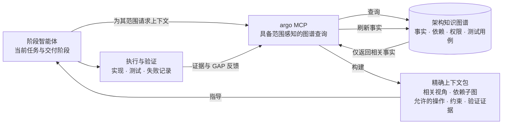

# ARGO HARNESS

ARGO 是一个面向复杂企业项目、由**架构知识图谱驱动**的 AI 编码框架。它通过精确的上下文管理，将业务意图、架构决策、测试关卡与智能体协作组织成一个可追溯、可验证、可重复的交付闭环。

## 核心方法

ARGO 由三个相互增强的组成部分构成：



1. **意图架构数据**：以 ArchiMate 元素、关系、视图和显式测试用例存储目标、能力、依赖、约束与验收语义。
2. **架构服务 MCP**：统一的 `argo MCP` 服务提供图谱查询、受控变更、模式与语义验证、交接验证和架构测试。
3. **HARNESS 交付流程**：BusinessPartner、IntentionDesign、ImplementationDesign、CodingAndReparing 与两级验收在明确的权限范围内协作。

了解更多：[总体架构](design/architecture.md) · [意图架构设计](design/intent-architecture/README.md) · [HARNESS 交付流程](design/argo-harness/README.md)

## 精确上下文管理

目标是让智能体**仅获得在正确阶段完成当前任务所需的事实、依赖、权限和验证证据**。这解决了大型项目中常见的上下文问题：信息过载、事实冲突、跨阶段越权、长会话退化，以及代码现实悄然覆盖业务意图。



四项约束使其成为可能：

- **事实精确性**：长期事实应归属于 `SystemArchitecture.json`、实现契约、交接文档和冻结测试，而非聊天记忆。
- **范围精确性**：每项任务都获得围绕其架构焦点、依赖子图和视角的上下文。
- **权限精确性**：每个阶段仅修改其负责的工件；超出范围的问题通过交接或 GAP 反馈流转。
- **时机精确性**：MCP 验证器、架构测试和两级验收通过执行证据刷新上下文。

完整机制请参阅[意图架构设计](design/intent-architecture/README.md)、[HARNESS 交付流程](design/argo-harness/README.md)和[基于架构依赖的 AI 任务编排方法论](notes/ai-engineering/驯服高维空间的重力：基于架构依赖的%20AI%20任务编排方法论.MD)。

## 一次交付如何运行

```text
业务澄清
  → 在意图架构中沉淀决策
  → 意图设计与人工验收评审
  → 实现设计与人工测试评审
  → 编码与修复，直至测试通过
  → 代码实现验收
  → 意图交付验收
```

上游阶段可以读取下游阶段的事实以辅助决策；下游阶段不得覆盖上游阶段的决策：

| 阶段 | 负责 | 不负责 |
| --- | --- | --- |
| BusinessPartner | 目标、选项、风险、控制点和可观测性点 | 实现设计和编码 |
| IntentionDesign | 意图图谱、覆盖度和显式测试用例 | 业务代码和实现契约 |
| ImplementationDesign | 稳定边界、测试入口和实现交接 | 直接修改意图图谱 |
| CodingAndReparing | 实际生产行为和清除失败记录 | 冻结测试和架构契约 |

有关智能体与技能之间完整的职责划分，请参阅[智能体和技能设计](design/argo-harness/agents-and-skills.md)。


## 快速开始

### 安装

将平台适配包与共享的 `.argo/` 目录一同复制到目标工作区根目录，然后确认目标平台能够发现名为 `argo` 的 MCP 服务：

| 版本 | 环境 | 部署内容 | 主要入口 |
| --- | --- | --- | --- |
| [Cursor](.cursor/) | Cursor | `.cursor/` + `.argo/` | `/business-partner`、`/orchestrating` |
| [Copilot](.github/) | GitHub Copilot | `.github/` + `.argo/` | `BusinessPartner`、`Orchestrator` |
| [OpenCode](.opencode/) | OpenCode | `.opencode/` + `.argo/` | `BusinessPartner`、`Orchestrator`、`/argoinit`、`/argotest` |

安装后，请确认：

1. 平台能发现 `argo` MCP 服务；
2. `design/KG/SystemArchitecture.json` 存在；
3. 可运行 `validateSystemArchitecture`；以及
4. 工作使用正确的智能体或技能入口。

稳定的设计参考文档负责定义 MCP 工具参数、变更副作用、验证器规则、生产语义生命周期、凭据边界及命令级操作说明。请参阅[意图架构 MCP 功能列表](design/mcp/意图架构%20MCP%20功能列表.md)和[MCP 验证机制](design/validator/intent-architecture-mcp-validation.md)。本 README 用于帮助新读者选择入口，不重复这些操作细节。

### 选择正确的入口

| 情况 | 从这里开始 |
| --- | --- |
| 新需求或业务提案 | `BusinessPartner` / `/business-partner`，然后使用 `/task-tidy` |
| 缺陷或测试失败 | 使用 `Orchestrator` / `/orchestrating`，判断问题位于意图、实现还是代码 |
| 没有可信的架构基线 | `/reverse-architecture-extraction` |
| 存在可信基线，但代码或测试被外部更改 | `/architecture-drift-recovery` |
| 寻找架构改进候选项 | `/improve-codebase-architecture` |
| 反复出现的智能体偏移或应提炼的规则 | `/distill-agent-rules` |

有关详细的选择标准、建议输入和输出，请参阅[使用场景与入口选择](design/argo-harness/usage-scenarios/README.md)。

## 扩展 ARGO

ARGO 具有稳定的基础：

```text
意图架构模板 + argo MCP + HARNESS 交付流程
```

项目可以通过领域模板和工作包扩展这一基础。工作包将一个有边界的交付关注点连接到约束它的架构元素，再提供交付该关注点所需的技能、环境访问和证据。

每个工作包应：

- 在意图架构中识别相关的目标、能力、流程、应用、技术和验收测试用例；
- 仅暴露该架构范围所需的领域技能、知识、测试环境信息、设备或外部服务控制；
- 定义其编码边界和测试入口；以及
- 通过公共验证流程返回构建、运行、可观测性和验收证据。

每个领域模板可以组合：

- 默认意图架构和视角；
- 领域技能和知识库；
- 编码标准和实现边界；
- 测试环境、设备或外部服务控制接口；以及
- 构建、运行、可观测性和验收证据。

| 可用领域 | 能力 |
| --- | --- |
| [HarmonyOS 与跨平台移动开发](design/specific-domain/harmonyos/README.md) | ArkTS/ArkUI、设备环境、窗口分析、跨平台比较、构建和运行工作流，以及交付预检 |

在 `design/specific-domain/<domain>/` 下添加新模板，并将领域技能放在 `.argo/skills/<domain>/` 或相应的平台适配目录中。领域能力不得绕过公共的意图设计、实现设计或两级验收流程。

更多扩展约定请参阅[领域模板索引](design/specific-domain/README.md)。
