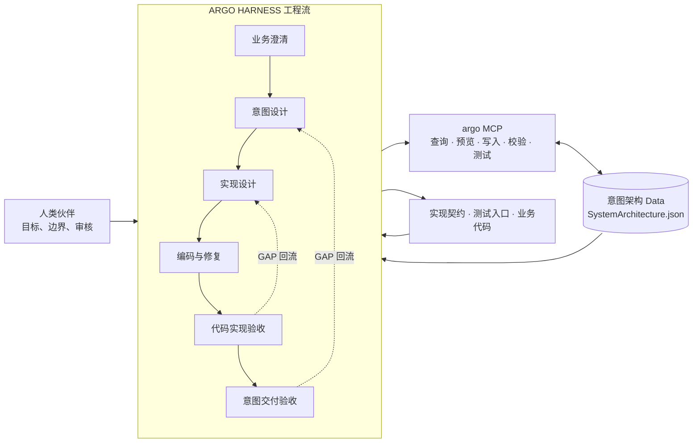

# ARGO 总体架构

ARGO 通过三个相互制约的构件，把一次概率性的 AI Coding 会话变成可追溯、可验证、可回归的交付闭环：

1. **意图架构（Data）**：保存目标、能力、约束、依赖和验收语义。
2. **架构服务（MCP）**：为图谱查询、变更、校验、测试和阶段交接提供受控接口。
3. **HARNESS 工程流（Process）**：让不同 Agent 在明确阶段、权限和人类门禁下完成交付。



## 1. 意图架构：共享的系统地图

`design/KG/SystemArchitecture.json` 使用 ArchiMate 元素、关系和视图表达“为什么做、做什么、由谁承担、依赖什么、如何验收”。它不是文件清单，也不是聊天摘要，而是人类和 Agent 共同导航的长期架构事实。

默认建模入口按业务关注点组织为五类 baseline viewpoint：

| Viewpoint | 回答的问题 |
| --- | --- |
| `StakeholderIntentViewpoint` | 谁关心，为什么做，成功对谁有价值 |
| `OutcomeCapabilityViewpoint` | 需要什么结果、能力、价值流和资源 |
| `BusinessBehaviorViewpoint` | 角色、流程、事件、服务和对象如何协作 |
| `CapabilityRealizationViewpoint` | 应用、数据和技术如何实现业务能力 |
| `AcceptanceDeliveryViewpoint` | 如何验收、有哪些风险、按什么顺序交付 |

详细建模规则见[意图架构设计](intent-architecture/README.md)。

## 2. 架构服务 MCP：唯一受控操作面

统一服务名为 `argo`，入口是 `.argo/scripts/argo-mcp-server.js`。它把直接编辑 JSON 的风险收束成可检查的操作链：

```text
读取当前图谱
  → 查询 focus element 上下文
  → preview mutation
  → apply mutation
  → validate architecture
  → validate handoff / run architecture tests
```

MCP 负责：

- 读取完整图谱和任务相关子图；
- 对元素、关系、view 做批量或 focused mutation；
- 校验 JSON Schema、ArchiMate 语义和 view 完整性；
- 校验意图到实现、实现到编码的 handoff；
- 执行显性架构 testcase 并刷新失败记录和交付状态；
- 生成架构变更与依赖顺序可视化。

接口详情见[意图架构 MCP 功能列表](mcp/意图架构%20MCP%20功能列表.md)，约束详情见[MCP 校验机制](validator/intent-architecture-mcp-validation.md)。

## 3. HARNESS 工程流：围绕事实源的闭环

ARGO 不依赖一个全能 Agent 在同一上下文里完成所有判断。每个阶段只拥有自己的变更权限：

| 阶段 | 主要职责 | 核心产出 |
| --- | --- | --- |
| 业务澄清 | 收敛目标、方案、风险、控制点和观测点 | `DecisionTreeRecord` |
| 意图内化/设计 | 更新意图图谱，定义显性验收边界 | 图谱 mutation、意图 handoff |
| 实现设计 | 定义稳定边界、测试入口和实现计划 | 实现契约、实现 handoff |
| 编码/修复 | 在冻结边界内修改真实生产行为 | 代码、失败记录清零 |
| 双层验收 | 检查实现契约和业务意图是否同时满足 | 通过或按 GAP 回流 |

完整流程见[HARNESS 工程流程](argo-harness/README.md)。

## 确定性如何形成

ARGO 的工程简化式是：

$$Total\ Certainty = C \times \frac{(P \cdot B) \times E}{G}$$

三大构件分别锚定公式中的可控因子：

| 因子 | 主要工程锚点 |
| --- | --- |
| `C` 目标清晰度 | BusinessPartner、结构化决策、显性验收 |
| `P` 协议规范 | 意图图谱、实现契约、handoff、测试入口 |
| `B` 边界约束 | MCP validator、阶段权限、人类审核、双层验收 |
| `E` 模型能效 | 聚焦子图、稳定事实源、清晰模块边界 |
| `G` 任务颗粒度 | 架构依赖切分、顺序交付、独立会话 |

完整推导见[ARGO 工程哲学](../notes/ai-engineering/ARGO%20工程哲学：确定性交付公式的工程化.md)。

## 稳定底座与可变扩展

ARGO 的稳定底座是“意图架构 + MCP + HARNESS 工程流”。领域模板是可变扩展层：每个模板预装适合该领域的意图架构起点、Skill、知识库、测试环境接口和验收能力。项目可以替换或组合模板，但不绕过通用阶段门禁。

领域模板组织方式见[领域模板索引](specific-domain/README.md)。
