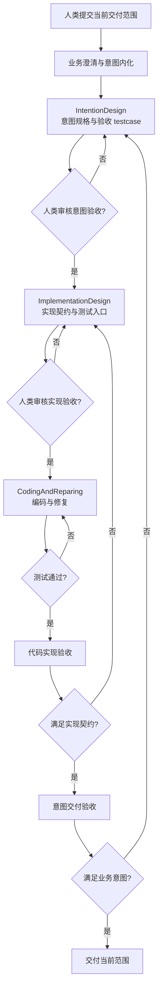

# ARGO HARNESS 工程流程

ARGO HARNESS 是围绕意图架构运行的强阶段交付流程。它用“上可见下、下不越上”的职责分层，把业务判断、架构决策、测试设计和代码修改分开，再通过 handoff、机器校验和双层验收闭环。

## 主流程



## 阶段职责

### 1. 业务澄清与意图内化

新需求先由 `BusinessPartner` 或 `/business-partner` 将自然语言目标收敛为结构化 `DecisionTreeRecord`。随后 `/task-tidy` 把决策树写入临时表格，委托 `TaskTidyGraphIntegrator` 生成图谱变更候选，由 host 验收后通过 `argo` MCP 内化到 `SystemArchitecture.json`。

该阶段不创建独立的 `design/tasks/` 任务文档。长期有效的目标、依赖、约束和验收标准必须成为架构元素、关系、view、属性或 testcase；只有无法表达为 durable architecture intent 的事项才保留为残余协调项。

### 2. 意图设计

`IntentionDesign` 拥有 Intent、Coverage 标准侧和意图 handoff。它可以读取下游现实以判断设计是否可交付，但不能直接修改业务代码、实现契约或测试代码。

完成条件：

- focus dependency subgraph 的业务语义完整；
- 每个 functional point 有同元素挂载的显性 testcase；
- testcase 已由人类审核；
- 图谱通过 `validateSystemArchitecture`；
- `.argo/temp/IntentToImplementationHandoff.json` 通过 `validateStageHandoff`。

### 3. 实现设计

`ImplementationDesign` 把意图映射为稳定实现边界、依赖方向、测试归属和可执行 testcase 入口。它只通过 intent element id 读取上层意图，不直接修改意图图谱；发现意图缺口时提交 `ImplementationToIntentTraceProposal`。

完成条件：

- 根/局部实现契约明确稳定边界；
- 显性 testcase 一对一物理化为可执行入口；
- 关键非显性测试和冻结文件明确；
- 初始执行结果区分 pass、expected failure 与 design blocker；
- `.argo/temp/ImplementationToCodingHandoff.json` 通过校验并获人类审核。

### 4. 编码与修复

`CodingAndReparing` 依据实现 handoff、失败记录和允许修改范围改变真实生产行为。它不能修改冻结的显性 testcase、关键非显性测试或架构契约，也不能用 test-only 分支、stub 或后门制造假通过。

完成条件：

- 当前 handoff 范围内的失败记录清零；
- 显性 testcase 与必要回归测试通过；
- 代码变化符合实现契约；
- 外部接口变化同步对外说明。

### 5. 双层验收

代码完成不等于交付完成：

1. **代码实现验收**检查代码是否满足实现架构契约；GAP 回到实现设计或编码。
2. **意图交付验收**检查实现是否满足业务意图和显性验收语义；GAP 回到意图设计。

## 事实源与优先级

| 资产 | 作用 | 生命周期 |
| --- | --- | --- |
| `design/KG/SystemArchitecture.json` | 意图、依赖和验收事实 | 长期 |
| `OVERALL_ARCHITECTURE.md`、局部 `ARCHITECTURE.md` | 实现架构契约 | 长期 |
| `.argo/temp/IntentToImplementationHandoff.json` | 意图到实现交接 | 当前阶段 |
| `.argo/temp/ImplementationToCodingHandoff.json` | 实现到编码交接 | 当前阶段 |
| `design/KG/test-failure-records.json` | 显性测试失败和修复队列 | 可回归 |
| `design/persistant-memory/*.md` | 未闭合风险与待蒸馏经验 | 临时治理 |

当事实冲突时，未经批准的代码现实不能覆盖意图；编码阶段不能通过修改冻结测试改写实现契约；下层发现上层缺口必须走提案和回流。

## 认知分层

```text
BusinessPartner             全局业务分析，只读架构事实
  ↓
IntentionDesign             拥有 Intent / Coverage / intent handoff
  ↓
ImplementationDesign        拥有 Implementation / Test / implementation handoff
  ↓
CodingAndReparing           拥有 Code / Repair / Forbidden Shortcut
```

完整的 Domain Ontology 与 Behavior 设计见[认知规格与事件驱动交付](../../notes/ai-engineering/ARGO%20领域本体与%20Agent%20行为：认知规格与事件驱动交付.md)。

## 人类伙伴的门禁

人类不是旁观者，必须负责：

- 确认目标、边界、优先级和业务价值；
- 审核意图验收 testcase；
- 审核实现测试入口与实现 handoff；
- 按架构依赖顺序提交交付范围；
- 处理 Agent 无法自行解决的权限、设备、外部服务和测试环境问题；
- 决定架构反推、漂移恢复和意图变更等高影响分支。

## 任务颗粒度与执行顺序

`/task-tidy` 根据架构依赖生成交付路由和 G 估算。即使图谱存在可并行范围，也优先由人类按依赖顺序逐个启动新会话；当 `G_cumulative > 10` 或存在高熵风险时必须分段，避免多个 Agent 同时污染架构事实、测试入口和代码边界。

方法论详见[基于架构依赖的任务编排](../../notes/ai-engineering/驯服高维空间的重力：基于架构依赖的%20AI%20任务编排方法论.MD)。

## 继续阅读

- [Agent 与 Skill 设计](agents-and-skills.md)
- [使用场景与入口选择](usage-scenarios/README.md)
- [总体架构](../architecture.md)
- [意图架构设计](../intent-architecture/README.md)
