# 使用场景与入口选择

本目录是 ARGO 使用方式的权威入口。先根据“当前是否有可信架构基线”和“变化属于意图、实现还是代码”选择流程，不要把所有问题都直接交给编码 Agent。

## 场景速查

| 场景 | 判断条件 | 首选入口 | 期望产出 |
| --- | --- | --- | --- |
| 新需求开发 | 新增或改变业务目标、能力、约束、验收 | `BusinessPartner` / `/business-partner` → `/task-tidy` | 结构化决策、图谱变更、交付路由 |
| 缺陷修复 | 已有失败现象，需要先判断问题层级 | `Orchestrator` / `/orchestrating` | 意图、实现或代码的正确分流 |
| 架构优化 | 不新增功能，改善边界和可测试性 | `/improve-codebase-architecture` → `/grill-me` | 候选、决策树、图谱内化 |
| 既有仓库架构反推 | 没有可信意图/实现基线 | `/reverse-architecture-extraction` | 候选架构、证据矩阵、开放问题 |
| 架构漂移恢复 | 已有可信基线，外部修改了代码/测试 | `/architecture-drift-recovery` | drift 分类与阶段路由 |
| 业务方案探索 | 目标或方案尚不稳定 | `/business-partner` 或 `/grill-me` | 可判断的方案树和验收控制点 |
| 市场/竞品研究 | 进入产品决策前需要外部证据 | `/market-research` | 有来源的事实、推断和建议 |
| 意图图谱审计 | 担心 ArchiMate 语义或追踪错误 | `ArchimateLanguagistAudit` | 只读审计发现 |
| Agent 行为治理 | 重复越权、漏读、跳阶段 | `/distill-agent-rules` | 可执行规则及源 memory 清理 |
| 交付归档 | 当前范围验收完成 | `/delivery-archive` | PRD、设计、自测、规格验收证据 |
| 领域开发 | 需要平台专属知识和环境 | 对应领域 Skill | 领域实现与可观察交付证据 |

## 新需求开发

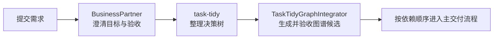

要求：

1. 不从普通编码会话开始。
2. 决策树必须包含目标、约束、方案、风险、控制点和观测点。
3. `/task-tidy` 将临时表格写入 `.argo/temp/decision-tree/`，不创建 `design/tasks/`。
4. host 必须验收每个决策节点是否映射为元素、关系、属性、view、testcase 或有理由的 residual coordination。
5. 通过 MCP preview、apply、validate 后生成依赖图和 G 估算。
6. 人类按依赖顺序逐个新会话提交给 Orchestrator。

## 缺陷修复

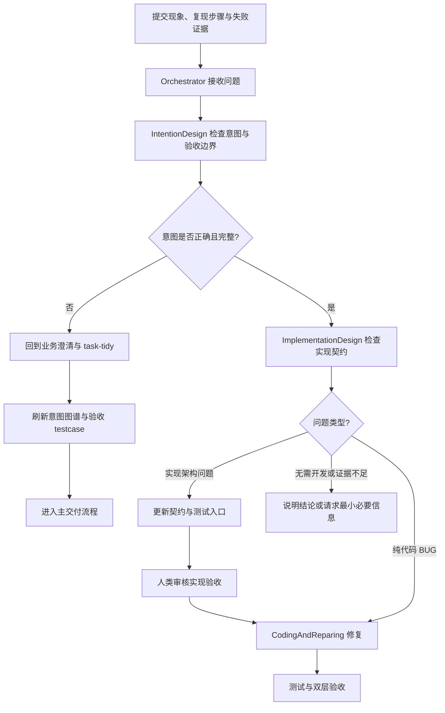

“问题”不等于“代码 BUG”。Orchestrator 先让 `IntentionDesign` 判断业务意图和验收边界是否正确：

- **意图错误或缺失**：回到新需求前置流程，重新澄清并内化。
- **意图正确、实现契约错误**：由 `ImplementationDesign` 更新契约和测试入口，经人类审核后编码。
- **意图和实现均正确**：`CodingAndReparing` 直接修复生产行为。
- **无需开发或证据不足**：说明原因或请求最小必要信息。

输入尽量包含现象、复现步骤、失败命令、日志摘要、期望行为和影响范围。修复完成后仍需经过实现契约和业务意图两层验收。

## 架构优化

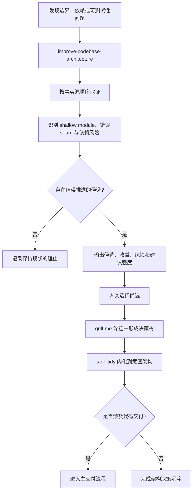

`/improve-codebase-architecture` 先按意图图谱、实现契约、局部架构文档、handoff、代码和测试的顺序取证，识别：

- shallow module 与 pass-through；
- 职责或接口泄漏；
- seam 位置不合理；
- 测试穿透内部实现；
- 依赖方向和稳定性问题；
- 影响 Agent 可导航性的高摩擦区域。

Skill 只输出候选，不直接修改资产。人类选择候选后用 `/grill-me` 深挖，再通过 `/task-tidy` 内化；涉及交付时进入主流程。

## 既有仓库架构反推

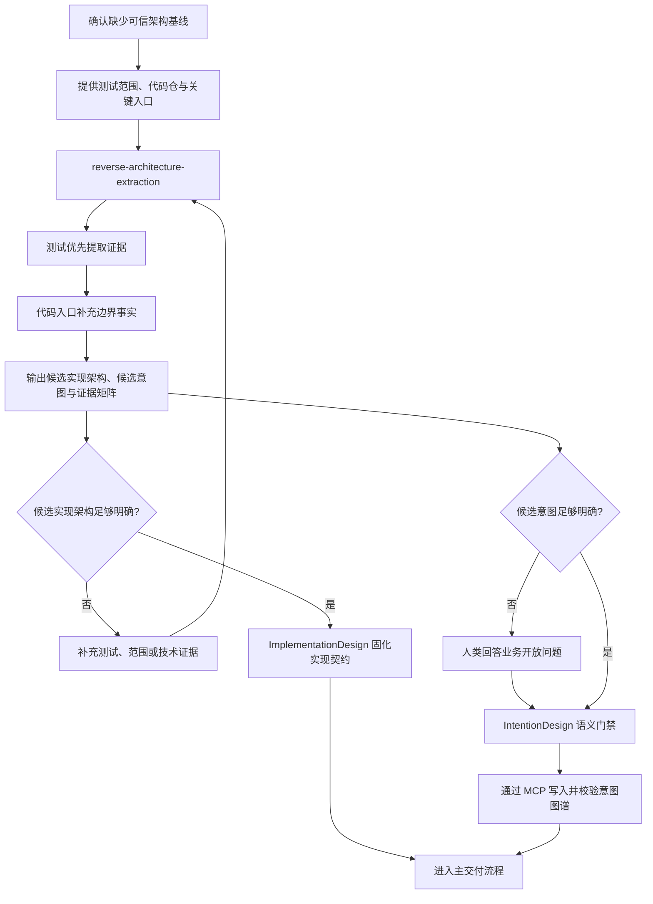

适用于缺少可靠 `SystemArchitecture.json`、实现契约或 handoff 的仓库：

1. 人类提供代码仓、测试范围或关键入口。
2. `ReverseArchitectureExtraction` 以测试为第一证据源、代码入口为边界补充。
3. 输出候选意图架构、候选实现架构、证据矩阵和开放问题。
4. 候选实现交给 `ImplementationDesign` 固化。
5. 候选意图经 `IntentionDesign` 业务语义门禁后才能写图谱。

无测试覆盖的代码只能作为低置信实现事实；纯技术细节不能自动提升为业务意图。

## 架构漂移恢复

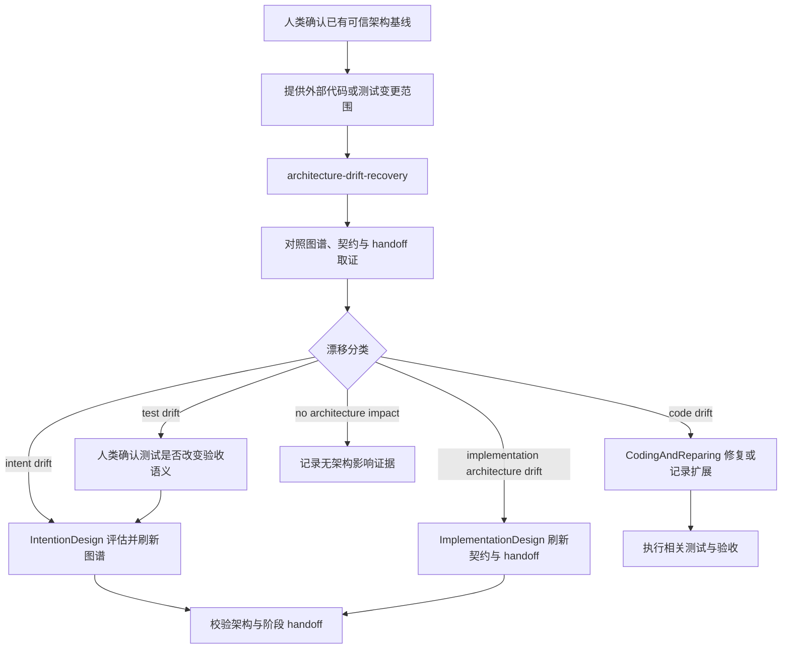

仅当人类确认已有可信架构基线，且代码或测试被外部修改时使用。每项变化必须分类：

| Drift | 路由 |
| --- | --- |
| `intent drift` | `IntentionDesign` 判断是否刷新图谱 |
| `implementation architecture drift` | `ImplementationDesign` 刷新契约、测试归属或 handoff |
| `code drift` | 记录偏离，必要时交 `CodingAndReparing` |
| `test drift` | 人类先确认测试是否越权改变验收语义 |
| `no architecture impact` | 记录证据，不刷新架构 |

Agent 不自行在“初始化反推”和“漂移恢复”之间切换；前提不清时必须让人类选择。

## 业务方案探索

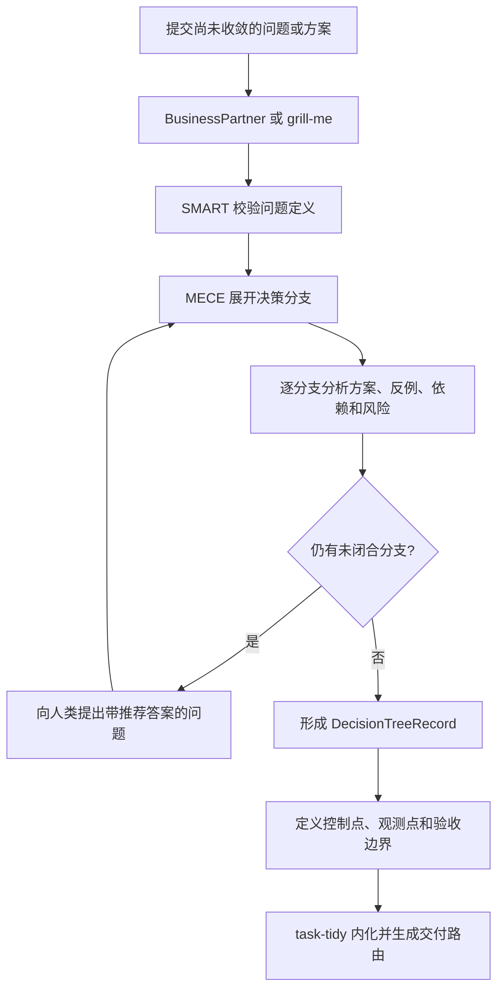

需求未收敛时先用 `BusinessPartner` 或 `/grill-me`：

- 用 SMART 判断问题是否可衡量、可完成；
- 用 MECE 展开方案分支；
- 明确推荐答案、反例、依赖和风险；
- 从验收者视角定义控制点和观测点；
- 达成共识后交 `/task-tidy`，而不是直接形成开发任务。

## 市场与竞品研究

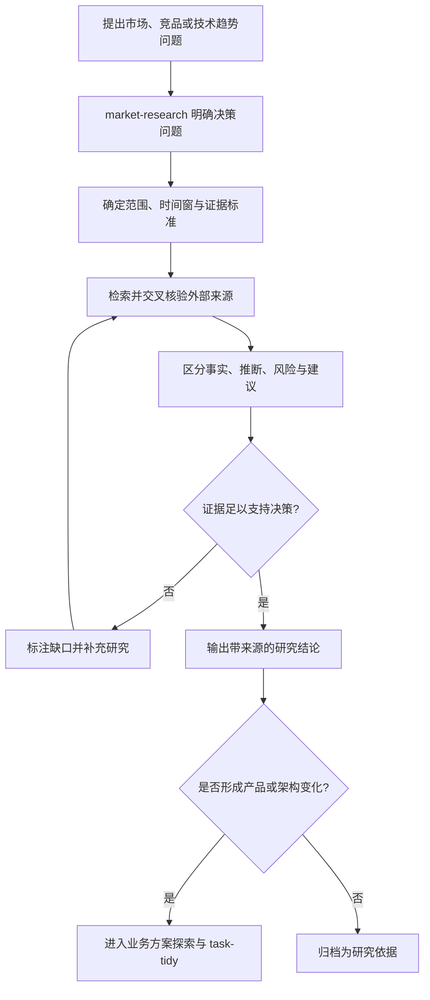

研究结果本身不是意图事实。只有经业务决策确认的目标、约束和验收变化，才能通过 `/task-tidy` 进入 `SystemArchitecture.json`。

## 意图图谱语义审计

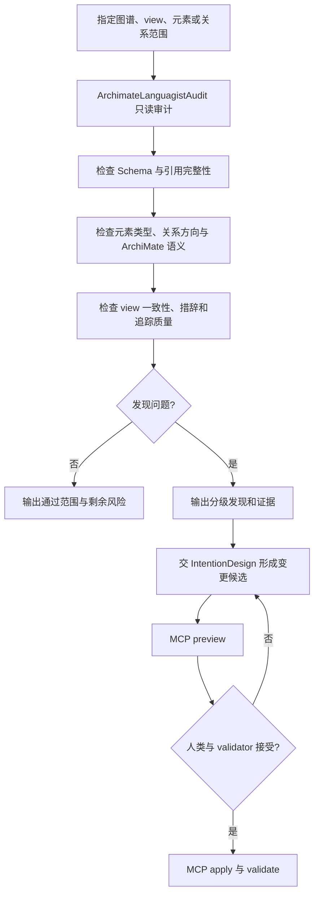

审计 Agent 默认不直接修改图谱。修复仍由 `IntentionDesign` 按 viewpoint-first 规则和 MCP 受控变更流程执行。

## Agent 行为与记忆治理

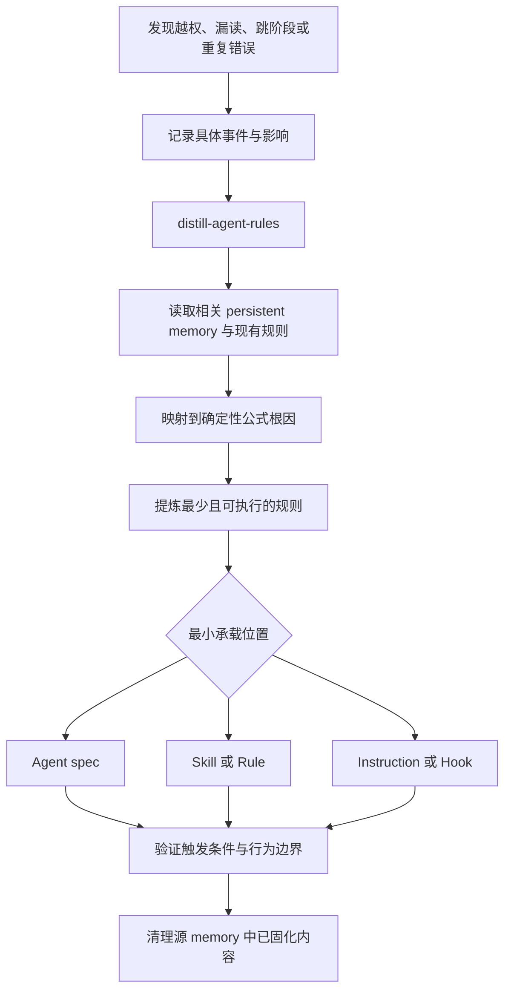

当 Agent 越权修改、漏读契约、误改冻结测试或反复跳阶段时，使用 `/distill-agent-rules`：

1. 从具体偏差和 `design/persistant-memory/` 中提取稳定复现模式；
2. 映射到确定性公式的根因；
3. 形成 1–3 条可执行规则和触发条件；
4. 选择最小承载位置：Agent spec、Skill、Rule、Instruction 或 Hook；
5. 固化后删除源 memory 中的重复内容，避免双重事实源。

## 交付归档与外部说明

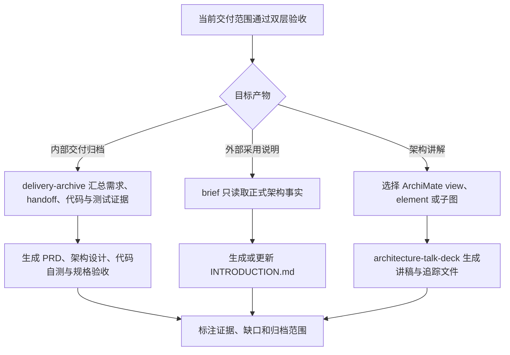

- `/delivery-archive` 在 `docs/YYYY-MM-DD-[名称]/` 下归档 `PRD.md`、`架构设计.md`、`代码交付自测试.md`、`规格验收.md`。
- `/brief` 只基于正式意图和实现架构生成或更新 `INTRODUCTION.md`。
- `/architecture-talk-deck` 从指定 ArchiMate view/element/子图生成讲稿，并保留范围与追踪证据。

## 领域开发

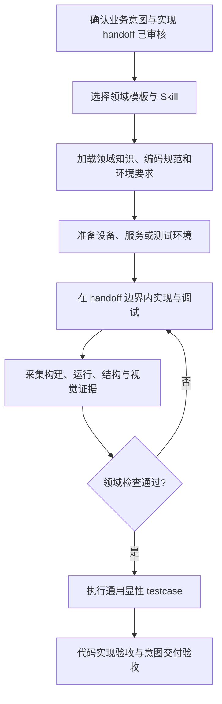

领域 Skill 提供平台知识和可观察证据，但不能取代通用意图设计、实现设计、冻结测试和双层验收。可用模板见[领域模板索引](../../specific-domain/README.md)。

## 输入建议

| 输入 | 推荐写法 |
| --- | --- |
| 需求/问题 | 目标 → 当前现象 → 约束 → 期望结果 |
| 文件 | 显式引用需求、设计、失败记录和关键代码 |
| 验收 | 写清控制点、观测点和业务可读结果 |
| 失败 | 附失败命令、错误摘要、日志和测试路径 |
| 不确定方案 | 先业务拷问，不直接要求编码 |

领域专属场景见[领域模板索引](../../specific-domain/README.md)。
