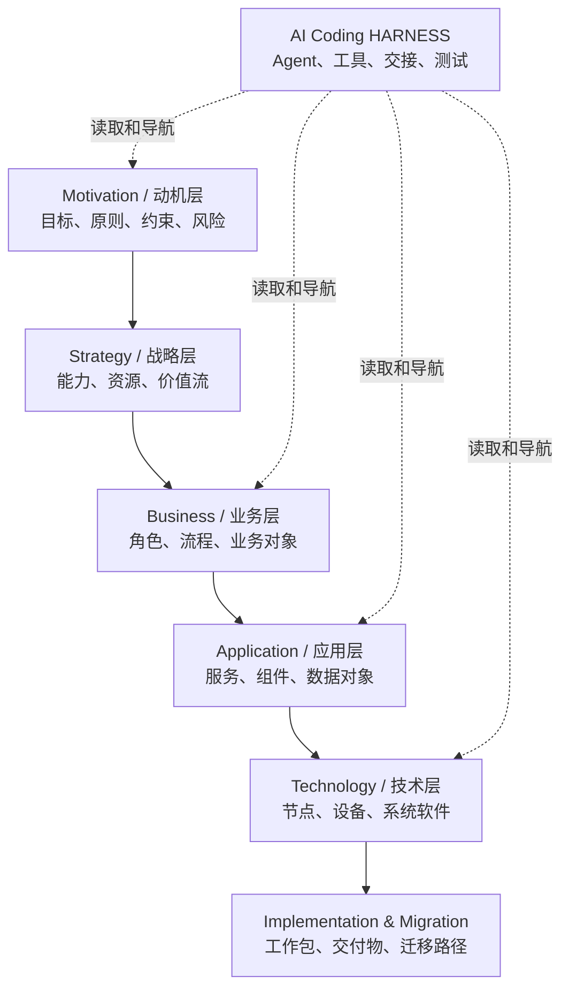
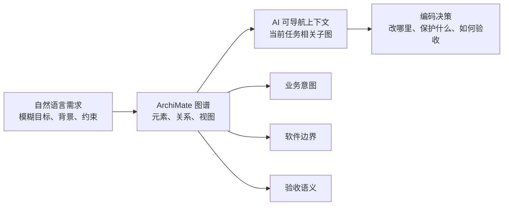
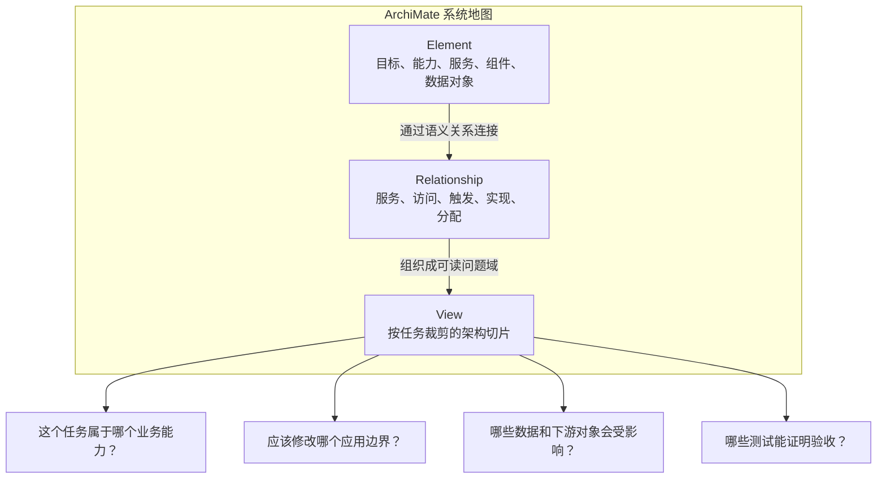
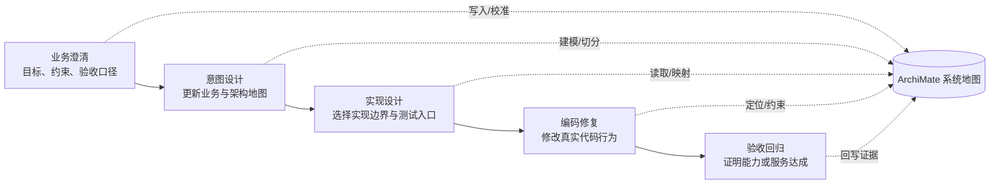
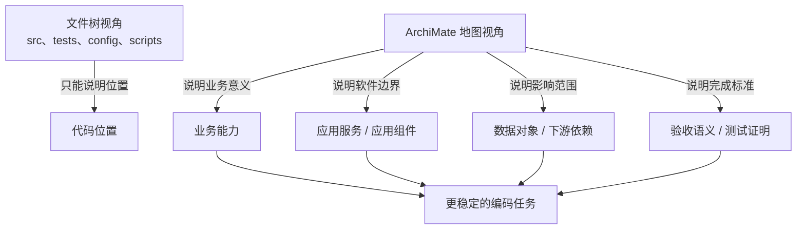

# ARGO HARNESS 的 ArchiMate 建模理念

ArchiMate 是 The Open Group 发布的企业架构建模语言。它的目标不是替代代码、需求文档或流程图，而是提供一套跨业务、应用、数据、技术和动机层的共同语言，用来描述复杂系统中的对象、关系、依赖和决策影响。

如果把 AI Coding 看成一次在复杂系统中的探索，那么 ArchiMate 的价值就是提供“地图”。这张地图不只标出 AI Agent 自身的 HARNESS，也标出业务领域、软件架构、数据对象、技术基础设施、约束、目标和交付关系。AI 不再只是在文件和提示词之间搜索，而是在一个有层次、有方向、有语义的系统地图中定位问题、理解边界、选择路径。

参考链接：

- [The ArchiMate Enterprise Architecture Modeling Language](https://www.opengroup.org/archimate-forum/archimate-overview)
- [ArchiMate 3.2 Specification](https://publications.opengroup.org/c226)
- [ArchiMate Certification Program](https://www.opengroup.org/certifications/archimate)

本文与《[ARGO 工程哲学：确定性交付公式的工程化](ARGO%20工程哲学：确定性交付公式的工程化.md)》和《[ARGO 领域本体与 Agent 行为：认知规格与事件驱动交付](ARGO%20领域本体与%20Agent%20行为：认知规格与事件驱动交付.md)》互补：前者解释为什么需要确定性交付系统，后者解释 Agent 如何通过本体与行为规格执行；本文聚焦 ArchiMate 这套建模语言本身，说明它为什么适合作为 AI Coding HARNESS 的顶层地图。

---

## 从“需求描述”到“可执行意图”

传统 AI Coding 的一个根本问题，是需求和架构经常停留在对话或 Markdown 段落里。它们可以被人理解，却很难被工具稳定检查，也很难在多个 Agent、多个会话之间保持一致。结果是：同一个“模块”“能力”“验收点”在不同阶段被重新解释，编码阶段可能实现了一个看似合理、但已经偏离原始意图的版本。

ARGO 的建模理念是：**意图必须结构化，结构必须形成地图，地图必须能被人和 AI 共同导航。**

ArchiMate 正好适合承担这层地图语言。它不是只描述软件组件，也不是只描述业务流程，而是能够把目标、业务能力、应用服务、应用组件、数据对象、技术节点、约束和迁移计划放在同一套语义框架里。对 AI Coding 来说，这意味着：

- 业务目标可以进入图谱，而不是只留在需求文档里。
- 业务领域、软件架构、数据流、外部系统、团队职责和 AI HARNESS 本身都可以放进同一张地图。
- 依赖、触发、访问、分配等关系有明确方向和语义，而不是靠元素名称猜测。
- View 可以把复杂系统切成不同视角，使每个 Agent 面对的是可掌握的架构子图。
- 动机层、业务层、应用层和技术层可以连在一起，让 AI 理解“为什么做”“做什么”“由谁实现”“运行在哪里”。

这让“需求是否已经进入系统”从主观判断变成一个工程问题：它是否已经被建模为元素、关系、属性、view、验收 testcase 和可追踪证据。

---

## ArchiMate 是 AI Coding 的系统地图

AI Coding 的难点很少只是“某一行代码怎么写”。真正困难的是模型必须在有限上下文里回答一组架构问题：这个功能属于哪个业务能力？它依赖哪些上游约束？应该修改哪个稳定边界？哪些测试代表验收？哪些代码只是实现细节，哪些接口是外部契约？

ArchiMate 提供的不是单点答案，而是定位这些问题的地图。它至少包含三类核心对象：

1. **elements**：地图上的对象，例如目标、原则、业务角色、业务过程、应用服务、应用组件、数据对象、技术节点。
2. **relationships**：对象之间的语义连接，例如组合、聚合、服务、访问、触发、实现、分配、影响。
3. **views**：面向不同读者和任务的地图切片，例如业务能力视图、应用协作视图、数据访问视图、技术部署视图、迁移路线视图。

这三者合起来，可以把“业务世界”和“软件世界”放到同一张可探索的地图上。AI 看到的不再只是 `src/` 下的文件列表，而是一个从目标到能力、从能力到服务、从服务到组件、从组件到数据和技术基础设施的路径网络。

因此，图谱中的关系方向、关系类型、view 归属和父子结构都不是装饰。它们会影响 AI 如何选择上下文、如何解释边界、如何判断依赖，以及如何避免把局部代码修改误认为系统级解决方案。

---

## ArchiMate 对 AI Coding 的核心价值

ARGO 并不把 ArchiMate 当作形式主义的建模模板，而是选择性强化那些能提高 AI Coding 确定性的语义。

### 1. 用顶层语言连接业务与软件

许多 AI Coding 失败不是因为模型不会写代码，而是因为它不知道代码背后的业务语义。ArchiMate 的 Motivation、Strategy、Business、Application、Technology 等层次，能把“业务为什么需要这个变化”和“软件应该在哪里变化”连起来。

这对 AI 很关键：模型需要的不只是文件路径，而是目标、能力、约束和实现边界之间的导航线索。ArchiMate 让这些线索成为显式结构，而不是一次性 prompt 里的背景叙述。

### 2. 用关系方向表达依赖和责任

ARGO 明确要求 ArchiMate 元素和关系语义要从图结构、方向、view 和上下文解释，而不是只看名称。原因很简单：自然语言名称容易相似，方向却决定责任。

`A --(Access)--> B` 表达 A 访问 B；`A --(Triggering)--> B` 表达 A 触发 B；`A --(Assignment)--> F` 表达 A 承担或执行 F。方向反了，Agent 的职责和证据链也会反。

对 AI Coding 来说，关系方向就是流程方向、读写方向、依赖方向和责任方向的一部分。方向清楚，模型才更容易判断应该先理解谁、修改谁、保护谁。

### 3. 用 View 管理上下文窗口

ArchiMate 的 view 在 AI Coding 中可以被理解为上下文窗口。它不是给人看的静态截图，而是针对某个问题裁剪出的系统切片。

一个 view 可以只展示业务能力及其目标，另一个 view 可以展示应用组件之间的协作，第三个 view 可以展示数据对象如何被访问。不同任务读取不同 view，就能减少无关上下文对模型推理的干扰。

过大的 view 会让模型回到“在一团上下文里猜重点”的状态。好的建模会把大系统拆成一组可导航的小地图，让 AI 每次只处理和当前任务最相关的架构子图。

### 4. 用模型边界承载验收语义

在 AI Coding 中，测试和验收不应该只是编码后的补充。它们应该和业务能力、应用服务、用户旅程、数据边界一起被建模。

关键原则是：验收语义应该挂回拥有该边界的架构对象。上游目标、方案文档或旁路测试都不能替代真正拥有验收责任的业务能力或应用服务。这样做是为了防止编码阶段用“看起来相关”的测试覆盖真正需要验收的业务点。

换句话说，ArchiMate 帮助 AI 明白：测试不是孤立脚本，而是架构地图上某个能力、服务或边界的证明。

---

## ArchiMate 与 HARNESS 的关系

AI Coding HARNESS 的关键，不是把所有事情交给一个“全能 Agent”，而是让不同角色围绕同一张系统地图分工协作。

在这样的 HARNESS 中，ArchiMate 可以承担三层作用：

1. **认知层**：让 Agent 知道系统有哪些业务对象、应用对象、数据对象和技术对象。
2. **导航层**：让 Agent 知道对象之间如何依赖、触发、访问、实现和服务。
3. **协作层**：让不同 Agent 围绕同一张图交接任务，而不是各自在自己的自然语言上下文里重新解释系统。

以 ARGO 为例，业务澄清、意图设计、实现设计和编码修复可以看作围绕同一张 ArchiMate 地图的不同探索动作。前一个阶段不是把一段文字交给后一个阶段，而是把更清晰的地图、边界和路径交给后一个阶段。

这带来一个重要后果：当系统发现问题时，可以回到正确的建模层。

- 如果业务目标、依赖或验收边界不清，问题属于地图的意图层。
- 如果应用边界、服务职责或数据归属不清，问题属于地图的应用层。
- 如果部署、运行环境或技术依赖不清，问题属于地图的技术层。
- 如果地图清楚而代码行为不满足，问题才真正落到编码修复层。

ArchiMate 图谱在这里承担的是“归因坐标系”的角色。没有它，所有问题都容易被误判成“让编码 Agent 再试一次”。

---

## 从文件树到架构地图

没有架构地图时，AI 看到的是文件树。文件树告诉它“东西在哪里”，但不一定告诉它“为什么存在”“谁依赖谁”“哪个边界稳定”“哪个变化会影响业务验收”。

ArchiMate 把文件树背后的系统结构显性化：

- 文件背后是应用组件或技术组件。
- 接口背后是应用服务或业务服务。
- 数据结构背后是业务对象或数据对象。
- 测试背后是能力、服务或约束的验收证明。
- 任务背后是目标、约束和依赖路径。

这会改变 AI Coding 的工作方式。模型不再从“搜索相关文件”开始，而是先沿地图确认：我要改的是哪个能力？它由哪个服务暴露？由哪些组件实现？依赖哪些数据对象？哪些下游对象会受影响？然后才进入代码层。

这就是 ArchiMate 对 AI Coding 的真正价值：它让代码修改前多了一层可讨论、可导航、可复用的系统语义。

---

## 对确定性交付公式的贡献

ARGO 的确定性交付公式是：

$$Total Certainty = C \times \frac{(P \cdot \mathbf{B}) \times E}{G}$$

ArchiMate 建模主要增强其中四个因子：

- **C：目标清晰度**。业务目标、能力、验收点和依赖进入图谱后，需求不再只靠自然语言回忆。
- **P：协议规范**。元素、关系、view、handoff 和 testcase 共同构成可传递协议。
- **B：边界约束力**。阶段 Agent 的读写权限可以绑定到图谱对象和行为规格，越界更容易被发现。
- **E：模型能效**。小而清晰的 view、明确的关系方向和稳定事实源减少模型搜索和猜测成本。

同时，它也帮助降低 **G：任务颗粒度**。当任务可以按架构元素、依赖子图和显性 testcase 切分时，单次 Agent 执行范围就不必吞下整套系统。

这就是 ARGO 使用 ArchiMate 的根本原因：它不是为了让架构看起来更专业，而是为了让 AI 交付过程更可控、更可验收、更可回归。

---

## 建模原则小结

在 AI Coding HARNESS 中使用 ArchiMate，可以用以下原则收束：

1. **图谱优先于对话记忆**：重要意图必须沉淀到 `SystemArchitecture.json`，不能只留在聊天上下文里。
2. **语义优先于名称直觉**：判断元素和关系时看类型、方向、view 和上下文，不只看名字是否像。
3. **关系必须表达责任方向**：访问、触发、分配、实现、服务等关系都要能说明谁依赖谁、谁驱动谁、谁证明谁。
4. **View 是认知边界**：每个 view 都应服务于一个清晰问题，并保持足够小。
5. **测试是意图的一部分**：显性验收 testcase 应挂回拥有该验收边界的架构元素。
6. **代码是证据，不是自动覆盖意图**：实现可以证明意图已落地，但不能无声改写尚未批准的意图。
7. **HARNESS 也应被建模**：AI Agent、工具链、交接物和测试入口同样是系统的一部分，但它们不是全部；业务领域和软件架构才是地图的主体。

---

## 结语

ARGO HARNESS 的 ArchiMate 建模理念，可以概括为一句话：**用架构语言为 AI Coding 构建系统地图，让 Agent 在业务与软件的总体结构中探索，而不是在文件和提示词之间猜测。**

这套做法把 AI Coding 从“模型理解了多少”推进到“系统如何让模型稳定理解”。ArchiMate 提供语义骨架，`SystemArchitecture.json` 提供事实载体，阶段 Agent 提供执行路径，人类伙伴则在关键节点确认目标和价值判断。

当这些部分闭合起来，HARNESS 才不只是一个 AI 自动化外壳，而是一套面向确定性交付的架构化工作系统。
