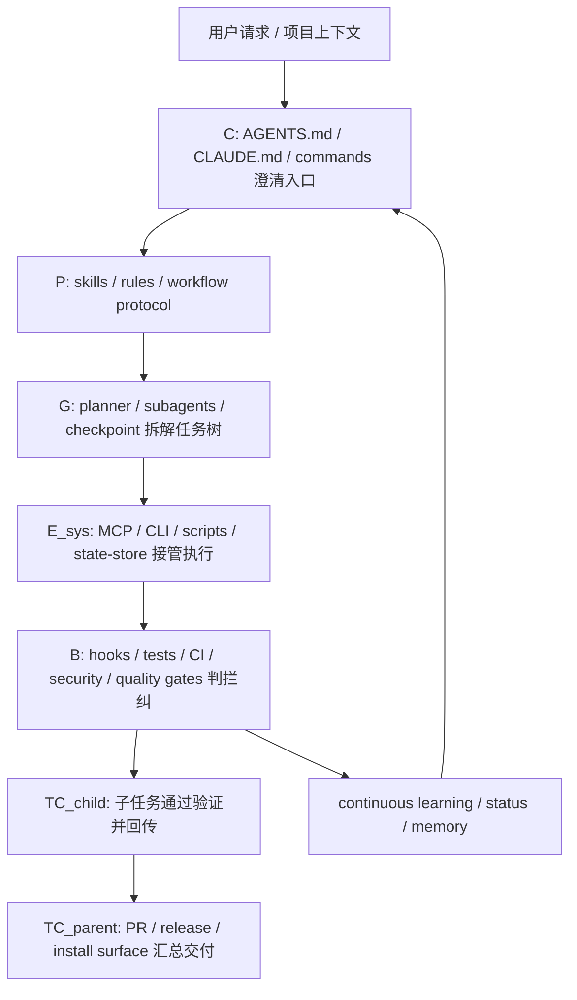

# ECC AI Coding Harness 确定性交付公式评估

本文基于 `notes/ARGO 工程哲学：确定性交付公式的工程化.md` 中的递归任务树交付公式，对本项目构建的 AI Coding Harness 系统进行结构化评估：

$$TC_{node} = \left[ C \times \frac{(P \cdot B) \times E_{sys}}{G} \right] \cdot \prod_{j \in Children} (TC_j)^{d_j}$$

结论先行：ECC 的设计并不是单点提示词增强，而是一个面向多 harness 的确定性交付系统。它将需求澄清、规则管道、工具接管、自动拦截、验证闭环、状态记忆、跨 harness 适配和持续学习拆成可安装、可测试、可观测的资产层。仓库自带 `scripts/harness-audit.js` 对当前仓库给出 `80/80` 的确定性审计结果，覆盖 Tool Coverage、Context Efficiency、Quality Gates、Memory Persistence、Eval Coverage、Security Guardrails、Cost Efficiency、GitHub Integration 八类检查。

## 一、公式因子解释口径

| 因子 | 在 AI Coding Harness 中的含义 | 目标 |
| --- | --- | --- |
| $C$ Clarity | 初始意图、项目约束、角色边界、任务成功标准的清晰度 | 让模型从正确坐标出发 |
| $P$ Protocol | 规则、技能、命令、工作流、接口和安装协议 | 预先裁剪可行路径 |
| $B$ Binding Power | hooks、测试、CI、审计、安全拦截、格式化、类型检查、评审代理 | 对偏离路径进行判、拦、纠 |
| $E_{sys}$ System Efficacy | 模型能力与外部工具、MCP、CLI、脚本、状态存储、子代理的组合效能 | 把概率推理外包给确定性工具 |
| $G$ Granularity | 任务拆分粒度、技能懒加载、安装模块、子代理分工、上下文压缩 | 降低单次搜索空间和上下文熵 |
| $\prod (TC_j)^{d_j}$ Recursive TC | 子任务、子代理、安装目标、工作流阶段、测试层级向父任务回传的确定性 | 防止底层不确定性污染上层交付 |

## 二、Harness 组成部分到公式因子的映射

| Harness 组成部分 | 代表文件或目录 | 映射因子 | 理由 |
| --- | --- | --- | --- |
| 顶层项目指令与协作原则 | `AGENTS.md`, `CLAUDE.md` | $C$, $P$, $G$ | 顶层文件把项目目标、代理优先、TDD、安全、不可变性、计划优先等约束提前写入上下文，提高起点精度；同时规定复杂任务先拆解，直接降低 $G$。 |
| Skills 工作流库 | `skills/`, `.agents/skills/`, `.cursor/skills/` | $P$, $G$, $E_{sys}$, $\prod TC$ | Skill 是可按需加载的工作流协议，把领域经验从提示词中抽成可复用模块；懒加载减少上下文负担，专项技能将大任务拆成可执行子过程。 |
| Agents 专业子代理 | `agents/`, `.codex/agents/*.toml` | $G$, $E_{sys}$, $\prod TC$ | 子代理把探索、评审、安全、构建修复、TDD 等任务分派给专用执行单元，缩小每个节点的动作空间，并把子节点结果回传给主任务。 |
| Commands / slash 入口 | `commands/`, `legacy-command-shims/`, `.opencode/commands/` | $C$, $P$, $G$ | 命令将模糊用户意图转换为预定义流程入口，例如审计、验证、模型路由、checkpoint；这相当于为常见任务提供低熵入口。 |
| Rules 规则层 | `rules/`, `.cursor/rules/` | $P$, $B$ | 通用和语言规则为代码风格、安全、测试、Git 工作流提供路径边界，防止模型在执行中偏离项目规范。 |
| Hooks 自动化护栏 | `hooks/hooks.json`, `.cursor/hooks.json`, `scripts/hooks/` | $B$, $E_{sys}$, $\prod TC$ | Pre/Post/Stop/Session hooks 在工具调用、文件编辑、shell 执行、MCP 调用、会话开始结束等节点执行拦截、检查、记录和纠偏，是系统最直接的 Binding Power。 |
| Verification / Eval 体系 | `skills/verification-loop/`, `skills/eval-harness/`, `commands/checkpoint.md`, `tests/` | $B$, $\prod TC$ | 构建、类型、lint、测试、覆盖率、差异审查和 eval checkpoint 把每个子节点的完成状态变成可判定事实，避免错误向上游传播。 |
| Security Guardrails | `skills/security-review/`, `agents/security-reviewer.md`, `commands/security-scan.md`, `.cursor/hooks/before-submit-prompt.js` | $P$, $B$, $E_{sys}$ | 安全规则、审查代理、扫描命令和 prompt/file/MCP 前置检查把 secrets、敏感文件、hook 绕过等高风险路径直接降权或阻断。 |
| MCP 配置与工具外包 | `mcp-configs/mcp-servers.json`, `.codex/config.toml`, `.mcp.json` | $E_{sys}$, $P$, $B$ | MCP 将搜索、记忆、浏览器、GitHub、数据库、部署等能力接入工具层；配置中的凭据占位和禁用策略同时约束工具边界。 |
| Cross-harness 适配层 | `.codex/`, `.cursor/`, `.opencode/`, `.gemini/`, `.zed/`, `docs/architecture/cross-harness.md` | $P$, $E_{sys}$, $\prod TC$ | ECC 将 durable behavior 留在共享资产中，再由各 harness 适配加载、事件和命令语义，减少跨工具重写造成的不一致。 |
| 安装与同步系统 | `scripts/install-plan.js`, `scripts/install-apply.js`, `manifests/`, `schemas/` | $P$, $B$, $G$ | Manifest-driven selective install 让用户按 target/profile/module 安装，安装计划可 dry-run、可 JSON 输出、可测试，降低部署动作的不确定性。 |
| 状态存储与会话记忆 | `scripts/lib/state-store/`, `schemas/state-store.schema.json`, `scripts/status.js`, `hooks/memory-persistence/` | $C$, $E_{sys}$, $\prod TC$ | session、skillRun、decision、installState、governanceEvent、workItem 等实体把历史上下文结构化持久化，使后续任务以事实状态而非聊天残影为起点。 |
| Continuous Learning | `skills/continuous-learning-v2/`, `scripts/hooks/observe-runner.js`, `scripts/hooks/evaluate-session.js` | $C$, $P$, $\prod TC$ | 观察 hooks 捕获提示、工具调用和结果，再将可复用模式沉淀为 project-scoped/global instincts，形成从经验到协议的递归增强。 |
| Context / Cost 控制 | `skills/strategic-compact/`, `docs/token-optimization.md`, `commands/model-route.md`, `scripts/hooks/ecc-context-monitor.js` | $G$, $E_{sys}$, $B$ | 通过上下文阈值、模型路由、成本记录和 compact 建议缩短单次任务链路，避免自回归长程漂移和上下文污染。 |
| Observability / Operator 状态 | `scripts/status.js`, `scripts/orchestration-status.js`, `scripts/observability-readiness.js`, `scripts/hooks/ecc-metrics-bridge.js` | $B$, $E_{sys}$, $\prod TC$ | 活跃会话、skill 成功率、安装健康、治理事件、work items 等指标使 harness 可观测，便于定位子节点失败来源。 |
| GitHub / CI 集成 | `.github/workflows/`, `.github/PULL_REQUEST_TEMPLATE.md`, `.github/ISSUE_TEMPLATE/`, `.github/CODEOWNERS` | $B$, $\prod TC$ | PR 模板、issue 模板、CODEOWNERS、依赖更新和 CI 让本地交付结果进入远端审查与自动化验证，形成最终上行确定性检查。 |

### 能力到公式因子的映射

下面这张表不再按文件或目录分类，而是按 ECC 实际提供的“能力”分类。一个能力通常由多种载体共同实现：Skill 负责流程知识，Agent 负责执行角色，Rules 负责静态边界，Hooks 负责自动拦截，Commands 负责入口，Scripts/Tests/MCP/CI 负责确定性执行与验证。

| 能力 | 主要实现方式 | 代表实现 | 映射因子 | 具体作用 |
| --- | --- | --- | --- | --- |
| 需求澄清与任务定向能力 | Rules, Commands, Skills, 顶层指令 | `AGENTS.md`, `CLAUDE.md`, `commands/plan.md`, `skills/product-capability/` | $C$, $P$, $G$ | 将用户的自然语言请求压缩成项目内可执行任务类型，明确成功标准、边界和拆解方式，避免模型从模糊语义云直接进入生成。 |
| 计划先行能力 | Agent, Command, Rule, Skill | `agents/planner.md`, `commands/plan.md`, `rules/common/development-workflow.md`, `skills/product-capability/` | $C$, $G$, $\prod TC$ | 在编码前先识别依赖、风险、阶段和验收点，把根任务拆成可验证子节点，使后续子任务确定性可以向上汇聚。 |
| TDD 与测试先行能力 | Agent, Skill, Rule, Test, Command | `agents/tdd-guide.md`, `skills/tdd-workflow/`, `rules/common/testing.md`, `tests/`, `commands/tdd.md` | $P$, $B$, $\prod TC$ | 将实现路径绑定到 RED/GREEN/REFACTOR 和覆盖率要求，使代码不是“写完再看”，而是被测试断言持续牵引。 |
| 代码质量守门能力 | Hooks, Tests, Scripts, Skills, CI | `scripts/hooks/quality-gate.js`, `scripts/hooks/stop-format-typecheck.js`, `skills/verification-loop/`, `package.json` test script | $B$, $E_{sys}$, $\prod TC$ | 在编辑后和 Stop 阶段运行格式化、类型检查、lint、测试和 validator chain，把主观完成感转化为工具判定。 |
| 安全防护能力 | Rules, Agent, Skill, Hooks, Command | `rules/common/security.md`, `agents/security-reviewer.md`, `skills/security-review/`, `.cursor/hooks/before-submit-prompt.js`, `commands/security-scan.md` | $P$, $B$, $E_{sys}$ | 把 secrets、敏感文件、hook bypass、未验证输入等高风险路径预先降权或阻断，并通过安全代理和扫描流程补充人工式审查。 |
| 工具接管能力 | MCP, Scripts, Commands, Skills | `mcp-configs/mcp-servers.json`, `.codex/config.toml`, `scripts/*.js`, `skills/documentation-lookup/` | $E_{sys}$, $P$, $B$ | 将文档查询、浏览器验证、GitHub 操作、记忆读取、安装审计等任务交给外部工具或脚本执行，减少模型凭记忆猜测。 |
| 自动拦截与实时纠偏能力 | Hooks, Scripts, Rules | `hooks/hooks.json`, `.cursor/hooks.json`, `scripts/hooks/config-protection.js`, `scripts/hooks/gateguard-fact-force.js` | $B$, $P$, $E_{sys}$ | 在 Bash、Edit、Write、MCP、Stop、Session 等生命周期节点执行判定和阻断，形成“判-拦-纠”控制回路。 |
| 上下文压缩与漂移控制能力 | Skill, Hook, Command, Script | `skills/strategic-compact/`, `scripts/hooks/suggest-compact.js`, `commands/model-route.md`, `scripts/hooks/ecc-context-monitor.js` | $G$, $B$, $E_{sys}$ | 根据 token 压力、工具调用数量、阶段边界和成本信号建议 compact 或模型路由，缩短单次自回归链路。 |
| 子代理分工与并行能力 | Agents, Codex agent configs, Orchestration scripts | `agents/`, `.codex/agents/explorer.toml`, `.codex/agents/reviewer.toml`, `scripts/orchestrate-worktrees.js` | $G$, $E_{sys}$, $\prod TC$ | 将探索、评审、安全、构建修复、语言专项任务拆给专用执行单元，降低每个节点的动作空间，并通过结果回传支撑父任务。 |
| 跨 harness 迁移能力 | Adapter configs, Install scripts, Docs, Skills | `.cursor/`, `.codex/`, `.opencode/`, `.agents/skills/`, `docs/architecture/cross-harness.md` | $P$, $E_{sys}$, $\prod TC$ | 保持 durable workflow 在 `skills/`, `rules/`, `hooks/`, `scripts/` 中统一，适配层只处理加载、事件形状和命令语义，降低不同工具之间的行为漂移。 |
| 安装计划与环境落地能力 | Scripts, Manifests, Schemas, Tests | `scripts/install-plan.js`, `scripts/install-apply.js`, `manifests/`, `schemas/`, `tests/scripts/install-plan.test.js` | $P$, $B$, $G$ | 将安装从手工复制变成 profile/module/component/target 驱动的可 dry-run 计划，减少目标 harness 缺文件、错路径、漏配置。 |
| 会话记忆与状态持久化能力 | Hooks, State Store, Scripts, Schema | `hooks/memory-persistence/`, `scripts/hooks/session-start.js`, `scripts/hooks/session-end.js`, `scripts/lib/state-store/`, `schemas/state-store.schema.json` | $C$, $E_{sys}$, $\prod TC$ | 保存 session、decision、skillRun、installState、governanceEvent 等事实状态，让后续任务从结构化记忆而非聊天残影出发。 |
| 持续学习与经验沉淀能力 | Skill, Hooks, Scripts, State | `skills/continuous-learning-v2/`, `scripts/hooks/observe-runner.js`, `scripts/hooks/evaluate-session.js` | $C$, $P$, $\prod TC$ | 捕获用户纠错、错误修复和重复流程，将其沉淀为 project-scoped/global instincts，再演化为 skills/commands/agents。 |
| 可观测性与运行态诊断能力 | Scripts, Hooks, State Store, Dashboard | `scripts/status.js`, `scripts/orchestration-status.js`, `scripts/observability-readiness.js`, `scripts/hooks/ecc-metrics-bridge.js`, `ecc2/` | $B$, $E_{sys}$, $\prod TC$ | 将 active sessions、skill 成功率、安装健康、治理事件、work items、上下文和成本信号暴露出来，便于发现隐性漂移。 |
| 审计评分能力 | Script, Command, Tests | `scripts/harness-audit.js`, `commands/harness-audit.md`, `tests/scripts/` | $B$, $E_{sys}$, $\prod TC$ | 用固定 rubric 检查 Tool Coverage、Context Efficiency、Quality Gates、Memory、Eval、Security、Cost、GitHub Integration，避免只凭印象评价 harness。 |
| 协作交付闭环能力 | CI, GitHub templates, CODEOWNERS, Commands | `.github/workflows/`, `.github/PULL_REQUEST_TEMPLATE.md`, `.github/ISSUE_TEMPLATE/`, `.github/CODEOWNERS` | $B$, $\prod TC$, $C$ | 将本地 agent 输出推入 PR、CI、review、issue 模板和负责人路由中，使最终交付在团队边界继续被验证和澄清。 |

### 逐项展开分析

#### 1. 顶层项目指令与协作原则：把任务起点从“聊天意图”固定到“工程契约”

**具体机制。** `AGENTS.md` 将 ECC 定义为包含 agents、skills、commands、hooks、rules、scripts、MCP configs、tests 的 AI coding plugin，并给出代理优先、TDD、安全优先、不可变性、先规划后执行等工作原则。`CLAUDE.md` 补充项目概览、测试命令、目录结构、文件命名和贡献格式。这些文件不是某一次会话的 prompt，而是每次进入仓库时都应稳定存在的项目契约。

**映射到公式。** 它首先提升 $C$，因为模型不用从用户一句话重新推断“这个仓库是什么、交付标准是什么、哪些约束不能破”。它同时构成 $P$，因为其中的 TDD、security、immutability、conventional commits、workflow surface policy 都是在生成前预设的轨道边界。它也降低 $G$，因为“复杂任务先规划、写完代码后评审、构建失败用 build resolver”等规则把大任务预先拆成阶段。

**确定性贡献。** 如果没有这一层，同一个需求可能被模型解释为“写代码”“改文档”“跑测试”或“只回答问题”。有了顶层契约后，任务会先落入项目定义的工作流：规划、实现、验证、评审、提交。这相当于把原文中的“语义云”压缩为仓库可执行坐标。

**风险与补强。** 顶层指令最大风险是过长、重复或多语言版本漂移。ECC 通过 catalog 校验、install manifests、cross-harness docs 进行缓解，但后续还可以把不同 locale 下 `AGENTS.md`/`CLAUDE.md` 的核心约束做一致性 diff，避免某个 harness 或语言版本加载到陈旧规则。

#### 2. Skills 工作流库：把经验从上下文噪声变成按需协议

**具体机制。** `skills/*/SKILL.md` 是 ECC 的 canonical workflow surface。比如 `skills/tdd-workflow/` 定义测试先行，`skills/verification-loop/` 定义 build/type/lint/test/security/diff 顺序，`skills/strategic-compact/` 定义何时 compact，`skills/continuous-learning-v2/` 定义如何从 session observation 进化为 instincts。`.agents/skills/`、`.cursor/skills/` 等是面向不同 harness 的适配副本。

**映射到公式。** Skills 是最典型的 $P$：它们把“怎么做”写成可复用流程。它们降低 $G$：只有相关技能被加载，避免把 277 个技能全部塞入上下文。它们提升 $E_{sys}$：技能通常会指向具体工具、命令、MCP 或脚本。它们还参与 $\prod TC$：每个技能对应一个可完成、可验证的子流程，子流程稳定后向父任务传递确定性。

**确定性贡献。** 以 `verification-loop` 为例，它不是提醒“记得测试”，而是规定 build、type check、lint、test、security scan、diff review 的阶段顺序。模型在完成代码后会自然进入可验证流程，而不是凭主观感觉宣布完成。

**风险与补强。** 技能数量很大时，触发冲突和语义重叠会削弱 $P$。例如两个技能都声称处理“security review”，但检查范围不同，就可能让模型选错轨道。后续可以为技能增加 trigger registry、冲突检测和“同类技能优先级”报告，让技能系统从“多”进一步走向“准”。

#### 3. Agents 专业子代理：把单模型长链路改成任务树节点

**具体机制。** `agents/` 下定义 planner、tdd-guide、code-reviewer、security-reviewer、build-error-resolver、language reviewers 等角色。`.codex/agents/explorer.toml` 明确 read-only 探索，`.codex/agents/reviewer.toml` 明确 correctness/security/missing tests 优先。这让“谁来做哪类子任务”变成显式路由。

**映射到公式。** Agents 主要削减 $G$，因为它们把一个大目标拆成探索、计划、实现、评审、安全、构建修复等子节点。它们提升 $E_{sys}$，因为每个 agent 可以使用适配的模型、工具权限和上下文。它们贡献 $\prod TC$，因为父任务的成功依赖子代理输出的可靠性。

**确定性贡献。** 一个单体模型在长任务中容易把探索证据、实现细节和评审标准混在一起。子代理把这三件事分开：explorer 只收集证据，reviewer 只找风险，主会话负责整合和编辑。这样每个节点的动作空间更小，失误更容易被定位。

**风险与补强。** 子代理结果如果没有结构化回传，仍会成为自然语言噪声。建议对关键代理输出统一要求 evidence、files、risk、next action 字段，并将子代理完成状态写入 state store 或 status snapshot，使 $\prod TC$ 可度量。

#### 4. Commands / slash 入口：把用户意图路由到固定工作流

**具体机制。** `commands/` 提供 `/plan`、`/tdd`、`/code-review`、`/harness-audit`、`/checkpoint`、`/model-route`、`/security-scan` 等入口；`legacy-command-shims/` 保留迁移兼容；`.opencode/commands/` 提供 OpenCode 镜像。

**映射到公式。** Commands 提升 $C$：用户不必描述完整流程，只要触发命令，模型就获得明确任务类型。Commands 也是 $P$：每个命令背后绑定固定步骤。Commands 降低 $G$：它们把开放式请求压成“执行这个已知流程”的小问题。

**确定性贡献。** `/harness-audit` 的价值不是“问模型评价 harness”，而是把评价转向 `scripts/harness-audit.js` 的可重复 rubric。`/checkpoint` 的价值是让长任务在关键节点停下来验证，而不是一路生成到最后才发现偏离。

**风险与补强。** 命令是 legacy slash surface，项目长期方向是 skills-first。如果命令与对应 skill 内容不一致，用户从不同入口进入会得到不同流程。建议为命令增加“backing skill”链接校验，确保 slash 命令只是薄入口，不复制核心流程。

#### 5. Rules 规则层：把“应该怎样写”变成默认轨道

**具体机制。** `rules/common/` 规定 development workflow、coding style、testing、security、agents、git workflow；`rules/typescript/`、`rules/python/`、`rules/golang/` 等提供语言规则；`.cursor/rules/` 是 Cursor 扁平化适配。

**映射到公式。** Rules 是 $P$ 的静态形态：它们预先定义可接受代码、测试、安全和协作边界。Rules 也增强 $B$，因为 hooks、reviewer、quality gate 可以围绕这些规则判断偏离。

**确定性贡献。** 例如“不可变性”“80% coverage”“不硬编码 secrets”“conventional commits”这些规则降低了模型在风格和工程选择上的自由度。自由度降低不是限制能力，而是把采样空间裁剪到项目愿意接受的区域。

**风险与补强。** 静态规则如果只存在于文档中而没有执行器，容易退化成软建议。ECC 的 hooks 和 tests 已经把一部分规则硬化为执行检查；后续可继续把 high-risk rules 映射到具体 hook/test，例如 secrets、config weakening、hook bypass、missing tests。

#### 6. Hooks 自动化护栏：在动作发生前后建立“判、拦、纠”

**具体机制。** `hooks/hooks.json` 对 Claude Code 注册 PreToolUse、PostToolUse、PostToolUseFailure、PreCompact、SessionStart、Stop、SessionEnd 等事件。PreToolUse 包括 `pre-bash-dispatcher`、`suggest-compact`、`observe-runner`、`governance-capture`、`config-protection`、`mcp-health-check`、`gateguard-fact-force`。PostToolUse 包括 `quality-gate`、`design-quality-check`、`post-edit-accumulator`、`console-warn`、`session-activity-tracker`、`ecc-metrics-bridge`、`ecc-context-monitor`。`.cursor/hooks.json` 则把 Cursor 事件映射到相似生命周期。

**映射到公式。** Hooks 是 $B$ 的核心实现。Pre 阶段负责拦截，Post 阶段负责判断，Stop 阶段负责批量纠偏，Session 阶段负责记忆保存。它们也提升 $E_{sys}$，因为判断和纠偏由 Node 脚本执行，不依赖模型自觉。

**确定性贡献。** `config-protection` 防止模型为通过 lint/typecheck 而削弱配置；`gateguard-fact-force` 要求首次编辑前调查 importers、schema、用户指令；`stop:format-typecheck` 把编辑过的 JS/TS 文件集中格式化和类型检查。这些都是在模型“将要偏离”或“刚刚偏离”时施加的物理护栏。

**风险与补强。** Hooks 的硬度取决于 harness 支持。Claude、Cursor、OpenCode 可以 hook-backed；Codex 当前更多 instruction-backed。跨 harness 的 $B$ 不均衡是系统上限。后续应继续把 `harness-adapter-compliance` 从文档矩阵升级为事件级可执行测试。

#### 7. Verification / Eval 体系：把“看起来完成”变成“可证明完成”

**具体机制。** `skills/verification-loop/` 定义 build、type check、lint、test、coverage、security、diff review。`skills/eval-harness/` 和 `commands/checkpoint.md` 提供 eval/checkpoint 概念。`tests/run-all.js` 与 `package.json` 的 `test` 脚本串联 validate-agents、validate-commands、validate-rules、validate-skills、validate-hooks、validate-install-manifests、catalog check 和测试套件。

**映射到公式。** Verification 是 $B$，因为它判断输出是否越界；也是 $\prod TC$，因为子节点只有通过测试/验证才应向父任务回传成功。它还间接降低 $G$：checkpoint 把长任务拆成多个可验收阶段。

**确定性贡献。** 对 harness 项目而言，错误不只可能出现在代码，也可能出现在 agent metadata、skill frontmatter、hook JSON、install manifests、command registry。ECC 的 test pipeline 覆盖这些资产类型，使“workflow asset 本身”也接受验证，而不是只测运行时代码。

**风险与补强。** 当前 `harness-audit` 对 eval coverage 的一部分是存在性检查：确认 eval skill、checkpoint command、测试数量存在。下一步应加入真实任务样例的行为回归，例如“给定一个坏 hook 配置，是否能阻断”“给定一个 skill 冲突，是否能报告”，让 eval 更接近实际 $TC$。

#### 8. Security Guardrails：把高风险路径直接降权或阻断

**具体机制。** `skills/security-review/` 定义安全审查流程，`agents/security-reviewer.md` 提供专用审查代理，`commands/security-scan.md` 提供扫描入口，`.cursor/hooks/before-submit-prompt.js` 检测 prompt 中的 secret pattern，`.cursor/hooks/before-read-file.js` 和 `before-tab-file-read.js` 对 `.env`、`.key`、`.pem`、credentials 等敏感文件给出警告或阻断。

**映射到公式。** Security 是 $P$，因为它定义哪些路径不可走；是 $B$，因为 hooks 和扫描会拦截；也是 $E_{sys}$，因为 secret detection、file pattern matching、扫描工具比模型记忆更稳定。

**确定性贡献。** 安全类错误一旦发生，后续测试通过也不能说明交付可靠。ECC 将 secrets、hook bypass、敏感文件读取、untrusted MCP 等动作提前纳入工具层检查，避免安全问题成为任务树底层污染源。

**风险与补强。** 安全扫描容易出现 coverage gap：能匹配常见 token pattern，不代表能发现所有业务授权缺陷。建议将 security-reviewer 的发现分类写入 governance events，并在 PR 模板或 release gate 中要求处理 critical/high 安全项。

#### 9. MCP 配置与工具外包：建立“确定性码头”

**具体机制。** `mcp-configs/mcp-servers.json` 列出 GitHub、Context7、Exa、memory、omega-memory、longhand、Playwright、Supabase、Cloudflare、evalview 等工具服务器，并用 `YOUR_*_HERE` 占位避免内置凭据。`.codex/config.toml` 提供 GitHub、context7、exa、memory、playwright、sequential-thinking 等 Codex 参考配置。

**映射到公式。** MCP 主要提升 $E_{sys}$：把搜索、浏览器、数据库、记忆、文档查询、PR/issue 操作交给工具。它也形成 $P$：配置定义哪些外部能力可用、如何启动、哪些凭据需要用户注入。`mcp-health-check` 则把它接入 $B$。

**确定性贡献。** 当模型需要查文档、跑浏览器、访问 GitHub 或读取记忆时，MCP 比“凭训练记忆猜”更确定。它把任务的一部分从概率生成转化为外部系统查询和结构化返回。

**风险与补强。** MCP 数量过多会吞上下文，也扩大外部信任边界。`mcp-configs` 的注释已经提醒保持少于 10 个 MCP，并支持 disabled MCPs。后续可把 MCP 使用频率、失败率、上下文占用纳入 status，让 $E_{sys}$ 的收益和成本都可见。

#### 10. Cross-harness 适配层：共享行为不变，边缘语义适配

**具体机制。** `docs/architecture/cross-harness.md` 明确 ECC 是 reusable workflow layer，Claude Code、Codex、OpenCode、Cursor、Gemini 等是 execution surfaces。共享资产在 `skills/`、`rules/`、`hooks/`、`scripts/`、`mcp-configs/`；适配层在 `.codex/`、`.cursor/`、`.opencode/`、`.gemini/`、`.zed/` 等目录。

**映射到公式。** 这提升 $P$，因为同一套 durable behavior 不因 harness 改变而重写。它提升 $E_{sys}$，因为每个 harness 可以使用自己的加载、事件和 MCP 能力。它支撑 $\prod TC$，因为不同 harness 的子树输出应回到同一套共享协议。

**确定性贡献。** 如果每个工具各写一套技能、规则、hook，行为漂移会很快污染交付。ECC 的策略是“共享源 + 薄适配”：`SKILL.md` 尽量不变，适配层只处理加载、事件形状、命令映射和平台限制。

**风险与补强。** Cross-harness 的问题不在理念，而在 parity。文档已承认 exact hook parity、cross-harness session resume 仍在成熟中。建议把每个 harness 的“加载成功、hook 触发、命令可用、MCP 可用、session 可记录”做成自动化合规测试。

#### 11. 安装与同步系统：把 harness 部署变成可计划操作

**具体机制。** `scripts/install-plan.js` 负责列出 profiles、modules、components，并可 dry-run 输出 plan；`scripts/install-apply.js` 负责按 target 安装到 claude、claude-project、cursor、codex、gemini、opencode、codebuddy、joycode、qwen、zed 等位置；`manifests/` 定义 profiles/modules/components；`schemas/` 提供结构约束。

**映射到公式。** 安装系统是 $P$，因为它规定资产如何进入目标 harness；是 $B$，因为 dry-run、JSON 输出、manifest validation 和 tests 能检查安装计划；也是 $G$，因为 profile/module/component/target 把安装拆成小颗粒组合。

**确定性贡献。** 没有安装计划时，用户复制文件很容易遗漏 hooks、rules、skills 或适配配置。ECC 把安装动作变成“请求 -> 解析 -> plan -> operations -> apply -> install-state”的流程，降低人工部署误差。

**风险与补强。** 安装成功不等于运行时生效。后续可以在 install 后自动跑 target-specific smoke tests，例如 Cursor hook JSON 是否可解析、Codex config 是否保留用户配置、OpenCode plugin 是否构建。

#### 12. 状态存储与会话记忆：让下一次任务从事实状态开始

**具体机制。** `schemas/state-store.schema.json` 定义 sessions、skillRuns、skillVersions、decisions、installState、governanceEvents、workItems。`scripts/lib/state-store/` 提供 schema validation、migrations、queries。`scripts/status.js` 从 SQLite state store 输出 active sessions、skill runs、install health、governance events、work items。

**映射到公式。** 状态存储提升 $C$，因为下一次任务可读取事实状态而非依赖用户回忆。它提升 $E_{sys}$，因为状态查询由数据库和脚本完成。它增强 $\prod TC$，因为每个子任务的结果、决策和治理事件可以成为父任务证据。

**确定性贡献。** 对长期 agent 工作而言，最大不确定性之一是“上一轮到底做了什么”。状态存储把 session、decision、install state、skill run 变成结构化实体，减少上下文压缩或会话切换造成的记忆丢失。

**风险与补强。** 如果采集事件不完整，状态存储会给人虚假的确定性。建议将不同 session adapter 的字段覆盖率、事件丢失率、schema validation 失败率纳入 `status.js` 或 `harness-audit`。

#### 13. Continuous Learning：把一次性纠错转化为下一次的协议

**具体机制。** `skills/continuous-learning-v2/` 定义 instinct-based learning：hooks 捕获 prompts、tool calls、outcomes 和 project context，观察代理抽取 user corrections、error resolutions、repeated workflows，形成 project-scoped 或 global instincts，再进一步 evolve 成 skills/commands/agents。

**映射到公式。** 它提升 $C$，因为项目偏好和历史纠错会在下一轮成为更清晰的起点。它提升 $P$，因为成功模式会沉淀为可复用 workflow。它强化 $\prod TC$，因为子任务经验不丢失，而是回流到未来任务树。

**确定性贡献。** 如果用户多次纠正“这个项目不要改 formatter config”，continuous learning 可以把这类纠错变成 instinct 或 hook 规则，下一次不再依赖模型记住对话细节。这是从局部失败到系统协议的转化。

**风险与补强。** 学习系统也可能学习错误经验，或把某项目偏好污染到全局。v2.1 的 project-scoped instincts 已经解决一部分问题。后续应加强 confidence threshold、promotion review、rollback 和 evidence citation，避免低质量经验进入 $P$。

#### 14. Context / Cost 控制：降低长上下文中的自回归漂移

**具体机制。** `skills/strategic-compact/` 建议在 research -> planning、planning -> implementation、milestone 完成等逻辑边界 compact。`scripts/hooks/suggest-compact.js` 读取 token usage 和 tool-call count 提醒 compact。`commands/model-route.md` 和 cost-aware skills 负责按复杂度选择模型。`scripts/hooks/ecc-context-monitor.js` 监控 context exhaustion、high cost、scope creep、tool loops。

**映射到公式。** 这一层主要削减 $G$：更短上下文、更小任务阶段、更合适模型。它提升 $E_{sys}$：路由和监控由脚本/命令辅助。它也形成 $B$：当上下文压力、成本或循环异常时提醒纠偏。

**确定性贡献。** 原文指出自回归链越长，误差越容易累积。ECC 不鼓励无限续写，而是把探索、计划、执行、验证分阶段，必要时 compact，把重要状态写到文件或 state store。这样每个阶段的模型上下文更干净。

**风险与补强。** Compact 如果发生在错误时机，会丢失关键上下文。`strategic-compact` 已明确不要 mid-implementation compact。后续可让 compact 建议附带“应先保存哪些 artifacts”，例如 plan、file list、test failures、open decisions。

#### 15. Observability / Operator 状态：把隐性漂移暴露成指标

**具体机制。** `scripts/status.js` 汇总 sessions、skill runs、install health、governance events、work items。`scripts/orchestration-status.js` 读取 dmux/tmux session target。`scripts/observability-readiness.js`、`operator-readiness-dashboard.js`、`ecc-metrics-bridge.js`、`ecc-statusline.js`、`ecc-context-monitor.js` 提供 readiness、metrics、状态栏、上下文和成本信号。

**映射到公式。** Observability 是 $B$，因为它让异常可见并推动纠偏；是 $E_{sys}$，因为指标生成由脚本和状态存储完成；也是 $\prod TC$，因为父任务可以根据子任务状态、skill 成功率、governance events 判断是否继续。

**确定性贡献。** 没有 observability 时，agent loop 可能卡住、成本飙升、上下文爆炸、子任务失败但主任务继续。ECC 的 status/metrics/context monitor 把这些隐性风险变成可查询状态。

**风险与补强。** 指标多不代表可行动。后续应为每类指标绑定 stop condition 和 next action，例如“skill failure rate 超阈值 -> 暂停自动演化”，“governance pending > 0 -> release gate 失败”。

#### 16. GitHub / CI 集成：把本地确定性延伸到协作边界

**具体机制。** `.github/workflows/` 提供 CI，`.github/PULL_REQUEST_TEMPLATE.md` 固定 PR 说明结构，`.github/ISSUE_TEMPLATE/` 固定问题输入，`.github/CODEOWNERS` 路由评审，dependabot/renovate 类配置处理依赖更新。`harness-audit` 将这些列为 GitHub Integration 检查。

**映射到公式。** GitHub/CI 是 $B$，因为它在本地会话外再次执行检查；也是 $\prod TC$，因为 PR、issue、review、CI status 是上层交付节点的依赖输入。

**确定性贡献。** 本地 agent 可能因为环境差异或上下文遗漏误判完成。CI 将验证搬到协作平台，PR 模板要求测试计划和变更说明，CODEOWNERS 确保关键区域有人审。这让交付不只在 agent 会话内闭环，也在团队流程中闭环。

**风险与补强。** CI 能发现自动化覆盖到的问题，不能发现需求理解错误。建议将 harness 公式中的 $C$ 也映射到 PR 模板，例如要求明确“任务意图、适用 skill/agent、验证证据、未覆盖风险”，让协作层也审查意图晶体化质量。

## 三、按公式因子的详细评估

### 1. $C$：意图晶体化能力强

ECC 对 $C$ 的贡献主要来自三层：

1. `AGENTS.md` 和各语言/平台规则把“怎样工作”提前写成稳定上下文，包括代理优先、TDD、安全优先、不可变性、计划优先。
2. `commands/` 把常见任务入口命名化，减少用户每次重新描述工作流的歧义。
3. `scripts/lib/state-store/` 与 `schemas/state-store.schema.json` 把会话、决策、技能运行、安装状态和治理事件结构化，使后续任务能从可查询状态出发。

这一层的优势是：项目并不依赖一次性 prompt 把上下文说清，而是把意图清晰度固化在 repo 资产、状态存储和命令入口中。

主要风险是：跨语言翻译文档和多 harness 拷贝可能出现版本漂移，导致不同入口加载到的 $C$ 不完全一致。当前的 catalog 校验、安装 manifest 校验和 cross-harness 文档已经在缓解这个风险。

### 2. $P$：协议管道非常完整

ECC 的协议层覆盖广：

- `skills/` 是主协议面，定义何时使用、如何执行、验证标准和反模式。
- `rules/` 与 `.cursor/rules/` 是静态边界，定义安全、测试、代码风格和语言习惯。
- `commands/` 是过程协议入口，连接用户意图与固定流程。
- `mcp-configs/mcp-servers.json` 与 `.codex/config.toml` 是工具协议入口，规定哪些外部能力可以接入。
- `scripts/install-plan.js` 和 `scripts/install-apply.js` 是安装协议入口，把“安装 ECC”从手工复制变成可解析计划。

这些协议共同完成“空间预裁剪”：模型在开始执行前就知道哪些路径是推荐路径、哪些路径高风险、哪些动作需要工具或验证接管。

### 3. $B$：Binding Power 是 ECC 最突出的设计点

从公式看，$B$ 是聊天机器人和交付 Agent 的分水岭。ECC 的 $B$ 由多个闭环组成：

- PreToolUse / beforeShellExecution：阻止 hook bypass、提醒 tmux/dev server、检查 MCP 健康、保护配置文件。
- PostToolUse / afterFileEdit：运行质量门、设计质量检查、console.log 警告、记录编辑文件。
- Stop / sessionEnd：批量 format/typecheck、会话状态持久化、成本统计、模式提取。
- CI/test：`package.json` 的 `test` 脚本串联 unicode safety、agents/commands/rules/skills/hooks/install manifest 验证、catalog 校验和 `tests/run-all.js`。
- Security：prompt secret 检测、敏感文件读取警告、安全扫描命令、安全评审代理。

这是一套“判、拦、纠”组合：判断偏离、拦截高风险动作、在停止点批量纠偏。它不是建议模型谨慎，而是在执行路径上放置硬控制点。

### 4. $E_{sys}$：工具接管显著提升系统能效

ECC 将模型能力与确定性工具组合起来：

- Node 脚本负责安装计划、审计、状态查询、hook 调度、catalog 校验、CI 验证。
- MCP 配置把 GitHub、Context7、Playwright、memory、Exa、sequential-thinking 等能力外包给工具。
- 子代理把探索、评审、文档研究等任务并行化和专门化。
- 状态存储让长期记忆和操作指标不再依赖模型上下文。

因此 $E_{sys}$ 不等于模型裸能力，而是“模型推理 + 工具执行 + 结构化状态 + 代理分工”的合成系统。`scripts/harness-audit.js` 本身就是例子：它用可重复评分替代主观判断，当前 repo 审计结果为 `80/80`。

### 5. $G$：颗粒度分治意识明确

ECC 在多个层面削减 $G$：

- 任务层：planner、tdd-guide、code-reviewer、security-reviewer 等代理把大任务拆给专业节点。
- 知识层：skill 懒加载避免把所有知识塞入同一上下文。
- 安装层：profile/module/component/target 让安装变成小颗粒组合。
- 上下文层：strategic compact、token optimization、model route 降低单次推理链长度。
- 执行层：checkpoint、verification-loop、quality-gate 将长链路拆成可验证阶段。

这与原文中的“缩短单次意图子弹飞行距离”一致。ECC 的设计目标不是让一个模型一次性吞下全部复杂度，而是将任务树拆到每个节点都能被工具、测试或人工审查校准。

### 6. $\prod (TC_j)^{d_j}$：递归依赖传导机制已成体系

ECC 的递归传导体现在：

- 子代理输出回传主任务，形成探索、实现、评审、安全审查的任务树。
- 测试和 CI 让每个子系统在合并前提供确定性证明。
- 状态存储记录 session、skillRun、decision 和 installState，使上层决策可以依赖子节点证据。
- Cross-harness 架构要求共享行为放在 `skills/`, `rules/`, `hooks/`, `scripts/`, `mcp-configs/`，适配层只处理加载和事件形状，降低不同 harness 子树之间的行为污染。

这一层的关键价值是：子任务不只“完成”，还要携带可验证状态向上传递。若某个子节点失败，harness 能通过 tests、status、audit、governance events 或 hook 日志定位污染源。

## 四、从用户请求到确定性交付的流程映射

这条链路的核心是闭环：执行结果不会停留在一次对话中，而是被 hooks、状态存储、测试、文档和 learning 系统吸收，反过来提升下一次任务的 $C$、$P$ 和 $\prod TC$。

## 五、当前设计强项

1. **从 prompt 工程升级为 harness 工程。** 项目把行为约束放进 skills、rules、hooks、scripts、MCP、installer 和 CI，而不是依赖单次提示词。
2. **Binding Power 很强。** hook 层覆盖 shell、编辑、MCP、会话生命周期、compact、stop 等关键控制点。
3. **跨 harness 迁移策略清晰。** `docs/architecture/cross-harness.md` 明确“共享资产不变，适配层变”，避免每个工具重新发明工作流。
4. **确定性审计内建。** `scripts/harness-audit.js` 将 harness 健康度变成可重复评分，当前仓库得到满分。
5. **记忆与学习不是附属品。** session/state/continuous-learning 让工作流能从历史中演化，而不是每次重置。

## 六、潜在薄弱点与改进方向

1. **跨 harness hook parity 仍是上限约束。** Claude、Cursor、OpenCode 可通过 hooks 获得较强 $B$，Codex 等环境更多依赖 instructions 和 MCP/config，实际拦截硬度可能不同。建议继续扩展 `scripts/harness-adapter-compliance.js` 的可执行验证，而不仅是文档矩阵。
2. **规则和技能数量增长会带来协议重叠。** 当 skills/rules/commands 很多时，$P$ 可能变成噪声源。建议对 skills 增加冲突检测、触发词去重和高频工作流合并报告。
3. **状态存储的价值取决于采集质量。** schema 已经存在，但不同 harness 的会话事件完整度可能不同。建议将 session adapter 的字段覆盖率纳入 audit 评分。
4. **Eval Coverage 目前偏“存在性检查”。** `harness-audit` 确认 eval skill、checkpoint command 和测试数量存在；下一步可以加入基于样例任务的行为回归评测，让 $TC$ 更接近真实 pass@k。
5. **多语言翻译与多适配副本需要漂移治理。** 建议将 README、AGENTS、CLAUDE、rules、skills 的跨语言/跨 harness 差异纳入自动 diff 和 freshness 检查。

## 七、与 ARGO、OpenSpec、Superpowers 的横向定位与选型

从方案定位看，ECC（Everything Claude Code / ECC harness）是一套面向多 agent harness 的 AI 工程操作系统。它通过大规模 agents、skills、commands、hooks、rules，以及会话管理、持续学习、自动化循环和安全能力，覆盖跨平台、多语言、多项目的工程操作层。

与其他方案相比：

- ARGO 是面向高确定性交付的架构治理工作流，强调强阶段、强门禁、结构化交接物、架构契约、双层验收和返工闭环。
- OpenSpec 是面向快速协作的轻量规格层，围绕 proposal、specs、design、tasks 等工件灵活往返，强调低摩擦和跨工具兼容。
- Superpowers 是面向高效率执行的技能驱动开发操作流，以 brainstorming、planning、TDD、subagent、review 和 branch finishing 等工程动作的自动触发为核心。
- ECC 是面向跨平台与规模化能力的 AI 工程操作系统，自动化深度和扩展能力高，但认知与治理成本也更高。

ECC 的横向优势：

- 跨 harness、跨语言、跨场景支持广，适合统一多项目的工程操作层。
- agents、skills、commands、hooks 和 rules 生态丰富，扩展速度快。
- 会话管理、持续学习、验证、安全、状态存储和可观测性形成系统化能力。
- 相比只覆盖规格或执行流程的方案，ECC 的能力面更完整。

边界与不足：

- 体系复杂，上手和维护成本较高。
- 能力面过大时容易产生选择负担、技能冲突和规则重叠。
- 架构治理虽达到中高水平，但对关键业务链路的契约强度、阶段验收和追踪闭环通常不及 ARGO。
- 跨 harness 的实际约束硬度受平台事件、hook 和工具能力差异影响。

适用场景：

- 多语言、多项目并行，并同时使用多种 agent harness。
- 中大型或平台型团队需要统一的工程操作层和规模化能力池。
- 团队需要集中治理自动化、安全、会话记忆、持续学习和跨平台适配。

分层组合建议：

- 平台型团队可采用 `ARGO + ECC`：ARGO 管理关键主链路的意图、架构契约和验收闭环，ECC 提供跨平台执行、工具、自动化与能力扩展。
- 大型多业务团队可采用 `OpenSpec + ARGO + ECC`：OpenSpec 负责前期需求澄清和轻量规格协作，ARGO 负责关键链路治理，ECC 负责规模化执行。
- 如果只需要快速强化开发操作流，Superpowers 通常比 ECC 更轻；如果需要跨 harness、多语言、状态与安全等平台能力，ECC 更合适。

管理层可用一句话区分四者：稳定交付、可追溯和可审计优先选 ARGO；轻量、快速和低门槛优先选 OpenSpec；开发节奏自动化优先选 Superpowers；跨平台和规模化能力优先选 ECC。

## 八、总评

按公式评估，ECC 当前已具备完整 AI Coding Harness 的六类确定性要素：

- $C$：通过项目指令、命令入口、状态存储和会话记忆提高起点精度。
- $P$：通过 skills、rules、commands、MCP 配置和 install manifests 预设路径边界。
- $B$：通过 hooks、测试、CI、安全扫描、质量门和审计脚本形成实时纠偏。
- $E_{sys}$：通过 CLI、Node 脚本、MCP、子代理和状态数据库建立确定性外包。
- $G$：通过技能懒加载、任务拆解、子代理、安装模块和 compact/model-route 控制搜索空间。
- $\prod TC$：通过子任务验证、状态记录、CI、PR 模板和 cross-harness 适配把子节点确定性向上汇聚。

因此，ECC 的核心价值可以概括为：它把 AI 编码从“模型给出答案”改造成“模型在协议、工具、拦截、验证和记忆构成的物理导轨中交付”。在这个意义上，本项目已经非常贴近《ARGO 工程哲学：确定性交付公式的工程化.md》所说的确定性交付目标。
