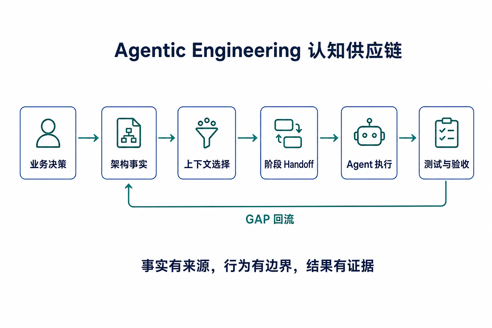
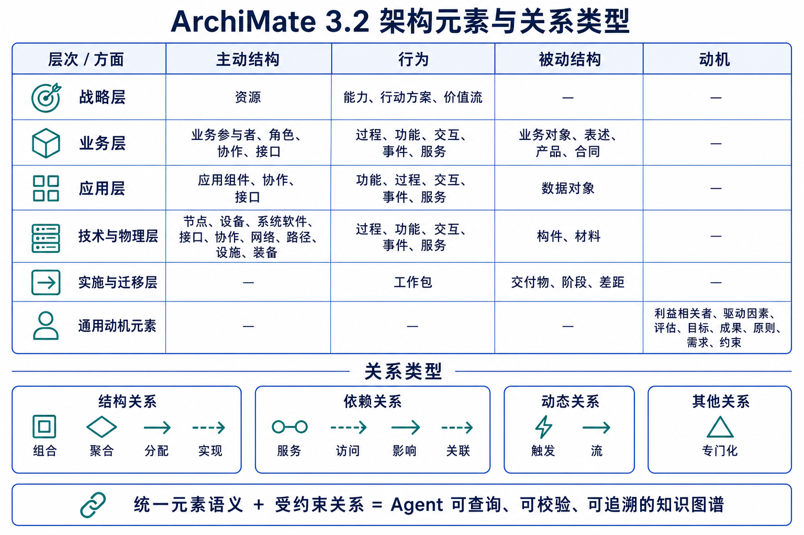
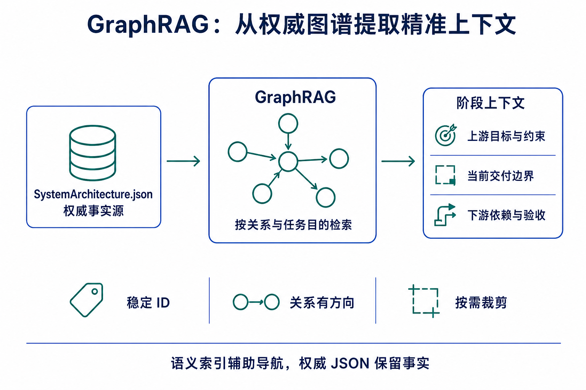
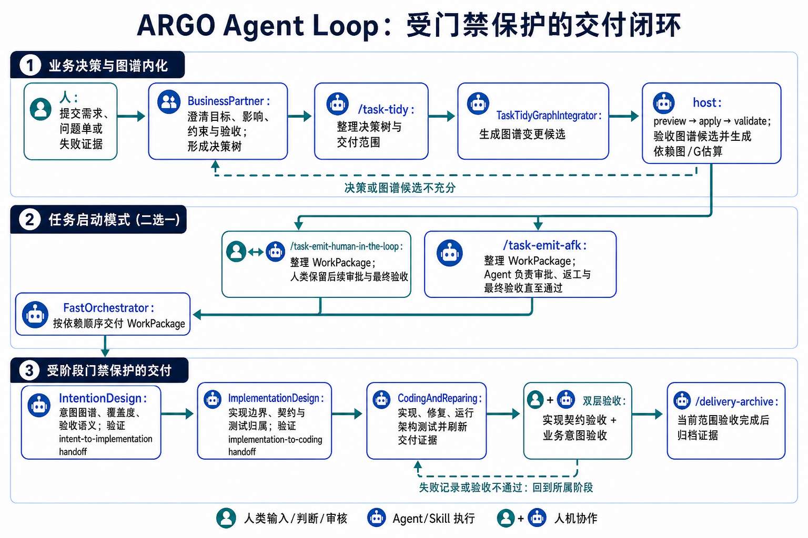
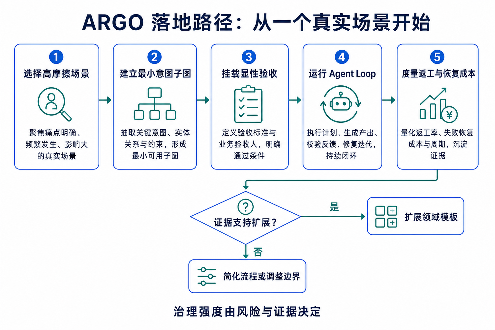

# 从 AI Coding 到 Agentic Engineering：用 GraphRAG 与 Agent Loop 构建可验证交付系统

> AI 已显著降低代码生成成本。复杂交付的主要矛盾随之转向：业务意图、架构边界、执行上下文和验收证据，如何在多轮协作中保持一致。

## 摘要

Coding Agent 正在参与需求分析、架构设计、编码、测试和返工。任务范围扩大后，单次代码质量已不足以代表交付质量。

企业需要回答四个问题：

- Agent 依据什么事实做决策？
- 当前阶段允许修改哪些资产？
- 测试失败应回到需求、架构还是代码？
- 哪些证据能够证明业务目标已经达成？

ARGO 将 ArchiMate 3.2、GraphRAG 和 Agent Loop 组合为一套工作区框架。ArchiMate 提供语义骨架，GraphRAG 提取任务相关子图，Agent Loop 约束阶段职责并处理验收回流。人类负责目标、价值和高影响决策，Agent 承担可协议化、可验证的执行。

---

## 一、背景：AI Coding 正在进入系统交付阶段

早期 AI Coding 侧重代码补全、函数生成和局部修复，开发者可以快速判断结果。如今，Agent 开始跨越多个模块和工程阶段，局部正确与系统正确之间的差距逐渐显现。

一个补丁可能通过测试，同时偏离业务目标；一个实现可能符合当前代码结构，同时破坏已确认的架构边界；一段完整会话可能保存大量历史，同时混入过期结论和临时方案。

模型能力仍然重要，交付质量还取决于模型所处的认知环境：

- 目标是否清楚；
- 事实是否权威；
- 关系是否明确；
- 权限是否受控；
- 任务是否足够小；
- 验收是否能回溯业务意图。

AI 工程的关注点正在从 Prompt 编写扩展到上下文、架构、权限和反馈的系统设计。

---

## 二、痛点与机遇：建立可治理的认知供应链

### 五类常见断裂

**意图断裂**  
需求在产品、架构、研发和 Agent 之间多次转述，目标、约束、反例和验收口径逐步丢失。

**架构断裂**  
Agent 容易把当前代码视为正确设计，使历史实现反向影响业务决策。

**上下文断裂**  
长会话积累了更多资料，也积累了冲突版本、陈旧状态和无关信息。

**责任断裂**  
同一个 Agent 同时裁决需求、设计实现、编写代码和修改测试，阶段责任难以区分。

**验收断裂**  
构建成功和单元测试通过只能证明局部条件成立，业务结果仍需独立确认。

### 新的工程对象

这些问题指向一条完整的认知供应链：

业务决策进入架构事实，架构事实经过上下文选择形成阶段 Handoff，Agent 在授权范围内执行，测试与验收产生反馈。发现 GAP 后，问题回到责任阶段修正。

这条链路带来三个机会：

1. 专家经验可以沉淀为组织可复用的系统上下文；
2. 架构可以参与任务导航、影响分析和验收归因；
3. 失败可以按意图、实现和代码分层处理，减少盲目补丁。

---

## 三、解决方案：GraphRAG × ArchiMate × Agent Loop

### 1. 三个核心构件

ARGO 由三部分共同运行：

- **意图架构**：`design/KG/SystemArchitecture.json` 保存目标、能力、约束、依赖和验收语义；
- **架构服务**：统一的 `argo` MCP 提供查询、变更预览、写入、校验、测试和 Handoff 检查；
- **HARNESS 工程流**：阶段 Agent 按权限协作，并通过双层验收处理偏差。

图谱提供长期事实，MCP 提供受控操作面，工程流负责交付秩序。任何一部分缺位，都会削弱追踪和纠错能力。

### 2. ArchiMate 3.2：统一业务与技术语义

Agent 处理复杂任务时，需要同时理解“为什么做、做什么、由谁承担、如何实现、运行在哪里、怎样验收”。

ArchiMate 3.2 覆盖动机、战略、业务、应用、技术及实施迁移等层次，并使用有方向的关系表达实现、服务、访问、触发、影响和责任。

ARGO 采用 Viewpoint-first 建模。每个 View 服务一个明确关注点，例如利益相关者意图、能力结果、业务行为、能力实现或验收交付。小型视图控制上下文范围，也便于人和 Agent 使用同一套语义讨论问题。

在这套地图中：

- 目标与能力说明价值来源；
- 服务与组件说明实现边界；
- 数据对象与技术节点说明状态和运行依赖；
- 显性 Testcase 说明完成条件；
- 关系方向说明责任和影响路径。

### 3. GraphRAG：从权威图谱提取精准上下文

`SystemArchitecture.json` 是 ARGO 的权威事实源。GraphRAG 围绕焦点元素、任务目的和关系深度提取语义子图。

实现设计可以读取目标到组件的映射，编码修复可以读取允许修改范围与测试入口，架构审计可以读取更完整的关系证据。每个阶段获得一份适合当前职责的上下文切片。

语义索引承担导航工作，权威 JSON 保留正式事实。GraphRAG 的语义能力需要 Neo4j 连通性和向量生命周期配置。

### 4. Handoff：阶段之间的上下文契约

长期图谱信息量较大，下游 Agent 通过结构化 Handoff 获取当前工作集。

意图到实现的 Handoff 说明：

- 需要实现的目标和范围；
- 关联的架构元素；
- 控制点与观测点；
- 显性验收边界。

实现到编码的 Handoff 说明：

- 实现契约与代码目标；
- 可执行测试入口；
- 冻结文件；
- 允许修改范围；
- 当前失败记录。

Handoff 保留架构元素 ID，并接受 Schema 校验。这样可以压缩上下文，同时保存决策来源。

### 5. Agent Loop：让偏差回到责任阶段

ARGO 的主流程包括：

1. `BusinessPartner` 澄清目标、方案、风险和验收控制点；
2. `TaskTidyGraphIntegrator` 生成图谱变更候选与覆盖证据；
3. `IntentionDesign` 维护意图图谱和显性验收；
4. `ImplementationDesign` 定义实现边界、测试入口和实现 Handoff；
5. `CodingAndReparing` 在授权范围内修改生产行为；
6. 代码实现验收检查实现契约；
7. 意图交付验收检查业务目标。

验收失败后：

- 业务目标或验收边界有缺口，回到意图设计；
- 实现边界或测试入口有缺口，回到实现设计；
- 图谱和契约均清楚，进入编码修复。

这种分流可以避免所有问题都落到代码层。

### 6. 确定性交付的工程框架

ARGO 用一个简化式描述交付可靠性的主要变量：

$$
Total\ Certainty = C \times \frac{(P \cdot B) \times E}{G}
$$

- `C — Clarity`：目标清晰度；
- `P — Protocol`：协议规范；
- `B — Binding Power`：边界约束力；
- `E — Efficacy`：模型在当前上下文中的有效能力；
- `G — Granularity`：单次任务颗粒度。

BusinessPartner 和显性验收提高 `C`；图谱、契约和 Handoff 提高 `P`；Validator、阶段权限、冻结测试和人类审核增强 `B`；聚焦子图释放有效 `E`；按架构依赖拆分任务降低 `G`。

这个公式是一种工程启发式，用于指导流程和工具设计。交付仍需持续校准：图谱会过期，关系可能建错，Handoff 可能遗漏信息，测试也无法代替价值判断。

### 7. 两种人机协作方式

**人在环路**适合高风险、跨团队和强审计场景。人类持续审核关键阶段和最终结果。

**人在环上**适合边界清楚、验证条件可执行的任务。Agent 持续推进并根据失败记录返工，人类保留监督、目标和高影响决策责任。

两种方式共享同一套图谱、Handoff 和双层验收。

---

## 四、启发与建议

### 1. 将治理范围扩展到认知供应链

企业可以控制 Agent 接收的事实、工具、权限、任务范围和验证反馈。治理工作应覆盖：

- 业务结论如何成为正式事实；
- 架构与代码冲突时如何裁决；
- 各阶段拥有何种读写权限；
- 验收证据如何关联业务能力；
- 失效知识如何被发现和更新。

### 2. 关注上下文恢复成本

代码生成量、采纳率和单次耗时反映局部效率。复杂项目还应观察：

- 同类任务跨会话的背景恢复时间；
- Agent 为定位边界读取的无关文件数量；
- Handoff 后的补问次数；
- 返工来自意图、实现和代码层的比例；
- 图谱元素到显性 Testcase 的覆盖率；
- GAP 回到正确阶段的比例。

这些指标能够反映组织上下文能否持续复用。

### 3. 从一个高摩擦场景开始

试点场景可以具备以下特征：

- 涉及多个模块或团队；
- 历史上经常因理解偏差返工；
- 业务验收边界清楚；
- 风险足以覆盖治理成本；
- 一个迭代内可以观察结果。

先建立最小意图子图，挂载显性验收，运行一轮 Agent Loop，再根据返工和恢复成本决定是否扩展。

### 4. 让流程强度随风险变化

高风险任务保留完整门禁。低风险、边界稳定的任务可以缩短路径。流程简化需要可观测风险和历史证据支持。

ARGO 适合错误成本高、需要追踪审计、跨团队协作或跨多个 Agent 会话的任务。一次性、小范围、低风险修改通常适合更轻的工作流。

### 5. 明确维护责任

组织需要明确业务意图、图谱质量、实现契约、Handoff 工具链和运行证据的负责人。缺少持续维护时，结构化图谱同样会成为陈旧资产。

---

## 五、问题与讨论

1. 哪些信息需要进入结构化事实源，哪些内容保留为文档更合适？
2. 如何衡量一次上下文提取的质量：更少文件、更少返工，还是更完整的决策追踪？
3. 当意图架构、测试、代码现实和用户行为发生冲突时，谁拥有裁决权？
4. Handoff 应压缩到什么程度，才能兼顾执行效率和决策理由？
5. 哪些任务可以安全缩短意图设计或实现设计阶段？
6. GraphRAG 与 CodeGraph 应如何协作？
7. 如何从代码、测试和运行证据中发现图谱漂移？
8. 多 Agent 并发时，怎样隔离和合并各自形成的事实？
9. 精准上下文会不会限制 Agent 的探索空间？
10. 谁应负责企业内部的“上下文产品”？

---

## 结语

ARGO 取意于希腊神话中的阿尔戈号。大模型像船员，目标、航线、船体边界、协作纪律和验收标准共同决定远航结果。

ARGO 的核心判断是：

> **稳定交付依赖工程系统，单次模型表现只是其中一环。**

意图有权威事实源，关系有明确语义，任务有阶段契约，行为有权限边界，失败能回到责任阶段，结果接受双层验收。这样的系统能够持续发现并纠正偏差，为 Agentic Engineering 提供一套可治理的交付基础。

---

## 延伸阅读

- [ARGO HARNESS 中文说明](../../README_CN.md)
- [ARGO 总体架构](../../design/architecture.md)
- [HARNESS 工程流程](../../design/argo-harness/README.md)
- [意图架构设计](../../design/intent-architecture/README.md)
- [使用场景与入口选择](../../design/argo-harness/usage-scenarios/README.md)
- [ARGO 工程哲学](./ARGO%20工程哲学：确定性交付公式的工程化.md)
- [精准上下文控制](./精准上下文控制：面向复杂软件交付的认知环境设计.md)
- [ArchiMate 建模理念](../architecture-modeling/ARGO%20HARNESS%20的%20ArchiMate%20建模理念.md)
- 项目仓库：<https://github.com/derekhu0002/Argo>
