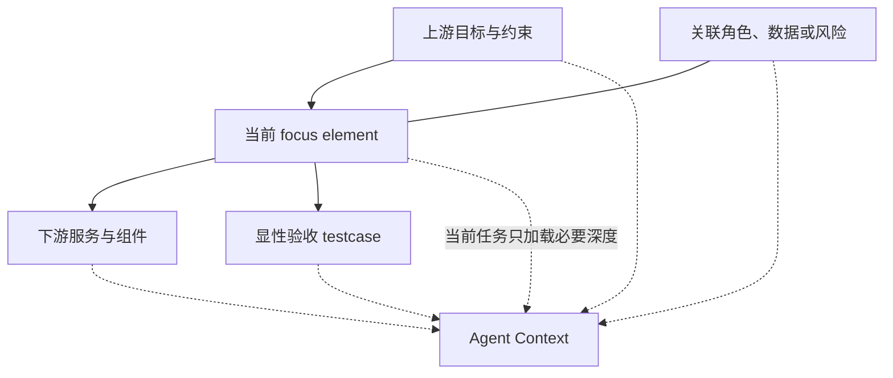
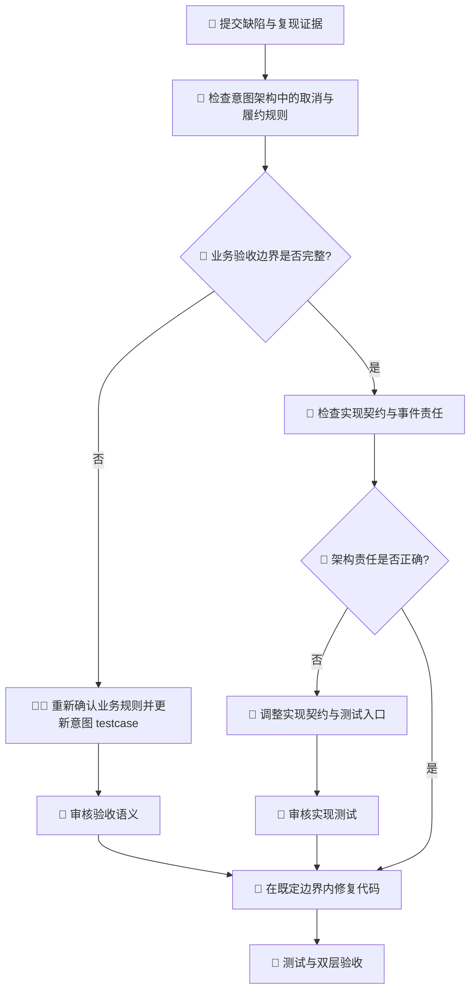

# 精准上下文控制：面向复杂软件交付的认知环境设计

很多 AI Coding 产品都在追求同一件事：让模型“看到更多”。

更长的上下文窗口、更大的代码索引、更积极的文件召回、更完整的历史会话，似乎天然意味着更好的回答。但在复杂项目里，我们观察到的现象恰好相反：模型看到的内容越来越多，真正需要它坚持的目标、约束和边界却越来越模糊。

模型具备写代码的能力，真正的困难在于判断眼前几万行信息中，什么是事实，什么只是参考；什么仍然有效，什么已经过期；什么属于当前任务，什么虽然相关却不该在这一阶段被修改。

本文将关注点从“如何把更多内容塞进 Prompt”推进到一个更接近工程治理的问题：

> 如何让 Agent 在正确的时间，只看到完成当前任务所需的正确事实，并且知道自己能改什么、不能改什么、最终由什么证据证明完成？

我们把这件事称为**精准上下文控制**。

精准上下文控制可能是 AI Coding 从个人效率工具走向企业工程系统时，绕不开的一道门槛。

---

## 一、上下文工程正在取代 Prompt 技巧

早期使用大模型时，我们习惯把问题归结为 Prompt：指令是否清楚、角色是否定义准确、示例是否充分。进入代码仓之后，问题开始变化。

一个企业项目里的“上下文”，至少包含以下内容：

- 业务为什么要做这项变化；
- 哪些用户、流程和指标会受到影响；
- 当前架构怎样承载这项能力；
- 哪些接口和数据对象是稳定边界；
- 哪些代码只是历史现实，不代表设计正确；
- 哪些测试代表业务验收，哪些只是实现护栏；
- 当前 Agent 能修改哪些资产；
- 哪些问题必须退回上游重新决策。

这些内容不可能靠一段精心编写的 Prompt 长期维持。随着会话变长、任务切换、多人协作和代码持续变化，Prompt 里的重要信息会被稀释，历史结论会相互冲突，模型也很难识别某一段话的权威等级。

所以，AI Coding 的竞争正在从“谁的模型更聪明”转向“谁能更好地组织模型所处的认知环境”。

模型能力当然重要，但模型每次发挥出来的有效能力，取决于它进入了怎样的上下文。一个强模型面对混乱事实，仍然会做出自洽但错误的修改；一个能力稍弱的模型，如果拿到边界明确、证据充分的小任务，反而可能交付得更稳定。

这种关系可以用一个简化公式概括：

$$Total\ Certainty = C \times \frac{(P \cdot B) \times E}{G}$$

其中，目标清晰度 `C`、协议规范 `P`、边界约束 `B`、模型能效 `E` 和任务颗粒度 `G` 都与上下文直接相关。上下文控制贯穿所有因子，是整套公式的基础设施。

---

## 二、“给模型更多上下文”为什么会失效

### 1. 相关不等于应该出现

搜索可以找到相关文件，却不一定能判断这些文件是否属于当前决策层。

例如，修改一个订单状态时，代码搜索可能召回数据库字段、接口实现、前端展示、历史迁移脚本和几十个测试。它们都相关，但当前问题也许首先是：“取消后的订单是否还能恢复？”这是业务规则，单靠代码搜索无法回答。

如果模型一开始就沉入实现文件，它很容易把当前代码行为当作需求，再用现状解释现状。检索命中了内容，却错过了问题所在的层级。

### 2. 文本相似不等于架构依赖

传统 RAG 更擅长回答“哪些文本与查询相似”，却不天然理解：

- 谁依赖谁；
- 谁实现谁；
- 谁访问谁；
- 谁触发谁；
- 哪个能力拥有这条验收边界；
- 修改一个节点会沿哪些路径影响下游。

代码世界中的关键关系由责任和依赖构成，词频只能提供有限线索。两个命名完全不同的组件可能存在强依赖，两个名称相似的文件可能毫无交付关联。

### 3. 上下文缺少权威等级

复杂仓库里经常同时存在需求文档、架构说明、代码、测试、聊天结论和历史方案。如果它们冲突，模型应该听谁的？

没有事实源优先级时，Agent 通常会选择最容易读取、最接近当前代码或最近出现在对话中的内容。这个选择在语言上可能很合理，在治理上却可能完全错误。

尤其危险的是测试。测试看起来最“确定”，但测试也可能过期，或者越权固化了错误需求。如果允许编码 Agent 修改验收测试来适配当前实现，整个系统会迅速形成一种虚假的确定性：所有测试都通过，但产品已经偏离原始目标。

### 4. 上下文会随时间失真

会话历史无法承担数据库的职责。

模型在前一小时得出的结论，可能已被后续决策推翻；早期读取的文件可能已经修改；一次临时绕行可能在长对话中被误认为正式规则。上下文越长，陈旧状态和有效状态越容易混在一起。

如果系统没有重新校验和刷新机制，“保留完整历史”并不会保留真相，只会保留更多版本的真相。

### 5. 任务过大会放大一切噪声

当一个会话同时处理业务澄清、架构选择、接口设计、编码、调试和验收时，每一步产生的信息都会继续污染下一步。模型既要记住上游目标，又要处理眼前错误，还要判断哪些失败可以忽略。

这也是为什么很多长任务会在后半程出现一种熟悉的状态：代码改得越来越快，但方向越来越不可信。

---

## 三、我们的判断：精准上下文是一套控制面

如果只把精准上下文理解为“更准确地找文件”，我们会低估问题。

一个可控的上下文至少要回答四个问题：

| 维度 | 必须回答的问题 |
| --- | --- |
| 事实 | 哪些信息是当前有效且具有权威性的？ |
| 范围 | 当前任务真正需要哪些信息和依赖？ |
| 权限 | 当前 Agent 可以读取、修改和产出什么？ |
| 时机 | 这些信息应在何时加载、校验、更新或废弃？ |

因此，精准上下文控制更像数据库、权限系统、工作流引擎和测试反馈的组合。单纯扩大 Prompt 无法承担这套职责。

我们可以把它画成一条闭环：


这里的重点在于让上下文有来源、有边界、有生命周期，并且能被执行证据纠正。

---

## 四、如何实现精准上下文控制

### 1. 把长期上下文从对话中搬到架构图谱

一种可行做法是使用结构化意图架构保存长期上下文。业务目标、能力、约束、应用服务、组件、数据对象、技术节点、依赖关系和显性验收用例，由此脱离单次会话获得稳定身份。

这一步解决的是上下文的**持久性和身份问题**。

自然语言段落很容易在多轮改写中失去指代。图谱元素拥有稳定 ID，关系拥有明确方向，验收用例挂载在真正拥有该边界的元素上。不同 Agent 可以引用同一对象，而不必每次用近似语言重新描述。

但必须强调：图谱化不等于把所有东西都画进图里。图谱如果变成另一个信息垃圾场，精准控制同样会失败。可以先确定利益相关者真正关心的问题，再围绕单一关注点组织小型视图，最终形成一组可导航的小地图。

### 2. 用架构依赖提取语义子图

当 Agent 处理某个架构元素时，语义子图查询器可以围绕焦点元素提取：

- 它所需的上游语义依赖；
- 依赖它的下游对象；
- 与它有关的 Association 邻居；
- 挂载在相关元素上的约束和 testcase；
- 面向当前角色的工作上下文。

查询深度可以按任务调整。实现设计需要看到意图到实现的映射，编码修复需要看到当前修复范围和相关验收，审计则需要更完整的关系证据。

这与普通代码搜索的差别在于：架构关系决定上下文范围，文本相似度只作为辅助线索。



### 3. 用阶段交接做“上下文编译”

图谱是长期事实源，但下游 Agent 不应直接吞下整张图。

意图设计与实现设计之间、实现设计与编码之间，可以使用结构化阶段交接。它们的作用类似编译器：

- 从上游复杂语义中选择本阶段需要的内容；
- 固化当前交付范围；
- 指明输入、输出、控制点和观测点；
- 给出测试入口、冻结文件和允许修改范围；
- 保留对上层架构元素的追踪 ID。

第一份交接让实现设计知道“需要实现什么、由什么验收”；第二份交接让编码 Agent 知道“应该改哪里、运行什么、哪些东西绝对不能改”。交接对象需要通过 Schema 或等价机制校验，避免自然语言摘要遗漏关键字段。

这是一种刻意的有损压缩。它允许舍弃当前角色无关的信息，以换取更小、更清晰的工作集。

### 4. 用阶段本体和权限阻止上下文越权

只告诉 Agent “你现在是程序员”远远不够。角色提示很容易在长会话中失效。

不同阶段可以采用独立的认知模型和行为边界：

- 意图设计角色负责目标、约束、覆盖标准和意图交接；
- 实现设计角色负责实现契约、测试入口和实现交接；
- 编码修复角色负责真实生产行为、修复队列和禁止捷径。

上层可以读取下层事实来做更准确的判断，下层只能通过 ID 引用上层结论，不能反向修改上层事实。

这种分层同时减少误操作和认知负担。编码 Agent 无需在修复一个接口时重新裁决商业目标；实现设计 Agent 也不应该因为某段现有代码写起来方便，就悄悄改掉业务验收边界。

### 5. 用能力模块和领域模板按需装载知识

通用 Prompt 往往越写越长：架构规则、编码规范、平台知识、测试环境、设备操作、发布步骤全部堆在一起。多数任务只会用到其中一小部分，却要持续承担全部上下文成本。

这些知识可以拆成独立能力模块，再通过场景和架构属性按需加载。

例如，某类架构视图可以挂载对应的建模规则；移动端项目可以加载设备环境、平台编码规范和跨端页面比较能力；普通后端任务无需看到这些内容。

领域模板进一步把默认意图架构、能力模块、知识库、测试环境和验收能力组合起来，在稳定工程流程上提供领域上下文包。

### 6. 用任务切分控制上下文半径

精准上下文不仅是“选哪些资料”，还包括“这次到底做多大”。

任务整理器可以将业务决策内化为架构元素和关系，并根据依赖生成交付顺序与颗粒度估算。人类按依赖顺序逐个启动交付会话，让每轮任务围绕有限的架构子图和验收边界展开。

这听起来不如“多 Agent 并行完成整个项目”激动人心，却更符合复杂工程的现实。多个 Agent 同时修改架构事实、测试入口和共享代码，可能提高局部速度，却会迅速增加上下文分叉与合并成本。

在事实合并、冲突检测和权限隔离尚未成熟时，顺序交付更容易维持单一上下文状态。盲目并发会制造新的不确定性。

### 7. 用测试和 validator 让上下文具备自我纠错能力

上下文永远可能出错。真正可靠的系统不能只负责提供上下文，还要负责证明上下文仍然可信。

上下文闭环可以组合以下机制：

- JSON Schema 和关系语义规则检查图谱；
- 写入预演避免错误事实直接落盘；
- 阶段交接校验检查输入是否完整；
- 显性验收用例和冻结入口守住业务边界；
- 结构化失败记录把测试结果转成下一轮修复输入；
- 双层验收分别检查实现契约和业务意图。

一旦发现 GAP，问题会回到正确阶段，避免继续在编码阶段“想办法通过”。这使上下文从一次性输入变成一个可回归、可刷新、可纠错的状态闭环。

---

## 五、一个缺陷修复，在精准上下文方法下有何不同

假设用户反馈：“订单取消后仍然能收到发货通知。”

普通 AI Coding 流程可能是：

1. 搜索“取消”“发货通知”；
2. 找到消息发送代码；
3. 增加 `if order.status != cancelled`；
4. 补一个单元测试；
5. 测试通过，结束。

这个修改可能正确，也可能掩盖了更深的问题：

- 取消是否应该撤销已创建的履约任务？
- 通知由订单状态驱动，还是由履约事件驱动？
- “已出库后取消”是否仍应通知？
- 当前测试是在证明业务规则，还是只证明新增的 `if`？

采用精准上下文控制后，流程会先判断问题属于哪一层：



它不保证第一次就找到正确答案，但会显著减少一种常见错误：用局部代码修补替代上游问题澄清。

精准上下文控制的价值，恰恰体现在这种“不急着写代码”的能力上。

---

## 六、这对企业意味着什么

### 从“个人记忆”变成“组织可复用的上下文”

今天很多 AI Coding 成功案例依赖少数熟悉系统的人：他们知道该给模型哪些文件、哪些历史不能信、遇到问题该找谁。换一个人、一个会话或一个模型，效果就难以复现。

如果意图、依赖、边界和验收可以进入结构化事实源，这些隐性经验才有机会成为组织资产。新成员和新 Agent 可以直接从当前有效的系统地图开始，省去对完整历史的重复学习。

### 从“代码产出速度”转向“上下文恢复成本”

企业衡量 AI Coding 时，往往只看生成量、采纳率和任务完成时间。但复杂项目真正昂贵的部分，常常是：

- 为下一次任务重新解释背景；
- 发现并修复 Agent 对系统边界的误解；
- 在多人并发后判断哪份结论仍然有效；
- 为一次局部修改补做跨系统影响分析；
- 追查某个测试为什么代表业务验收。

精准上下文控制降低的是这类恢复成本。它不一定让每一次代码生成更快，却可能让第二次、第五次和第五十次交付不必反复从零开始。

### 从“模型治理”转向“认知供应链治理”

企业无法完全控制底层模型，但可以控制模型接收到的事实、工具、权限、任务范围和验收反馈。

这意味着 AI 治理不应只关注模型是否合规，还应关注整条认知供应链：

```text
业务决策
  → 架构事实
  → 上下文选择
  → 阶段 handoff
  → Agent 行为
  → 测试证据
  → 交付结论
```

任何一环失真，最终结果都可能看起来合理却无法信任。

---

## 七、需要警惕：精准控制也可能变成“精致的错误”

这套方法存在明确成本，也不能把“图谱”“流程”和“校验”当作正确性的自动保证。

### 图谱可能过期

结构化事实比聊天稳定，但也更容易给人权威感。如果图谱没有随业务和实现变化及时更新，它会成为一种更难被质疑的陈旧文档。

### 关系可能建错

错误的依赖关系会让上下文提取更加“精准”地走向错误方向。图谱质量、建模能力和审计机制决定了精准控制的上限。

### 流程可能过重

小改动如果也被迫走完所有阶段，治理成本会超过收益。流程设计需要根据风险、影响面和任务颗粒度动态调整强度，避免所有任务一律重型化。

### Handoff 可能丢失关键语义

上下文压缩必然有损。哪些信息应该保留、哪些可以省略，需要用失败案例持续校准。过度压缩会让下游只见指令、不见理由；压缩不足又会回到信息过载。

### “通过验证”不等于“创造了价值”

Schema 能证明结构合法，测试能证明预期行为发生，却不能证明产品方向正确。关键业务目标、价值判断和风险取舍仍然需要人类承担责任。

所以，精准上下文控制需要保留人的判断，并把人的判断放在真正需要它的位置。

---

## 八、给组织落地的几条建议

第一，不要从“建设完整知识图谱”开始。选择一个跨模块、容易发生理解偏差、验收边界清楚的真实场景，先证明上下文闭环是否能降低返工。

第二，把事实源冲突当作一等问题。明确需求、架构、代码、测试和会话结论的优先级，比增加更多知识内容更重要。

第三，记录“上下文为什么错了”。不要只记录模型生成了什么错误代码，还要追查它缺了哪条事实、加载了哪条过期规则、跨越了哪个阶段边界。

第四，建立上下文质量指标。除了任务完成率，可以尝试观察：

- Agent 为定位正确边界读取了多少无关文件；
- 多少返工来自意图、实现或代码层误判；
- 阶段交接后的下游补问次数；
- 冻结测试被误改的次数；
- 同类任务跨会话的背景恢复时间；
- 图谱元素到 testcase 的覆盖率；
- GAP 被路由回正确阶段的比例。

第五，允许流程被证据简化。治理成熟后，低风险任务可以使用更短路径；“简化”的依据应是可观测风险，单纯追求表面速度无法成为跳过控制的理由。

---

## 九、我们希望讨论什么

精准上下文控制仍然有很多开放问题。下面这些问题，比“上下文窗口还会扩大多少”更值得讨论：

1. 在企业项目中，哪些信息必须进入结构化事实源，哪些保留为文档更合适？
2. 架构依赖子图与代码向量检索应该如何形成互补？
3. 如何衡量一次上下文提取是否“精准”？是文件更少、返工更少，还是决策更可追踪？
4. Handoff 应压缩到什么程度，才能兼顾下游效率和决策理由的完整性？
5. 哪些任务可以安全跳过意图设计或实现设计？风险分级应由谁决定？
6. 多 Agent 并发时，如何合并各自形成的上下文状态，并避免图谱和测试事实冲突？
7. 图谱维护成本由谁承担？能否从测试、代码和运行证据中持续反推并提示漂移？
8. 当意图架构、测试和真实用户行为相互冲突时，系统应如何决定回到哪一层？
9. 精准上下文控制会不会限制模型发现意外方案的能力？应该为探索保留多大的自由空间？
10. 在组织内部，谁应该成为“上下文产品”的负责人：架构师、研发效能团队、产品团队，还是新的复合角色？

我们目前的观点是：AI Coding 的下一阶段，不会只属于更大的模型，也不会只属于更强的 Agent。它属于那些能把业务事实、架构依赖、执行权限和验证反馈组织成稳定认知环境的工程系统。

上下文已经成为 AI Coding 产品本身的一部分。
