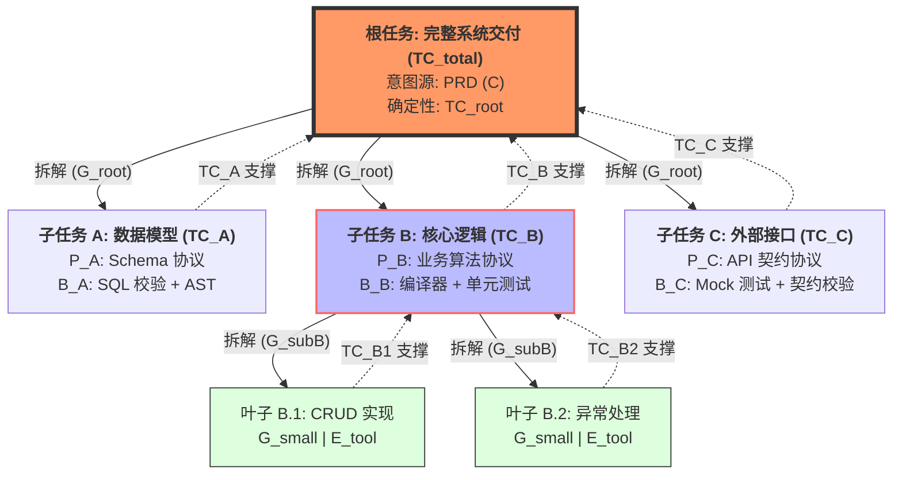

这是一篇深度探讨 AI 软件工程交付本质的白皮书简介。它不仅是一套方法论，更是建立在 Transformer 微观动力学、高维流形几何以及控制论基础上的“AI 物理定律”。

---

### 一、 核心观点

AI 软件研发的本质，是一场**在高维语义空间中寻找唯一确定解的“重力博弈”**。交付的失败并非源于 AI 的“愚笨”，而是源于意图在高维空间中由于熵增、噪声和引力衰减导致的“路径偏离”。

为了实现工业级的确定性交付，我们必须从“调优提示词”的传统思维，转向**“构建高维空间物理护栏”**的工程思维。其核心逻辑可以用以下**递归任务树交付公式**来表达：

$$TC_{node} = \left[ C \times \frac{(P \cdot B) \times E_{sys}}{G} \right] \cdot \prod_{j \in Children} (TC_j)^{d_j}$$

**最终交付的确定性（$TC$）取决于：**
1.  **$C$ (Clarity)：** 初始意图在空间中坍缩的质量（起点精度）。
2.  **$P$ (Protocol)：** 业务规则预设的逻辑管道（轨道边界）。
3.  **$B$ (Binding Power)：** “判-拦-纠”三位一体的闭环护栏（系统向心力）。
4.  **$E_{sys}$ (System Efficacy)：** 模型原生推理力与工具接管能力的乘积（动力总成）。
5.  **$G$ (Granularity)：** 任务拆解的颗粒度（搜索空间熵值）。
6.  **$\prod (TC_j)^{d_j}$：** 子任务确定性的向上传导（递归依赖稳定性）。

---

### 二、 深度维度：影响交付的六大核心因素

#### 1. 意图晶体化（$C$）：本体论的对焦
世界是客观的，但人类的表达往往是模糊的。在高维 12288 维空间中，一个模糊的需求（如“处理订单”）对应的是一团弥散的“语义云”。
*   **洞察：** 交付的第一步是将“主观语义云”映射为“客观本体坐标”。
*   **失效模式：** 如果 $C$ 的对焦不准，后续所有的引力拉扯都会在一个错误的基准点上进行，导致“失之毫厘，差之千里”。

#### 2. 规则管道化（$P$）：空间的曲率预设
$P$ 是我们在 AI 进入高维空间滑行前，预先埋下的“重力锚点”。通过在系统上下文中明确表达业务规则，我们人为地改变了空间的曲率。
*   **洞察：** $P$ 的本质是**空间预裁剪**。它在第一秒就宣布了：凡是不符合业务规范的路径，其引力权重（$\alpha$）将被强行降为零。
*   **工程价值：** 明确的规则能让模型在滑行时，面对分支路口产生本能的逻辑排他性。

#### 3. 闭环绑定力（$B$）：物理护栏的实时自愈
这是区分“聊天机器人”与“交付 Agent”的分水岭。$B$ 不再是静态的建议，而是由**“判（Judge）、拦（Intercept）、纠（Correct）”**构成的控制系统。
*   **洞察：** 在高维空间，AI 会由于 RoPE（旋转位置编码）衰减或随机采样而产生“漂移”。$B$ 的作用是在 $x_{t+1}$ 产生的瞬间，通过 AST 扫描、编译器反馈或测试断言，强行将越界的坐标“弹回”$P$ 定义的轨道。
*   **结论：** 智能不在于不犯错，而在于纠偏的硬度。

#### 4. 系统能效杠杆（$E_{sys}$）：确定性孤岛的建立
原生模型 $E$ 是概率性的。但在 Agent 形态下，我们通过引入**外部工具（Tools）**，实现了能力的“确定性外包”。
*   **洞察：** 工具（如代码解释器、SQL 执行器）是高维大海中的“确定性码头”。
*   **效应：** 当任务从“概率推理”转化为“确定性脚本执行”时，$E$ 会发生数量级的跃迁，同时通过接管复杂度，实现了对分母 $G$ 的有效削减。

#### 5. 颗粒度分治（$G$）：对抗自回归熵增
Transformer 的生成是自回归的（$S^n$）。随着任务链 $n$ 的增加，误差会呈指数级累积。
*   **洞察：** 减小 $G$ 的本质是缩短单次“意图子弹”的飞行距离。
*   **物理意义：** 越小的步长，受 RoPE 远距离引力衰减的影响就越小，系统就越容易在每个微小的“采样区间”内实现快速收敛。

#### 6. 递归依赖传导（$\prod TC$）：任务树的引力守卫
在宏观软件工程中，任务是以树状结构展开的。子节点的确定性是父节点成功的基石。
*   **洞察：** **不确定性具有传染性。** 如果底层数据库 Schema 的交付概率（$TC_{child}$）只有 0.8，那么基于此构建的业务逻辑（$TC_{parent}$）无论 $B$ 有多强，其确定性都会被子节点的偏差“污染”。
*   **对策：** 必须建立“原子节点自愈”机制，确保每个子任务在向上传递结果前，已经过 $B$ 的 100% 校准。

---

### 三、 总结：从“调优”走向“受控”

在 **AI Coding Harness** 的哲学中，我们不再祈祷 AI 给出正确答案，而是构建一个**“让它无法交付错误答案”**的环境。

通过控制 **$C$ 的精度**、**$P$ 的边界**、**$B$ 的硬度**、**$E$ 的杠杆**、**$G$ 的步长**以及**任务树的传导稳定性**，我们将 AI 从一个不可预测的“文字接龙机器”，改造为一个在高维空间物理导轨上精准运行的**“确定性逻辑引擎”**。